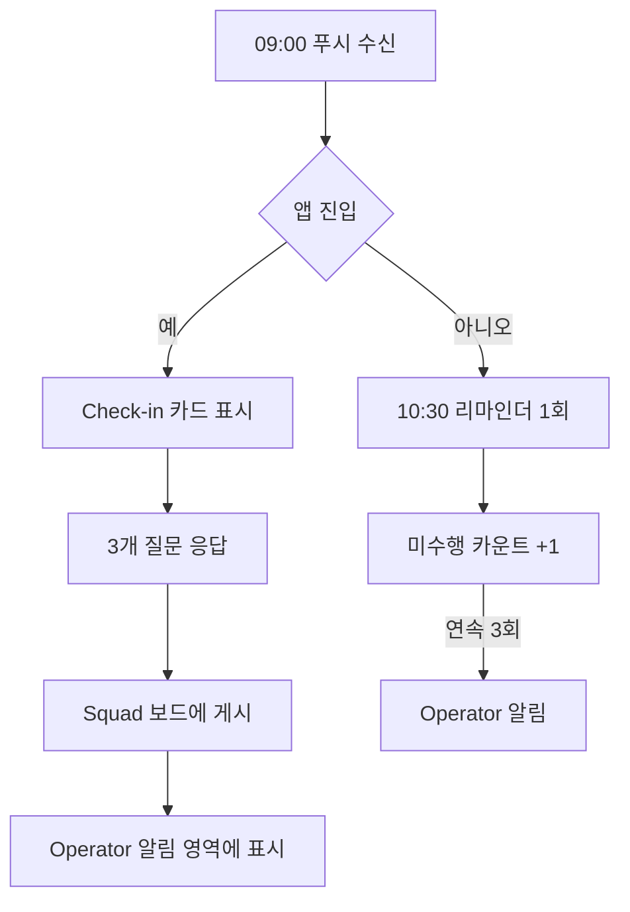

# UX Flow — Daily Check-in

```mermaid
flowchart TD
    A[09:00 푸시 수신] --> B{앱 진입}
    B -->|예| C[Check-in 카드 표시]
    B -->|아니오| D[10:30 리마인더 1회]
    C --> E[3개 질문 응답]
    E --> F[Squad 보드에 게시]
    F --> G[Operator 알림 영역에 표시]
    D --> H[미수행 카운트 +1]
    H -->|연속 3회| I[Operator 알림]
```

## 핵심 인터랙션 노트

- 카드는 스와이프로 닫을 수 없음 (의도적 마찰)
- 응답 후 즉시 Squad 동료의 어제 응답 1개 노출 → 약한 연결 강화

## 디자인 결정 근거

- Operator가 "이상 신호"를 발견할 수 있도록 응답 누락을 시각적으로 강조 (POL-CF-01 §2).
