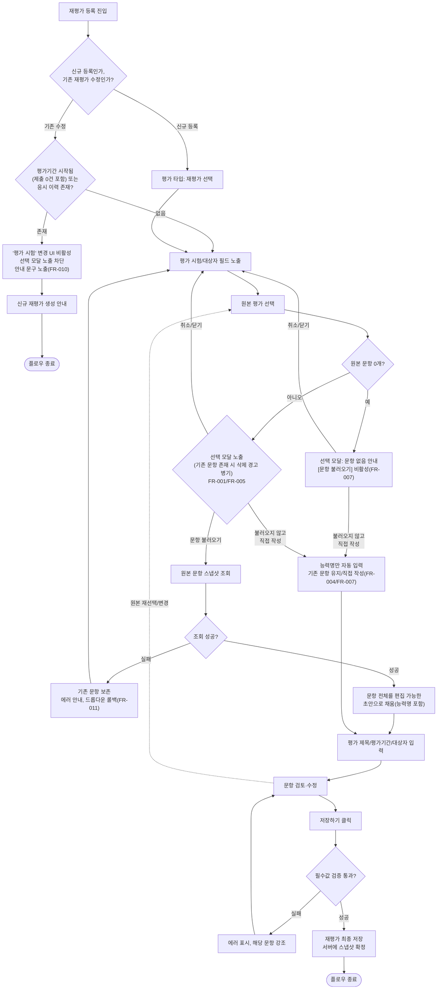

# 기능정의서: 훈련평가 — 재평가 등록 시 원본 평가 문항 불러오기

## 변경 이력

| 버전 | 날짜 | 변경 요약 | 사유 |
|------|------|-----------|------|
| 1.0 | 2026-08-03 | 최초 작성 | 내부 검토 — 재평가 등록 문항 수기 재입력 비효율 해소 |
| 1.1 | 2026-08-03 | 1차 검수 반영 — 응시 이력 존재 시 차단(FR-010) 신설, 권한·조회 범위(§3) 신설, 문제 유형별 복사 대상 필드(§4.2) 추가, 불러오기 실패·연타 처리(FR-011) 추가, 유저 플로우 신규/수정 갈래 분리, FR 표기·상호참조 정합성 수정 | 내부 검토 |
| 1.2 | 2026-08-03 | 2차 검수 반영 — 유저 플로우 수정 진입 경로 단축, FR-011 우선순위 상향 및 조회 실패 시 드롭다운 롤백 조항 추가, FR-005 삭제·교체 시점 단서 추가, FR-010 응시 이력 정의 보강(§4.1·§9) 및 차단 UI 동작 정의 추가, §8 제외 범위 1행 추가, 표기 정리(§3 근거/상태 분리, 플로우 종료 노드) | 내부 검토 반영 |
| 1.3 | 2026-08-03 | 엣지케이스 검토 반영 — FR-010 저장 시점 재검증 조항 추가, §3 서버측 권한·소속 재검증 조항 추가, §7 정답-보기 매핑·all-or-nothing 저장·중복 저장 방지·로딩 중 저장 비활성·응시 이력 조회 실패 시 차단 판정 추가, §11 동시 편집 잠금 정책 제안 추가 | 내부 검토 반영 |
| 1.4 | 2026-08-03 | 사용자 확정 정책 3건 반영 — FR-010 차단 조건에 평가기간 진행 중(제출 0건) 포함, FR-007/FR-008 최소 1문항 저장 검증 확정, FR-004 능력명 복사 범위 포함으로 확정. §4.1·§5·§6 정합화, §9 해당 미결 3건 제거 | 정책 확정 반영 |
| 1.5 | 2026-08-03 | 자동 불러오기(FR-001) 폐기, 원본 선택 시 선택 모달("문항 불러오기"/"불러오지 않고 직접 작성")로 전환. FR-005 덮어쓰기 모달을 선택 모달에 통합, FR-006 빈 상태도 동일 모달 노출로 개정, FR-004 능력명 자동 입력을 선택지 무관 수행으로 보강, FR-010·FR-011 서술 정합화, §5 플로우·§6 갱신 | 정책 개정 — 불러오기 선택형 전환 |
| 1.6 | 2026-08-03 | FR-001에 [취소/닫기] 선택지 명시 및 동일 원본 재선택 시에도 모달 노출 조항 추가, FR-007에 원본 문항 0건 시 모달 [문항 불러오기] 비활성 처리 확정 추가. §5 플로우에 원본 문항 0개 사전 분기(QC/Q0) 반영, §6 관련 행 정합화 | 내부 검토 반영 |

---

## [검토 기준]

- 출처: 문제정의(재평가 문항 수기 재등록 비효율), 확정 정책 4건(범위·불러오기 UX·스냅샷 원칙·응시 이력 존재 시 차단), 현재 화면 구조(평가 등록 화면 — 평가 상세 패널 '평가 시험' 필드, 문항 편집기), master.md §2.2 훈련평가 조항(재평가 설정 기능 근거).
- 가정: 이 문서 내 "확인 필요" 표기 항목 외 화면 필드·레이블 구성, 권한 체계는 기존 화면·스펙 구조를 그대로 전제한다.
- 검증 기준: 화면 재설계·평가↔평가 복제·문항은행 등 범위 확장 요소가 본문에 없는지, FR 항목마다 우선순위·정책 근거·미결사항이 표기되어 있는지, 절 간 상호참조 번호가 실제 절 번호와 일치하는지.

## 핵심 결론

재평가 등록 화면에서 원본 평가를 선택하면, 즉시 로드하지 않고 선택 모달을 통해 [문항 불러오기] 또는 [불러오지 않고 직접 작성]을 고르도록 한다(FR-001, 자동 로딩 폐기). [문항 불러오기] 선택 시에만 문항 전체를 편집 가능한 초안으로 채우며, 능력명은 두 선택지 중 어느 쪽을 고르든 자동 입력된다(모달 [취소/닫기] 시에는 미수행, FR-004). 평가 제목·평가기간·대상자는 불러오지 않는다. 불러온 내용은 스냅샷 복사본이며 [저장하기] 이전까지 서버에 반영되지 않는다. 재평가는 최소 1문항 이상이어야 저장 가능하다(FR-007·FR-008). 평가기간이 시작된 재평가(답안 제출 0건 포함) 또는 응시 이력이 존재하면 '평가 시험' 변경 UI 자체를 비활성화해 선택 모달이 노출되지 않도록 차단한다(FR-010). 기능 사용 권한과 원본 평가 조회 범위는 기존 스펙을 그대로 준용하며 신규 권한을 추가하지 않는다(§3).

---

## 1. 배경

부트캠프 클래스룸 훈련평가에서 강사·매니저는 평가/재평가 두 타입을 등록한다. 재평가는 원본 평가와 동일한 문항 구조로 재응시하는 구조이나(100점 만점 60점 미만 대상자 재평가 진행, [참고: likelion-lms-master master.md §2.2]), 문항 약 20개를 매번 수기로 재등록해야 해 등록 비효율이 크다. 이번 기능은 재평가 등록 시 원본 평가 문항을 불러와 수기 재입력을 없애는 것이 목적이다.

## 2. 범위

### 2.1 이번에 하는 것
- 재평가 등록(신규/수정) 화면에서 원본 평가 선택 시 문항 전체 불러오기(편집 가능한 초안, 스냅샷 복사)
- 재평가 상태(응시 이력 유무)에 따른 불러오기·교체 허용 여부 제어(§4.1)

### 2.2 이번에 하지 않는 것
제외 범위는 §8을 참조한다.

## 3. 권한·조회 범위

이번 기능은 기존 '평가 시험' 드롭다운의 선택값을 그대로 사용하므로, 조회 스코프는 신규 정책이 아니라 기존 스펙 준용이다.

| 항목 | 내용 | 근거 | 상태 |
|------|------|------|------|
| 기능 사용 권한 | 클래스룸 강사·매니저(기존 훈련평가 등록 권한과 동일) | [기존 스펙 준용] | 확정 |
| 원본 평가 노출 범위 | 재평가 등록 화면의 기존 '평가 시험' 드롭다운 노출 범위를 그대로 따른다(신규 조회 스코프 도입 없음) | [기존 스펙 준용] | 구체 범위(클래스룸/훈련 경계, 강사·매니저 간 차등 여부)는 확인 필요 — §9 |
| 신규 권한 추가 여부 | 없음 | 이번 기능은 기존 등록·조회 권한 체계에 신규 권한을 추가하지 않는다 | 확정 |
| 서버측 권한 재검증 | 이번 델타로 신설되는 원본 문항 조회 API는 서버측에서 요청자의 권한·소속 범위를 재검증한다(클라이언트 제어만으로 차단하지 않음) | [본 기획서 제안] | 확정 |

## 4. 기능 요구사항

| ID | 요구사항 | 우선순위 | 정책 근거 | 미결사항 |
|----|----------|----------|-----------|----------|
| FR-001 | 재평가 등록 화면 '평가 시험' 필드에서 원본 평가를 선택(최초 선택 또는 변경)하면, 즉시 로드하지 않고 선택 모달을 노출한다 — "원본 평가의 문항 N개를 불러올까요?" 문구와 함께 [문항 불러오기](주 버튼) / [불러오지 않고 직접 작성] 두 선택지를 제공한다. 모달에는 [취소/닫기]도 제공하며, 선택 시 동작은 FR-005를 따른다(선택지는 사실상 3개). [문항 불러오기] 선택 시에만 문항 조회·불러오기(FR-002~FR-004, FR-011)가 진행된다. 동일한 원본 평가를 다시 선택한 경우에도 선택 모달을 노출한다(다시 불러오기 수단 제공)([본 기획서 제안]). 모달의 정확한 문구 워딩은 화면 설계 영역(§10)이며, 선택지 구성·기본 강조(주 버튼=문항 불러오기)는 본 문서에서 확정한다. | Must | [사용자 확정 정책] 자동 불러오기(즉시 로딩)를 폐기하고 선택 모달로 전환 — 원본과 다른 문항으로 재평가를 구성하는 케이스 대응. | 없음(확정) — 모달 문구 워딩은 화면 설계 영역(§10) |
| FR-002 | 불러온 문항은 편집 가능한 초안 상태로만 존재하며, 사용자가 [저장하기]를 눌러야 재평가에 최종 반영된다. 저장 전 이탈 시 불러온 내용은 소실된다(기존 평가 등록 화면과 동일하게 임시저장 없음 — [확인 필요]). | Must | [사용자 확정 정책] "불러오기 시점에는 서버에 아무것도 저장되지 않으며 저장하기를 눌러야 최종 반영" | "임시저장 없음" 전제 사실 확인 — §9 |
| FR-003 | 불러오기는 문항의 스냅샷 복사이며, 재평가 문항은 원본 평가와 시스템상 참조·연결 관계를 갖지 않는다. 저장 후 원본 수정·삭제, 재평가 문항 수정은 상호 영향이 없다. | Must | [사용자 확정 정책] "복제가 아니라 불러오기 UX... 스냅샷 복사본(참조 아님)" | 없음 |
| FR-004 | 불러오기 대상은 문항 단위 요소 전체와 능력명이다 — 질문명, 보조 설명(없음/코드), 문제 유형, 보기(객관식), 정답, 해설, 배점, 문항 순서(문제 유형별 상세는 §4.2), 능력명. 능력명은 다른 필드와 동일하게 편집 가능한 초안 상태로 불러오며 저장 전까지 서버에 반영되지 않는다. 평가 제목·평가 시작일~종료일·대상자는 불러오지 않고 재평가 작성자가 신규 입력한다. 능력명 자동 입력은 FR-001 선택 모달에서 [문항 불러오기]·[불러오지 않고 직접 작성] 중 어느 것을 선택하든 동일하게 수행한다(같은 능력을 재평가하는 것이므로). 모달에서 [취소/닫기]를 선택한 경우에는 능력명 자동 입력을 수행하지 않는다. | Must | [사용자 확정 정책] "문항 요소 전체 + 능력명은 복사, 평가 제목·평가기간·대상자는 복사하지 않고 신규 입력". [본 기획서 제안] 능력명 자동 입력은 선택 모달의 두 선택지 모두에서 수행하고 취소/닫기 시에는 미수행함. 평가 제목·평가기간·대상자는 재평가마다 새로 정해지는 값이며 기존 화면에서도 이미 별도 입력·선택 필드로 존재함(대상자는 60점 미만자 별도 선택 로직). | 없음(확정) |
| FR-005 | 문항 편집기에 1개 이상의 문항이 이미 존재하는 상태(신규 등록 중 최소 1개 추가, 또는 저장된 재평가를 열람한 상태)에서 '평가 시험' 값을 최초 선택하거나 다른 원본으로 변경하면, FR-001의 선택 모달에 "불러오기 시 기존 문항 N개는 삭제되고 대체됩니다" 경고를 병기한다(별도 덮어쓰기 모달을 두지 않고 선택 모달에 통합). [문항 불러오기] 선택 시 기존 문항 전체를 삭제하고 신규 원본 문항으로 교체하며, 교체는 신규 원본 문항 조회가 성공한 시점에 일괄 수행한다(선삭제 금지, FR-011 참조). [불러오지 않고 직접 작성] 선택 시 기존 문항을 그대로 유지한다. 모달에서 [취소/닫기] 선택 시 '평가 시험' 선택값을 직전 상태로 되돌리며 기존 문항도 유지한다. 단, 해당 재평가가 FR-010의 차단 대상(평가기간이 시작된 재평가(제출 0건 포함) 또는 응시 이력 존재)이면 FR-010이 우선 적용되어 본 조항은 적용하지 않는다. | Must | [사용자 확정 정책] 별도 덮어쓰기 확인 모달을 폐기하고 FR-001 선택 모달에 삭제 경고 문구로 통합. | 경고 문구 워딩·모달 내 배치는 화면 설계 영역(§10) |
| FR-006 | 문항 편집기가 빈 상태(신규 등록, 아직 문항 미추가)에서 '평가 시험'을 선택하는 경우도 FR-001과 동일한 선택 모달을 노출한다. 다만 대체할 기존 문항이 없으므로 FR-005의 삭제 경고 문구는 노출하지 않는다. | Must | [사용자 확정 정책] 빈 상태에서 모달 없이 즉시 불러오던 조항을 폐기하고 선택 모달로 통일. | 없음(확정) |
| FR-007 | 원본 평가에 등록된 문항이 0개인 경우, FR-001 선택 모달에 문항이 없음을 안내하고 [문항 불러오기]는 비활성 처리한다([불러오지 않고 직접 작성]·[취소/닫기]만 진행 가능)([본 기획서 제안]). [불러오지 않고 직접 작성] 진행 시 능력명 자동 입력은 FR-004와 동일하게 수행한다. 재평가는 최소 1문항 이상이어야 저장 가능하며, 문항 0건 상태로 [저장하기] 시 저장을 거부하고 문항 등록 요구 에러를 표시한다. 저장 검증 상세는 FR-008을 따른다. | Must | [사용자 확정 정책] 재평가는 최소 1문항 이상이어야 저장 가능, 문항 0건 상태로 저장 시 거부하고 문항 등록 요구 에러 표시. [본 기획서 제안] 원본 문항 0건 시 모달의 [문항 불러오기] 비활성 처리. | 없음(확정) |
| FR-008 | 불러온 문항의 필수값 검증은 불러오기(로드) 시점이 아닌 저장 시점에, 기존 평가 등록 화면과 동일한 검증 룰을 적용한다. 원본에 필수값 누락 문항이 있어도 로드는 그대로 진행하고, 저장 시 해당 문항에 에러를 표시해 수정을 요구한다. 최소 1문항 하한(FR-007)도 저장 시점 검증에 포함한다. 기존 평가 등록 화면의 저장 검증 룰에 이미 최소 문항 하한이 있으면 기존 룰을 따르며 별도 로직을 신설하지 않는다 [개발 검토 필요]. | Must | [본 기획서 제안] 로드 단계에서 별도 검증 로직을 신설하면 기존 저장 검증과 이중 관리가 발생함. 기존 저장 검증 로직 재사용이 정책 일관성 측면에서 우선함. | 없음 |
| FR-009 | '평가 시험' 드롭다운은 현재 유효한(삭제되지 않은) 평가만 노출한다(기존 로직 그대로 준용, 이번 기능으로 신설하지 않음). | Must | [기존 기능 전제] 원본 평가 선택 UI는 변경하지 않음. | 재평가 저장 이후 연결된 원본 평가가 사후 삭제되는 경우 재평가 측 표시·영향 — §9(평가 삭제 정책 소관이라 본 기획 범위 밖) |
| FR-010 | 이미 저장된 재평가 수정 화면에서 평가기간이 시작된 재평가(답안 제출 0건 포함) 또는 답안 제출 1건 이상이 존재하면, '평가 시험' 변경 UI를 비활성(disabled) 처리하여 FR-001의 선택 모달 자체가 노출되지 않도록 차단하고, 비활성 사유 안내 문구를 노출한다([본 기획서 제안]). 문항 변경이 필요한 경우 신규 재평가 생성으로 우회하도록 안내한다. 차단 판정은 액션 진입 시점과 저장 요청 시점 양쪽에서 검증하며, 저장 시점 재검증에서 차단 대상임이 확인되면 저장을 거부하고 안내한다([사용자 확정 정책의 실효성 보강, 본 기획서 제안]). 재평가 상태축별 허용 여부는 §4.1 참조. | Must | [사용자 확정 정책] 차단 조건은 "평가기간이 시작된 재평가(답안 제출 0건 포함) 또는 답안 제출 1건 이상 존재"로 확정, 신규 재평가 생성으로 우회 안내. [본 기획서 제안] 차단 UI는 비활성 처리로 구현. | 안내 문구·비활성 사유 문구 워딩은 화면 설계 영역(§10), 노출·비활성 조건만 본 문서 소관 |
| FR-011 | FR-001 선택 모달에서 [문항 불러오기]를 선택한 이후, 문항 조회 중 로딩 상태를 표시한다. 조회 실패 시 에러만 노출하고 기존에 작성돼 있던 문항(선택 모달 승인 이전 상태 포함)은 그대로 보존한다 — 문항 교체는 조회가 성공한 시점에만 발생한다. 조회 실패 시 '평가 시험' 드롭다운 선택값도 직전 값으로 롤백한다(FR-001 취소/닫기 시 롤백과 동일 원칙). 원본 평가를 연속으로 재선택(연타)하는 경우 마지막 선택값 기준으로 1회만 최종 조회·반영한다. | Must | [본 기획서 제안] 로드 실패로 작성 중이던 문항까지 소실되면 안 된다는 원칙(FR-002·FR-003 스냅샷 원칙과 정합). 데이터 소실 경로를 차단하는 것이 목적. | 로딩 UI·에러 메시지 문구는 화면 설계 영역(§10) |

### 4.1 재평가 상태별 문항 불러오기 허용 여부

| 재평가 상태 | 문항 불러오기 | 문항 교체(원본 재선택) | 적용 FR |
|-------------|---------------|--------------------------|---------|
| 신규 등록(저장 전) | 허용 | 허용 | FR-001, FR-005, FR-006 |
| 저장됨 · 평가기간 시작 전(응시 이력 없음) | 허용 | 허용(선택 모달에 삭제 경고 병기) | FR-005 |
| 저장됨 · 평가기간 진행 중(제출 0건) | 차단 | 차단 | FR-010 |
| 저장됨 · 응시 이력 1건 이상 존재 | 차단 | 차단 | FR-010 |

### 4.2 문제 유형별 복사 대상 필드

| 문제 유형 | 복사 대상 필드 |
|-----------|----------------|
| 객관식 | 질문명, 보조 설명(없음/코드), 보기(최대 5개, [기존 기능 전제]), 정답(보기 중 선택값), 해설, 배점 |
| 주관식 | 질문명, 보조 설명(없음/코드), 정답(텍스트), 해설, 배점 |

현재 문항 스키마에 첨부(이미지·파일) 필드 없음 — 복사 대상은 텍스트 필드 전체. 추후 문항 첨부 기능 도입 시 파일 복제 정책 재검토.

능력명은 문항 단위가 아닌 평가 단위 필드로, 문제 유형·문항 수와 무관하게 원본 선택 시점에 1회 복사한다(FR-004). 원본 문항이 0건이어도 능력명은 복사된다.

## 5. 유저 플로우

## 6. 엣지 케이스

| 시나리오 | 기대 동작 | 근거/비고 |
|----------|-----------|-----------|
| 문항 0개 원본 평가 선택 | 선택 모달에 문항 없음 안내, [문항 불러오기] 비활성([직접 작성]·[취소/닫기]만 가능). [직접 작성] 진행 시 능력명은 자동 입력. 문항 0건 유지 시 저장 거부(최소 1문항 하한) | FR-004, FR-007, FR-008 |
| 문항 작성 중 원본 재선택(평가기간 시작 전, 응시 이력 없음) | 선택 모달에 삭제 경고 병기 → [문항 불러오기] 선택 시 전체 교체, [불러오지 않고 직접 작성] 선택 시 기존 문항 유지, [취소/닫기] 시 선택값 원복 | FR-005 |
| 신규 등록에서 최초 원본 선택(빈 상태) | 동일한 선택 모달 노출(삭제 경고 없음), 선택지에 따라 문항 불러오기 또는 직접 작성 진행 | FR-006 |
| 선택 모달에서 [불러오지 않고 직접 작성] 선택 | 문항은 불러오지 않되 능력명은 자동 입력됨 | FR-004 |
| 선택 모달에서 [취소/닫기] 선택 | '평가 시험' 선택값 직전 상태로 롤백, 능력명 자동 입력 미수행, 기존 문항 유지 | FR-001 |
| 원본에 필수값 누락 문항 존재 | 로드는 그대로, 저장 시 해당 문항 에러 표시 | FR-008 |
| 저장 전 화면 이탈(뒤로가기 등) | 불러온 내용 소실, 재진입 시 처음부터 다시 불러와야 함(전제: 기존 화면 임시저장 없음 — 확인 필요, §9) | FR-002 |
| 저장된 재평가 수정 화면에서 원본 변경 — 평가기간 시작 전(응시 이력 없음) | FR-001 선택 모달에 FR-005 삭제 경고 병기(저장된 문항도 대체 대상) | FR-005 |
| 저장된 재평가 수정 화면에서 원본 변경 — 평가기간 시작됨(제출 0건 포함) 또는 응시 이력 존재 | '평가 시험' 변경 UI 비활성화로 선택 모달 자체를 차단, 안내 문구만 노출, 신규 재평가 생성 안내 | FR-010 |
| 문항 조회 API 실패 | 기존에 작성돼 있던 문항 보존, 에러만 표시(교체는 조회 성공 시점에만 발생) | FR-011 |
| 원본 평가 연속 재선택(연타) | 마지막 선택값 기준으로 1회만 최종 조회·반영 | FR-011 |
| 재평가 저장 후 원본 평가가 삭제됨 | 재평가 문항은 스냅샷이므로 영향 없음. 화면상 원본 평가명 표시 처리 방식은 확인 필요 | FR-003, §9 |

## 7. 개발 검토 필요

- 문항 스냅샷 조회 API: 원본 평가 ID로 문항 목록(질문명·보조설명·유형·보기·정답·해설·배점·순서) 전체를 반환하는 조회 엔드포인트.
- 재평가 응시 이력(답안 제출) 존재 여부 조회 API — 문항 불러오기·교체 액션 진입 전 체크(FR-010).
- 문항 수는 시스템 상한이 아니라 실사용 관측치(약 20개 수준)이며, 보기는 문항당 최대 5개([기존 기능 전제])이다. 이를 프론트 문항 편집기 상태로 일괄 주입 시 드래그 정렬 핸들·검증 상태 초기화 로직 처리 필요.
- 스냅샷 저장 시 원본과의 FK 참조 금지(딥카피 방식) — 원본 삭제/수정과 재평가 데이터 완전 독립 보장.
- 보조 설명이 "코드" 유형인 문항의 대용량 텍스트 복사 시 사이즈 제한 재검토.
- FR-001 선택 모달의 "취소/닫기" 동작 시 '평가 시험' 필드 선택값 롤백 처리(프론트 상태 관리).
- 문항 조회 API 실패 시 재시도/에러 처리, 원본 재선택 연타 시 최신 선택 기준 debounce 처리(레이스 컨디션 방지, FR-011).
- 정답은 보기 순번이 아닌 보기 식별자 기준으로 복사한다(문항 순서·보기 순서 변경 시에도 정답-보기 매핑 무결성 유지).
- 재평가 문항 저장은 all-or-nothing으로 처리한다(부분 저장 금지 — FR-003 스냅샷 신뢰성 보장).
- 저장 버튼 연타 시 중복 저장을 방지한다.
- 문항 조회 로딩 중에는 [저장하기] 버튼을 비활성 처리한다.
- 응시 이력 조회 API 자체가 실패하는 경우, 이력 존재 여부를 판정할 수 없으므로 안전 우선 원칙에 따라 차단으로 판정한다(FR-010).

## 8. 제외 범위 (Out of Scope)

- 훈련 내 평가↔평가 간 문항 복제: [사용자 확정 정책] 1차 범위는 "재평가 생성 시에만 불러오기 제공"으로 한정. [본 기획서 제안] 근거: 같은 훈련 내 평가는 측정 교과목·능력단위가 달라 문항 중복 가능성이 낮음.
- 문항 은행/템플릿 기능: 요청 범위 밖.
- 다른 기수 간 문항 복제: 요청 범위 밖.
- 원본 평가 삭제 정책 자체의 변경: 본 기획은 재평가 측 문항 불러오기만 다루며, 원본 평가 삭제 가능 여부·조건은 기존 평가 메뉴 정책 소관.
- 응시 이력 존재 시 문항 수동 편집(개별 문항 수정·삭제) 제어: 기존 재평가 수정 정책 소관이며 본 기획 범위 밖. 다만 FR-010 차단 정책과 동일한 정합성 리스크(응시 후 문항 변경으로 인한 채점 불일치)가 있으므로 기존 정책 확인을 권장한다(§9).

## 9. 확인 필요 사항

### 사용자 결정 필요
- 해당 사항 없음. 이전 미결 3건은 v1.4에서 모두 [사용자 확정 정책]으로 반영·종료됨: FR-004 복사 범위(능력명 포함), FR-007/FR-008 최소 1문항 저장 검증, FR-010 응시 이력 정의(평가기간 진행 중 포함).

### 기존 스펙 조사로 확정 가능
- [ ] §3 원본 평가 노출 범위 구체값(클래스룸/훈련 경계, 강사·매니저 간 차등 여부) — 실서비스 확인
- [ ] FR-009 원본 평가 사후 삭제 시 재평가 화면 내 표시 처리 — 기존 평가 삭제 로직 확인
- [ ] "재평가 등록 화면에 임시저장 기능 없음" 전제가 현재 실제 스펙과 일치하는지 확인(FR-002 근거 전제)
- [ ] §8 응시 이력 존재 시 문항 수동 편집(개별 수정·삭제) 제어의 기존 재평가 수정 정책 확인

## 10. 개발/디자인 전달 시 주의사항

- 이번 기획은 기존 화면 구조(평가 등록 화면, '평가 시험' 필드, 문항 편집기)를 그대로 두고 델타(선택 모달·불러오기·차단 동작)만 정의한 것이다. 화면 레이아웃·모달·안내 문구의 최종 워딩은 이 문서 범위가 아니며 별도 화면 설계 산출물에서 다룬다. 이 문서는 노출 조건과 핵심 메시지 요건만 규정한다(FR-001, FR-004, FR-005, FR-007, FR-010, FR-011 참조).
- 인수기준·테스트케이스는 이 문서에 포함하지 않으며 별도 QA 산출물에서 정의한다.
- 개발 영향 지점은 §7 개발 검토 필요 참조.
- FR-004 복사 범위(문항 전체 + 능력명, 평가 제목·평가기간·대상자 제외)는 v1.4에서 확정됨.

## 11. [제안]

- 재평가 등록 완료율/불러오기 사용률 등 사용 현황 모니터링은 이번 요청에 없어 범위에서 제외했으나, 추후 필요 시 별도 요청으로 검토 가능.
- 문항 편집기 내 개별 문항 단위 "이 문항만 원본 값으로 되돌리기" 같은 부분 되돌리기 기능은 이번 범위 밖이며, 사용자 피드백이 있을 경우 후속 검토 대상.
- 동시 편집(두 관리자 동시 수정) 잠금 정책은 평가 등록 기능 전반의 과제 — 별도 백로그 권장.
