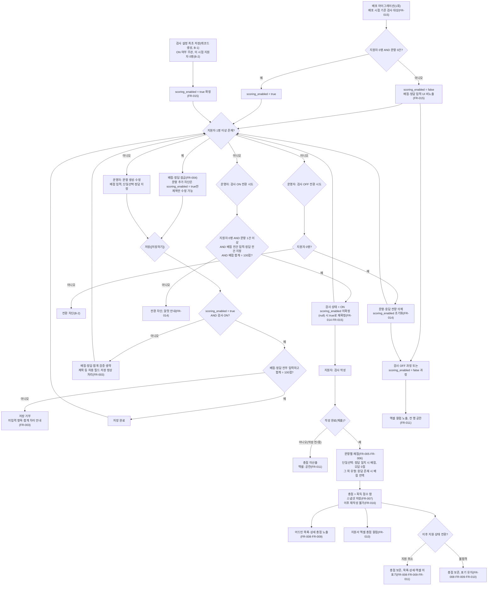

# 과정 적합성 검사 — 채점 기능 기능정의서

## 변경 이력

| 버전 | 날짜 | 변경 요약 | 사유 |
|------|------|-----------|------|
| 1.0 | 2026-08-10 | 최초 작성. 교육팀 확정 요청서를 기능 요구사항(FR-001~015)으로 전환 | 내부 검토 — 교육팀 회의 확정 사항 반영, 기능정의서 착수 |
| 1.1 | 2026-08-10 | 기존 문항(배점 없음) 검증·백필 제외 명시, FR-008·FR-009 미적용 과정 분기, FR-011·FR-013 우선순위 상향, 지원자 수 판정 기준 승계 표기, 지원 취소 총점 보존 명시 등 반영 | 내부 검토 |
| 1.2 | 2026-08-10 | §8 확인 필요 사항 5건에 대한 PM 결정 반영(8-1·8-2·8-3·8-5 확정, 8-4 개발팀 검토 이관), FR-004·FR-015 예외 문구 및 §7·§9 보강 | 내부 검토 |
| 1.3 | 2026-08-10 | PM 답변("부분응답 없음")으로 잠금 시점 기준 표현 차이 해소. FR-004 예외·미결사항 정리, §8 잔여 확인 사항 1건으로 축소 | 내부 검토 |
| 1.4 | 2026-08-10 | PM 결정(배점 총합 100점 고정) 반영 — FR-001 예외·FR-003 검증 항목 추가, §2 만점 정의·§4 데이터 항목·§7 제외 범위 수정, §8 확정 사항 1건 추가 | 내부 검토 |
| 1.5 | 2026-08-10 | 내부·외부 검토 지적 반영 — 채점 적용 대상 판정을 검사 단위 불변 플래그(exam.scoring_enabled)로 확정(FR-008·FR-009·FR-011·FR-015), FR-003 검증 로직 2단 구조 재정리 및 안내·이탈 경고 신설, FR-004 조건을 응답 존재 기준으로 단일화하고 문항 추가 잠금·지원 취소자 포함 판정 추가, 재작성(재제출) 서버측 차단 신규 FR-016 추가, 지원 취소·불합격 전환자 총점 표기 규칙 명확화(FR-008·FR-010·FR-011), §1·§2·§5·§6·§7·§8·§9 정정 | 내부 검토 |
| 1.6 | 2026-08-10 | 재검수 지적 반영 — 배점·정답·문항 추가 잠금 판정 축을 기존 문항 잠금과 동일한 지원자 수 기준으로 재통일(FR-004·FR-014·FR-015, §1·§6·§8-1·§8-7·§9), FR-015를 배포 마이그레이션 규칙과 런타임 규칙(레코드 생성 시점 확정)으로 분리해 최초 저장 경로 순환 해소, FR-003에 문항 0건 저장 예외 신설, §4 question.score 필수 조건 재정의 및 참조 FR 보강, §5 Mermaid 흐름 정합성 보완, FR-001 조건·FR-004 결과 표현 정정, §8-10 배포 전 결정 기한 표기 추가 | 내부 검토 |
| 1.7 | 2026-08-10 | 직전 개정이 만든 결함 해소 — 검사 ON 전환 조건(문항 1건 이상·배점 합계 100점)을 FR-003·FR-014에 신설해 문항 0건 저장 후 영구 고착 경로 차단, 배포 마이그레이션 대상을 "지원자 0명 AND 문항 0건"으로 축소(FR-015)해 기존 문항 보유 검사의 저장 거부 회귀 해소, "검사 레코드 생성 시점"·OFF 전환 시 scoring_enabled 초기화를 구조 정의로 확정(FR-014·FR-015), FR-008~011 지원 취소·불합격 표기 규칙을 FR-011 단일 기준(SSOT)으로 통합, §4 correct_choice 판정 축 통일, §5 Mermaid ON/OFF 전환 게이트 신설 및 고아·단절 노드 정리, §2·§8·§9 정합 재정리 | 내부 검토 |
| 1.8 | 2026-08-10 | 최종 검수 반려 건 해소 — FR-003 판정 축에 scoring_enabled를 추가해 마이그레이션 false 검사의 저장 영구 차단 회귀 해소(FR-003·§2·§5), FR-014 ON 전환 게이트에 배점 전건 입력·정답 전건 지정 조건을 추가해 영구 0점 문항 발생 경로 차단(FR-014·§5·§6·§8-11), scoring_enabled 재확정 조건을 미확정 또는 false로 확대(FR-014·§9), FR-004 문항 추가 차단 범위를 scoring_enabled = true 검사로 한정(FR-004·§6), FR-007 조건에 scoring_enabled = true 추가(FR-007·§4), FR-008에 적합성 검사 상태 표시 명문화, §4 exam.scoring_enabled 타입 nullable 명시, §8-9 소관·기한 지정, §5 Mermaid 고아·단절 노드 정리(H·OFF1·ON1·ON4·A3), §1 개요 보강 | 내부 검토 |
| 1.9 | 2026-08-10 | 최종 검수 조건부 통과 건 정정 — FR-014 회생 경로를 OFF 전환(플래그 null 초기화) 후 문항 재구성·ON 전환 확정 단일 경로로 정리하고 "이미 OFF 상태에서 조건 충족만으로 재확정"하는 경로를 삭제(FR-014·§4·§6·§5 ON4), FR-015 처리 2)에 scoring_enabled = null 상태는 배점·정답 입력 UI 비노출 대상이 아님을 명시(FR-015), 구제되지 않는 OFF+false 잔존 레코드는 §9 데이터 실사에서 개발팀과 처리 방안을 협의하도록 1줄 추가, §5 Mermaid H 노드에 문항 추가 차단이 scoring_enabled = true 검사에 한정됨을 명시, FR-001·FR-002 예외의 ON/OFF 1축 재서술을 삭제하고 FR-003 참조로 축약(DRY) | 내부 검토 |

---

## 1. 개요

과정 적합성 검사에 문항별 배점·정답 설정과 자동 채점 기능을 추가한다. 목적은 운영진이 지원자 검토·선발 과정에서 참고할 총점을 확보하는 것이며, 학생에게 점수를 제공하는 기능이 아니다. 적용 범위는 어드민 문항 설정, 채점 로직, 어드민 조회, 지원서 엑셀 다운로드다. 기존 문항 관리 정책(지원자 발생을 트리거로 한 잠금)은 유지하되, 잠금 대상 필드에 배점·정답·문항 추가를 더하고 저장 시점 배점 합계 검증(FR-003)을 신설한다. 검사를 ON으로 전환하려면 문항 배점 전건 입력·단일선택 정답 전건 지정·배점 합계 100점이 완료되어야 하는 ON 전환 게이트(FR-014)도 함께 신설한다. 지원자의 검사 작성·제출 플로우 자체는 변경하지 않는다.

---

## 2. 용어 정의

| 용어 | 정의 |
|------|------|
| 배점 | 운영자가 문항 생성·편집 시 설정하는 해당 문항의 최대 획득 가능 점수 |
| 정답 | 객관식 단일선택 문항에서 운영자가 지정하는 정오답 판정 기준 선택지 |
| 획득 점수 | 지원자 응답에 채점 규칙(FR-005·FR-006)을 적용해 문항별로 산정된 점수 |
| 총점 | 지원자가 획득한 문항별 획득 점수의 합계 |
| 만점 | 전체 문항 배점의 합. scoring_enabled = true인 ON 상태 검사는 ON 전환 조건(FR-014)에 의해 항상 문항 1건 이상·배점 합계 정확히 100점이 보장되므로, 만점 0점이거나 100점이 아닌 해당 검사는 존재할 수 없다. OFF 상태 검사와 scoring_enabled = false인 검사(ON 상태 포함)는 문항 구성이 자유로워 배점 합계가 100점 미만이거나 0건일 수 있다(FR-003). 학생·지원자 화면 및 지원서 엑셀에는 노출하지 않는다(§7 제외 범위 참조). 어드민 문항 설정 화면에서는 운영자가 배점을 배분할 수 있도록 현재 배점 합계(만점)를 노출한다 |

---

## 3. 기능 요구사항

### 3-1. 어드민 문항 설정

#### FR-001. 문항 배점 입력

- **우선순위**: Must
- **정책 근거**: 요청서(B-1) ① 문항 설정 시 배점 설정 가능 / 확정 정책(B-2) 문항 구성 — 운영자가 직접 작성 / PM 결정: "적합성 검사 문항별로 배점을 매겨서 총 문항의 합이 100점이 되도록 계산되면 된다"
- **트리거**: 운영자가 적합성 검사 문항 생성 또는 편집 화면에서 배점 필드에 값을 입력 후 저장
- **조건**: 해당 검사가 잠금 상태(FR-004)가 아닐 것
- **처리**: 입력값을 문항의 배점 필드에 저장. 문항 유형(단일선택/복수선택/선형배율/주관식)과 무관하게 모든 문항에 배점 입력란을 제공
- **결과**: 문항 배점 값 확정. 이후 채점 로직(FR-005·FR-006)의 배점 기준값으로 사용
- **예외**: 검증 조건은 FR-003을 따른다. 개별 문항 배점은 1 이상 정수다. ON 전환 자체의 조건(문항 1건 이상·합계 100점)은 FR-014 참조. 문항 수 상한 정책 여부는 §8 잔여 확인 사항 참조
- **미결사항**: 없음

#### FR-002. 단일선택 문항 정답 설정

- **우선순위**: Must
- **정책 근거**: 요청서(B-1) ① 객관식 단일선택 문항에 정답 설정 가능
- **트리거**: 운영자가 단일선택 유형 문항의 선택지 중 하나를 정답으로 지정 후 저장
- **조건**: 문항 유형이 객관식 단일선택일 것. 복수선택·선형배율·주관식은 정답 설정 UI 자체를 제공하지 않음
- **처리**: 지정된 선택지를 문항의 정답 필드에 저장
- **결과**: 이후 채점 로직(FR-005)에서 지원자 응답과 정답 필드를 비교해 정오답 판정
- **예외**: 검증 조건은 FR-003을 따른다
- **미결사항**: 없음

#### FR-003. 배점·정답 필수 입력 검증

- **우선순위**: Must
- **정책 근거**: [기획 판단] — 배점·정답이 지원자 발생 이후 잠금 대상(FR-004)에 편입되므로, 잠금 전 미입력 상태로 저장되면 해당 문항이 영구히 0점으로 고정된다. 이를 막기 위한 저장 시점 검증 / PM 결정: 전체 문항 배점의 합이 100점이 되도록 계산되어야 함(FR-001) / PM 결정(v1.5): 합계 불일치 시 저장 차단을 유지하되 안내를 강화하고, 미저장 상태 이탈 시 경고를 표시함 / PM 결정(A-1, v1.7): 검증 시점을 "검사 ON 여부"로 재정의한다 — 검사 OFF 상태는 문항을 준비하는 중간 저장 경로이므로 검증을 수행하지 않는다. 검사를 ON으로 전환하려면 문항 1건 이상·배점 합계 100점이 필수이며(전환 조건은 FR-014 참조), 이 게이트로 인해 ON 상태 검사는 저장 시점에도 항상 동일한 조건을 충족해야 한다. 문항 0건 저장은 OFF 상태에서만 허용된다 — v1.6의 "ON 전환 직후 문항 0건 허용" 경로는 검사 ON+문항 0건 상태로 지원자가 유입되면 문항 추가 불가(FR-004)·OFF 전환 불가(지원자 존재)로 영구 고착되는 결함이 있어 폐기한다 / PM 결정(A-1, v1.8): 판정 축에 exam.scoring_enabled를 추가한다 — "검사 ON 여부"만으로 판정하면 배포 마이그레이션으로 scoring_enabled = false가 된 ON 상태 검사(FR-015, 배점·정답 입력 UI 비노출 대상)까지 검증 대상에 포함되어, 입력 수단 없이 배점 합계 100점을 요구받아 저장이 영구 차단된다. scoring_enabled = false인 검사는 배점 개념 자체가 없으므로 ON 상태 여부와 무관하게 검증을 생략해야 한다
- **트리거**: 운영자가 적합성 검사 설정을 저장([저장하기]) 하는 시점. 검증은 이 저장 시점과 검사 ON 전환 시점(FR-014)에 수행하며, 문항 단위 저장 시점이 아니다. ON 전환 시점에는 조건 2)와 동일한 검증을 적용한다 — 전환 시점 자체는 아직 검사가 OFF 상태이지만, ON 전환 게이트(FR-014)는 조건 2)의 검증 항목(①②③)을 동일하게 적용한다
- **조건**: exam.scoring_enabled와 검사 ON/OFF 상태의 조합에 따라 다음과 같이 판정한다.
  1) scoring_enabled ≠ true 또는 검사 OFF — 배점·정답·합계 검증을 수행하지 않는다. 문항 0건을 포함해 문항을 준비하는 중간 저장을 자유롭게 허용하며, 제목 등 필드 단독 수정을 포함한 저장 요청을 정상 처리한다
  2) scoring_enabled = true 그리고 검사 ON — 저장 시점에 다음을 검증한다: ① 배점 미입력(전 유형) ② 정답 미지정(단일선택) ③ 배점 합계 ≠ 100점. 문항이 0건이면 합계가 0점이 되어 이 조건에서 자동으로 실패 처리된다(별도 분기 불필요). scoring_enabled = true인 검사는 FR-014의 ON 전환 게이트에 의해 ON 상태일 때 항상 문항 1건 이상·합계 100점 조건을 충족한 채로 존재하므로, 이 검증은 사실상 유지 확인 역할을 한다
- **처리**: 검증 실패 시 저장 요청을 거부한다. 배점·정답 미입력 필드가 있으면 어느 문항의 무엇이 비어 있는지 안내한다. 배점 합계가 100점이 아니면 현재 합계와 100점의 차이를 알럿으로 안내한다(예: "배점 합계가 95점입니다. 5점을 더 배정해야 저장할 수 있습니다"). 저장하지 않은 변경 사항이 있는 상태에서 페이지를 벗어나려 하면 이탈 경고를 표시한다
- **결과**: scoring_enabled ≠ true인 검사 또는 검사 OFF 상태는 문항 0건을 포함해 검증 없이 저장된다. scoring_enabled = true이고 검사가 ON인 경우에는 문항 1건 이상·배점(전 유형)·정답(단일선택)이 모두 입력되고 배점 합계가 정확히 100점인 구성만 저장된다. ON 전환 자체의 조건은 FR-014에서 정의한다
- **예외**: 없음
- **미결사항**: 없음

#### FR-004. 배점·정답·문항 추가 잠금(문항 수정 제한 확장)

- **우선순위**: Must
- **정책 근거**: 확정 정책(B-2) 문항 수정 제한(지원자 1명 이상 발생 시 본문·타입·삭제·순서 수정 불가, 제목만 수정 가능) + [기획 판단] 배점·정답을 동일 잠금 범위에 편입 + PM 결정(v1.5): 문항 추가도 동일 기준으로 불가 / 지원자 수 판정 기준은 §8-7 참조 / PM 결정(v1.6): 배점·정답·문항 추가의 잠금 판정 축을 기존 문항 잠금과 동일한 "지원자 수" 기준으로 재통일(응답 존재 기준 병용 회귀 수정) / PM 결정(B-4, v1.8): 문항 추가 차단은 scoring_enabled = true 검사에 한정한다 — 차단 근거(배점 합계 100점 고정 상태에서 재배분 불가)는 배점이 존재하는 검사에만 성립하며, 확정 정책(B-2)의 잠금 목록에도 문항 추가는 없다. scoring_enabled = false 검사(배포 시점 진행 중 과정 대다수)까지 이 제약을 적용하면 채점이 적용되지도 않는 과정의 기존 운영 동작을 축소하는 결과가 된다
- **트리거**: 해당 검사에 지원자가 1명 이상 존재하게 되는 시점
- **조건**: 해당 검사에 지원자가 1명 이상 존재할 것(지원자 수 판정 기준은 §8-7 참조). 잠금은 지원자 수가 0명으로 되돌아가지 않는 한 해제되지 않는다
- **처리**: 어드민 문항 편집 화면에서 배점·정답 입력 필드를 비활성화(disabled) 처리한다. 기존 잠금 대상(본문·타입·삭제·순서)과 동일한 방식을 적용한다. exam.scoring_enabled = true인 검사는 신규 문항 추가도 동일하게 차단한다 — 배점 합계가 100점으로 고정된 상태에서 문항을 추가하면 기존 배점 재배분이 불가능해 저장이 영구히 차단되기 때문이다. exam.scoring_enabled = false인 검사는 배점 개념이 없어 이 제약이 적용되지 않으며, 기존 운영 동작대로 지원자 발생 후에도 신규 문항 추가가 가능하다
- **결과**: 지원자 1명 이상 발생 이후 배점·정답 변경은 모두 불가하다(scoring_enabled = true 검사에 한함, false 검사는 배점·정답 필드 자체가 없음). 문항 추가는 scoring_enabled = true 검사에서만 지원자 1명 이상 발생 이후 불가하며, scoring_enabled = false 검사는 지원자 발생 후에도 계속 가능하다. 지원자 수가 0명인 상태에서는 문항 신규 작성이 가능하다. 지원자 수가 1명 이상에서 0명으로 되돌아가는 경로 자체는 이 문서 범위 밖이다 — §8-7에 따라 지원 취소자·불합격 전환자도 지원자 수에 포함되므로 개별 지원 취소만으로는 0명이 되지 않는다
- **예외**: 문항 제목 수정은 기존 정책대로 지원자 발생 후에도 가능하며 배점·정답 잠금과 무관하다. 참고로 적합성 검사는 부분 응답을 저장하지 않으므로(§8-1) 지원자 존재 시점과 응답 완료 시점이 사실상 동일하게 나타나지만, 이는 총점 산출 시점(FR-007)의 근거일 뿐 잠금 판정 축과는 무관한 별개 사실이다
- **미결사항**: 없음

### 3-2. 채점 로직

#### FR-005. 채점 로직 — 객관식 단일선택

- **우선순위**: Must
- **정책 근거**: 요청서(B-1) ② 문항 유형별 채점 기준
- **트리거**: 지원자가 적합성 검사를 작성 완료(제출)
- **조건**: 문항 유형이 객관식 단일선택
- **처리**: 지원자 응답 선택지와 문항의 정답 필드를 비교. 일치 시 해당 문항 배점 전액을 획득 점수로 산정, 불일치 시 0점
- **결과**: 문항별 획득 점수 확정
- **예외**: 해당 문항에 응답이 없는 경우(스킵 제출) 0점
- **미결사항**: 없음

#### FR-006. 채점 로직 — 복수선택·선형배율·주관식

- **우선순위**: Must
- **정책 근거**: 요청서(B-1) ② 문항 유형별 채점 기준
- **트리거**: 지원자가 적합성 검사를 작성 완료(제출)
- **조건**: 문항 유형이 객관식 복수선택, 선형배율, 주관식 중 하나
- **처리**: 응답 존재 여부만 판정한다. 응답이 1개 이상 존재하면(주관식은 공백·개행을 제외하고 trim 후 1자 이상) 응답 내용·선택값과 무관하게 문항 배점 전액을 획득 점수로 산정
- **결과**: 문항별 획득 점수 확정. 주관식 응답 내용에 대한 자동 평가는 수행하지 않으며, 운영진이 기존과 동일하게 응답 원문을 직접 확인한다
- **예외**: 해당 문항에 응답이 없는 경우(스킵 제출) 0점
- **미결사항**: 없음

#### FR-007. 총점 산출 및 저장

- **우선순위**: Must
- **정책 근거**: 요청서(B-1) 총점 = 각 문항 획득 점수의 합 + [기획 제안, 개발 검토 대기] 저장 시점·방식 + PM 결정(C-1, v1.8): 조건에 exam.scoring_enabled = true를 추가한다 — 플래그 언급이 없으면 scoring_enabled = false 과정도 총점 0점이 산출·저장되며, §9 롤백 조항이 total_score 보존을 명시하므로 향후 노출 시 0점이 드러날 수 있다
- **트리거**: 지원자의 적합성 검사 상태가 '작성 완료'로 전환되는 시점(제출 처리)
- **조건**: 검사 상태가 '작성 완료'이며 exam.scoring_enabled = true인 과정일 것
- **처리**: FR-005·FR-006에서 산정한 문항별 획득 점수를 합산해 총점을 계산하고, 해당 지원자의 제출 데이터에 스냅샷으로 저장한다(기획 제안, 확정 아님) [개발 검토 필요 — 저장 필드·위치·스냅샷 방식 채택 여부]
- **결과**: 총점 값 확정. 저장 이후 문항 배점·정답이 변경되더라도(FR-004에 의해 원칙적으로 변경 불가) 저장된 총점은 재계산하지 않는다. 작성 완료 후 지원 취소로 전환돼도 저장된 총점은 보존한다. 단, 스냅샷 방식이 아닌 실시간 계산 방식이 채택될 경우 재계산 금지 조항은 재검토 대상이다
- **예외**: 검사 상태가 '작성 전'·'작성 중'인 지원자는 총점을 산출하지 않는다(값 없음). exam.scoring_enabled = false인 과정도 검사 상태와 무관하게 총점을 산출하지 않는다(값 없음)
- **미결사항**: 총점 저장 방식(스냅샷 vs 실시간 계산)은 개발팀 검토 후 확정 — §8 잔여 확인 사항 참조

### 3-3. 어드민 조회

#### FR-008. 어드민 지원자 목록 — 총점 노출

- **우선순위**: Must
- **정책 근거**: 요청서(B-1) ④ 점수 노출 정책(Admin 운영진 화면 노출) + PM 결정(B-5, v1.8): 총점과 함께 적합성 검사 상태를 노출한다 — 운영진이 총점 공란의 사유(미작성/채점 미적용/검사 OFF)를 목록에서 즉시 구분해야 하기 때문이다. 엑셀은 요청 원안대로 점수 1열만 유지한다(§7)
- **트리거**: 운영진이 훈련별 지원자 목록 화면에 진입
- **조건**: exam.scoring_enabled = true이며(FR-015), 지원자의 검사 상태가 '작성 완료'
- **처리**: 저장된 총점 값과 함께 적합성 검사 상태를 목록에 표시한다
- **결과**: 운영진이 지원자별 총점과 상태를 목록 단위로 확인
- **예외**: '작성 완료' 외 상태, 지원 취소 전환자, scoring_enabled = false 과정의 공란 표기 규칙은 FR-011을 따른다(이 규칙의 SSOT는 FR-011). 불합격으로 전환된 지원자는 작성 완료 시 저장된 총점을 그대로 표시한다(총점 표기 유지 — 지원 취소와 달리 지원 철회가 아닌 심사 결과이므로 검토 이력으로 남는 것이 자연스럽다)
- **미결사항**: 없음

#### FR-009. 어드민 지원자 상세 — 총점 확인

- **우선순위**: Must
- **정책 근거**: 요청서(B-1) ④
- **트리거**: 운영진이 지원자 상세(지원서·적합성 검사 응답) 화면에 진입
- **조건**: exam.scoring_enabled = true인 과정이며(FR-015), 지원자의 검사 상태가 '작성 완료'
- **처리**: 저장된 총점 값을 상세 화면에 노출한다. 문항별 응답 원문(주관식 포함)은 기존과 동일하게 조회 가능
- **결과**: 운영진이 총점과 응답 원문을 함께 검토
- **예외**: '작성 완료' 외 상태, 지원 취소 전환자, scoring_enabled = false 과정의 미노출 규칙은 FR-011을 따른다(이 규칙의 SSOT는 FR-011). 목록(FR-008)이 공란으로 "표시"하고 상세는 항목 자체를 "미노출"하는 방식 차이는 화면 구조상 의도된 차이다. 불합격으로 전환된 지원자는 작성 완료 시 저장된 총점을 그대로 노출한다(총점 표기 유지 — FR-008과 동일)
- **미결사항**: 없음

### 3-4. 지원서 엑셀 다운로드

#### FR-010. 지원서 엑셀 다운로드 — 총점 컬럼

- **우선순위**: Must
- **정책 근거**: 요청서(B-1) ③ 지원서 엑셀 다운로드
- **트리거**: 운영진이 훈련별 지원서 목록 엑셀 다운로드 실행
- **조건**: 없음(검사 ON/OFF 무관, FR-011 참조)
- **처리**: 기존 지원서 컬럼 중 지원상태 컬럼 다음 위치에 `적합성 검사 점수` 컬럼을 추가한다. 값은 지원자의 저장된 총점(작성 완료 건)만 표기하며, 문항별 점수는 포함하지 않는다
- **결과**: 엑셀 파일에 총점 컬럼 반영
- **예외**: 작성 완료가 아닌 건(지원 취소 포함)의 공란 처리 규칙은 FR-011을 따른다(이 규칙의 SSOT는 FR-011). 불합격으로 전환된 지원자는 작성 완료 시 저장된 총점을 그대로 표기한다(총점 표기 유지 — FR-008과 동일)
- **미결사항**: 없음

#### FR-011. 검사 OFF 과정 및 미완료·미적용 건의 엑셀 표기

- **우선순위**: Must
- **정책 근거**: [기획 판단] — 확정 정책(B-2) 훈련별 기본값 OFF, 작성 기간 제한 없음 / 미작성 불이익 없음 / PM 결정(§8-2): "작성 완료자에 한해서 점수를 준다"
- **트리거**: FR-010 실행 시점
- **조건**: 다음 중 하나에 해당하는 행
  (a) 해당 훈련의 적합성 검사가 OFF
  (b) 검사 ON, exam.scoring_enabled = true, 해당 지원자의 검사 상태가 '작성 전'·'작성 중'이거나 지원 상태가 '지원 취소'
  (c) 검사 ON, exam.scoring_enabled = false(해당 과정의 모든 지원자, 작성 완료 포함)
- **처리**: 위 조건에 해당하는 행은 `적합성 검사 점수` 컬럼 값을 공란으로 출력한다. 검사 OFF 과정과 scoring_enabled = false 과정도 컬럼 자체는 동일하게 노출한다(전 과정 엑셀 양식 일치)
- **결과**: 검사 미사용 과정과 미완료 지원자를 0점과 구분해 최저점 지원자로 오독되지 않도록 한다. 이 조건은 FR-008·FR-009·FR-010의 총점 공란·미노출 판정 기준(SSOT)이다
- **예외**: 없음
- **미결사항**: 없음

### 3-5. 권한·노출 통제

#### FR-012. 학생·지원자 화면 및 API 비노출

- **우선순위**: Must
- **정책 근거**: 요청서(B-1) ④ 비노출 대상(지원 완료 화면, 마이페이지, 기타 사용자 화면 전체)
- **트리거**: 지원자·학생이 지원 완료 화면, 마이페이지, 검사 작성 화면 등 사용자 화면에 접근하거나 관련 API를 호출
- **조건**: 요청 주체가 학생·지원자 권한
- **처리**: 총점·문항별 획득 점수·배점 값을 응답 데이터에 포함하지 않는다. 검사 작성 화면에도 문항 배점을 표기하지 않는다 [기획 판단]
- **결과**: 학생·지원자는 어떤 경로로도 자신의 총점·문항별 점수·배점을 확인할 수 없다
- **예외**: 운영진(Admin) 권한 경로는 예외이며 FR-008·FR-009·FR-010·FR-013에서 별도 정의
- **미결사항**: 없음

#### FR-013. 어드민 열람 권한 범위

- **우선순위**: Must
- **정책 근거**: [기획 판단] — 총점은 지원서 응답에서 파생된 값으로 원본 응답보다 높은 등급의 권한을 부여할 근거가 없음 / PM 결정(§8-5): "어드민에서만 보여지게 할 예정임. 별도 권한 불필요"
- **트리거**: 어드민 사용자가 지원자 목록·상세·엑셀 다운로드에 접근
- **조건**: 없음
- **처리**: 기존 지원서 열람 권한 범위를 총점 조회·엑셀 다운로드 권한에 동일 적용한다(별도 권한 신설 없음)
- **결과**: 기존 지원서를 열람할 수 있는 어드민 사용자는 총점도 동일하게 열람 가능
- **예외**: 없음
- **미결사항**: 없음

### 3-6. 데이터 정합성

#### FR-014. ON/OFF 전환에 따른 배점·정답 데이터 처리

- **우선순위**: Must
- **정책 근거**: 확정 정책(B-2) ON/OFF 변경(지원자 0명일 때만 가능, OFF 전환 시 문항 정의 + 응답 데이터 전량 삭제) + [기획 판단] 배점·정답은 문항 정의의 일부 + PM 결정(A-1): ON 전환 조건으로 문항 1건 이상·배점 합계 100점을 필수화. 조건 미충족 시 전환을 차단하고 사유를 알럿으로 안내한다. 문항 0건 저장은 검사 OFF 상태에서만 허용된다(FR-003) — OFF/ON 전환이 지원자 0명일 때만 가능하다는 B-2 제약과 맞물려, ON 전환 시점에는 항상 문항 편집이 자유로우므로 문항 0건 상태로 ON 전환 후 고착되는 경로가 원천 차단된다 + 구조 정의(B-2): OFF 전환 시 exam.scoring_enabled 값도 함께 초기화한다 + PM 결정(A-2, v1.8): ON 전환 검증 항목을 FR-003 조건 2)의 검증 항목(①배점 전건 입력 ②단일선택 정답 전건 지정 ③배점 합계 100점)과 동일하게 맞춘다 — 배점·합계만 검증하면 정답 미지정 문항이 ON 상태로 유입될 수 있고, 지원자 발생 후에는 FR-004 잠금으로 정답을 영구히 지정할 수 없는 "영구 0점 문항"이 발생한다 + PM 결정(B-3, v1.9): scoring_enabled 재확정 경로는 OFF 전환(플래그 null 초기화 + 문항 전량 삭제) 후 문항을 재구성해 ON 전환 조건을 충족하는 단일 경로로 한정한다 — OFF 전환 없이 false 상태에서 곧바로 ON 전환 조건 충족만으로 재확정하는 경로는 scoring_enabled = false 검사에서 배점·정답 입력 UI 자체가 노출되지 않아(FR-015) 성립하지 않는다
- **트리거**: 운영자가 지원자 0명 상태에서 검사를 ON 또는 OFF로 전환
- **조건**:
  - 공통 — 지원자 수 0명일 것(지원자 수 판정 기준은 §8-7 참조 — 지원 취소자·불합격 전환자 포함). 이들이 지원자 수에 남아 있으면 0명으로 판정하지 않는다
  - ON 전환 — 공통 조건에 더해 문항이 1건 이상이고, 배점이 전 문항에 입력되어 있고, 단일선택 문항은 정답이 전건 지정되어 있고, 배점 합계가 정확히 100점일 것(FR-003 조건 2와 동일)
  - OFF 전환 — 공통 조건 외 문항 구성 상태에 대한 추가 조건 없음
- **처리**:
  - ON 전환 — 조건 충족 여부를 확인한다. 미충족 시 전환을 차단하고 사유를 알럿으로 안내한다(예: "문항을 1건 이상 등록하고, 배점과 단일선택 정답을 모두 입력하고, 배점 합계를 100점으로 맞춰야 검사를 켤 수 있습니다"). 충족 시 검사 상태를 ON으로 전환한다. 이때 exam.scoring_enabled이 미확정(null) 상태였다면 이 시점에 true로 재확정한다 — ON 전환은 지원자 0명을 전제하므로(B-2), 레코드 생성 시점(FR-015, B-1)과 동일한 논리로 값은 항상 true다
  - OFF 전환 — 기존 정책에 따라 문항 정의(제목·본문·유형·선택지·순서) 및 응답 데이터를 전량 삭제하며, 배점·정답 값도 문항 정의의 일부로 함께 삭제한다. 동시에 exam.scoring_enabled 값을 초기화(미확정 상태로 되돌림)한다
- **결과**: OFF 전환 후 재설정 시 배점·정답을 신규로 입력해야 한다. exam.scoring_enabled은 OFF 전환 시 초기화되고 재-ON 전환 시점에 true로 재확정된다(FR-015 참조) — 이미 문항이 구성돼 scoring_enabled = false로 고정된 검사는 OFF 전환(플래그 null 초기화 + 문항 전량 삭제) 후 문항을 새로 구성하고 ON 전환 조건을 충족해야 true로 재확정되는 단일 경로만 존재한다. 검사가 이미 OFF 상태라 OFF 전환 자체를 적용할 수 없는 레코드의 처리는 §9 배포 전 데이터 실사를 따른다
- **예외**: OFF 전환 액션 자체는 FR-003의 배점 합계 검증 대상이 아니다. 문항 전량 삭제로 합계가 0점이 되더라도 OFF 전환은 차단되지 않는다
- **미결사항**: 없음

#### FR-015. 기능 적용 대상 판정 — exam.scoring_enabled 플래그

- **우선순위**: Must
- **정책 근거**: 확정 정책(B-2) 문항 수정 제한 + [기획 판단] 소급 적용 범위 + PM 결정(v1.5): 판정 기준을 검사 단위 불변 플래그로 확정 + PM 결정(v1.6): 플래그 확정 시점을 "검사 레코드 생성 시점"으로 이동, 배포 시점 마이그레이션 규칙 별도 신설 + 구조 정의(B-1): "레코드 생성 시점 = 운영자가 해당 훈련의 적합성 검사 설정을 처음 저장하는 시점(검사 ON 여부 무관)"으로 확정한다. 이 시점에 지원자가 존재할 수 없는 근거는 확정 정책(B-2)의 ON/OFF 제약(지원자 0명일 때만 전환 가능)이다 + PM 결정(A-2, v1.7): 배포 마이그레이션 대상을 "지원자 0명 AND 문항 0건"인 검사로 축소한다 — v1.6 방식(지원자 0명이면 일괄 true)은 이미 문항이 구성돼 있고 배점이 없는 검사까지 true로 잡아, 제목 한 글자만 고쳐도 FR-003 검증에 걸려 저장이 거부되는 회귀(v1.1에서 막았던 문제)를 재발시켰다
- **트리거**: (1) 배포 마이그레이션 — 이 기능 배포 시점에 1회. (2) 레코드 생성 — 배포 이후 운영자가 해당 훈련의 적합성 검사 설정을 처음 저장하는 시점(B-1 정의, ON 여부 무관). (3) 재확정 — FR-014 OFF→ON 재전환 시점(OFF 전환으로 초기화된 플래그를 재확정)
- **조건**: (1) 배포 마이그레이션은 배포 시점에 이미 존재하는 전체 검사를 대상으로 한다. (2) 레코드 생성 규칙은 배포 이후 신규 생성되는 모든 검사에 적용된다. (3) 재확정은 FR-014의 ON 전환 조건(지원자 0명·문항 1건 이상·합계 100점)을 충족한 시점에 적용된다
- **처리**:
  1) 배포 마이그레이션 — 배포 시점에 존재하는 전체 검사를 대상으로 지원자 수(§8-7 판정 기준)와 문항 수를 함께 조회한다. 지원자가 0명이고 동시에 문항도 0건인 검사만 exam.scoring_enabled = true로 세팅한다. 그 외(지원자 1명 이상이거나, 지원자는 0명이나 문항이 이미 1건 이상 구성된 검사)는 false로 설정한다. 문항이 이미 구성된 채로 배점 없이 true를 세팅하면 이후 사소한 저장도 FR-003에 의해 거부되므로 이를 방지하기 위함이다. 배치 처리 [개발 검토 필요]
  2) 레코드 생성 규칙 — 배포 이후 신규 생성되는 검사는 레코드 생성 시점(B-1 정의)에 exam.scoring_enabled = true로 확정한다. 이 시점에는 지원자가 존재할 수 없으므로(B-2) 값은 항상 true이며, 이후 지원자 발생·검사 상태 변화·저장 요청과 무관하게 불변이다(단, FR-014 OFF 전환에 의한 초기화·재확정은 예외). 문항의 score 필드 존재 여부로 적용 대상을 판정하는 방식은 채택하지 않는다 — 배점을 일부만 입력한 중간 상태에서 판정이 흔들리기 때문이다. scoring_enabled = false인 검사는 어드민 문항 편집 화면에서 배점·정답 입력 UI 자체를 노출하지 않는다(필드가 보이면 운영자가 값을 입력하고 저장을 시도하다 FR-003에 의해 차단되는데 사유를 알 수 없다). scoring_enabled이 null(미확정)인 검사는 이 비노출 대상이 아니며 배점·정답 입력 UI를 노출한다 — OFF 전환 직후처럼 플래그가 아직 확정되지 않은 상태에서도 문항을 구성하고 ON 전환 조건(FR-014)을 충족할 수 있어야 하기 때문이다
  3) 재확정 — FR-014 참조. OFF 전환으로 초기화된 플래그는 재-ON 전환 조건 충족 시점에 true로 재확정된다. 이미 문항이 구성돼 scoring_enabled = false로 고정된 검사도 이 경로로 채점을 회생시킬 수 있다(FR-014의 회생 경로)
- **결과**: 배포 시점에 지원자·문항이 모두 없던 과정과 배포 이후 신규 개설되는 과정은 exam.scoring_enabled = true로 설정되어 배점·정답 입력과 채점이 적용된다. 배포 시점에 지원자가 있거나 문항이 이미 구성된 진행 중 과정은 exam.scoring_enabled = false로 고정되며, 검사 OFF 과정과 동일하게 엑셀 총점 컬럼을 공란 처리한다(FR-011). FR-003·FR-007·FR-008·FR-009·FR-011의 판정 조건은 모두 이 플래그를 참조한다. scoring_enabled = false 과정에 채점이 적용되지 않는다는 사실은 어드민 화면에 안내 문구·배지·툴팁 등 시스템 UI로 표시하지 않으며, 관련 부서 운영 안내로 갈음한다(§7 제외 범위, §9 참조)
- **예외**: 없음
- **미결사항**: 없음

### 3-7. 재작성 제한

#### FR-016. 작성 완료자 재작성(재제출) 제한

- **우선순위**: Must
- **정책 근거**: PM 결정(v1.5) — 작성 완료자의 재작성(재제출) 불가 / FR-007 "저장 후 재계산하지 않는다"와 정합
- **트리거**: 검사 상태가 이미 '작성 완료'인 지원자가 검사 작성 화면 재진입 또는 재제출을 시도
- **조건**: 지원자의 검사 상태 = '작성 완료'
- **처리**: 진입점(수강신청 페이지 작성하기, 내강의실 등)에서 작성 완료자에게 재작성 진입 버튼을 노출하지 않는 기존 정책(§6 참조)에 더해, 서버 측에서도 이미 '작성 완료' 상태인 지원자의 재제출 요청을 차단한다 — 진입점 비노출만으로는 우회 접근(직접 API 호출 등)을 막을 수 없다
- **결과**: 작성 완료 후 저장된 응답과 총점(FR-007)은 변경되지 않는다
- **예외**: 없음
- **미결사항**: 없음

---

## 4. 데이터 항목

| 필드명 | 타입 | 필수 | 설명 | 비고 |
|--------|------|------|------|------|
| exam.scoring_enabled (채점 적용 여부) | Boolean, nullable | Y(단, 미확정 상태는 null로 허용 — OFF 전환 직후 재확정 전까지) | 해당 검사의 채점 기능 적용 대상 여부 | 신규 필드. 신규 검사는 레코드 생성 시점(B-1 정의)에 true로 확정. 배포 시점에 이미 존재하던 검사는 배포 마이그레이션(1회)에서 "지원자 0명 AND 문항 0건"인 검사만 true, 그 외는 false로 세팅(A-2, FR-015). OFF 전환 시 null로 초기화, 재-ON 전환 조건(문항·배점·정답·합계) 충족 시 미확정(null) 상태를 true로 재확정하는 단일 경로만 존재한다(FR-014). false 고정 레코드의 처리는 §9 배포 전 데이터 실사를 따른다. 참조: FR-003·FR-004·FR-007·FR-008·FR-009·FR-011·FR-014·FR-015 [개발 검토 필요 — 플래그 저장 위치] |
| question.score (배점) | Integer | scoring_enabled = true 검사의 문항 전건 Y / scoring_enabled = false 검사 해당 없음 | 문항 배점(1 이상 정수) | 신규 필드. FR-001·FR-003·FR-015. 전체 문항 합계 100점 제약. scoring_enabled = true이고 검사가 ON이면 저장 시점에 항상 검증(FR-003), 그 외(OFF 또는 scoring_enabled ≠ true)는 검증 생략 |
| question.correct_choice (정답) | 선택지 참조 | scoring_enabled = true 검사의 단일선택 문항 전건 Y / scoring_enabled = false 검사 해당 없음 | 단일선택 문항 정답 선택지 | 신규 필드. FR-002·FR-003. scoring_enabled = false 검사는 정답 입력 UI 자체를 노출하지 않는다(FR-015) |
| submission.total_score (총점) | Integer, nullable | 작성 완료 및 exam.scoring_enabled = true인 경우에만 값 존재 | 지원자별 총점 스냅샷 | 신규 필드. FR-007, 작성 완료 시점 저장 후 재계산하지 않음. scoring_enabled = false 과정은 산출하지 않음(값 없음). 기존 제출 건은 값 없음으로 유지 [개발 검토 필요 — 저장 위치] |
| submission.question_score (문항별 획득 점수) | Integer, nullable | N | 총점 산출용 내부 값 | 신규 필드. 화면·엑셀에 노출하지 않음(FR-008~010) [개발 검토 필요 — 문항별 저장 여부] |
| excel.적합성_검사_점수 | Integer 또는 공란 | - | 지원서 엑셀 신규 컬럼 | FR-010·FR-011 |

---

## 5. 상태 및 흐름

---

## 6. 정책 준수 사항

| 확정 정책(B-2) | 이 기능에 대한 동작 제약 |
|---|---|
| 훈련별 기본값 OFF | 검사 OFF 과정은 채점 기능도 동작하지 않으며, 엑셀 컬럼은 노출하되 전 행 공란 처리(FR-011) |
| 작성 가능 대상(검토전·예비합격·합격, 불합격 제외) | 총점도 동일 대상 범위에서만 발생. 다만 작성 완료 후 불합격으로 전환된 지원자는 이미 응답이 존재하므로 저장된 총점을 그대로 유지·표기한다(FR-008·FR-009·FR-010) — 지원 취소와 달리 지원 철회가 아닌 심사 결과이므로 검토 이력으로 남는 것이 자연스럽다 |
| 작성 기간 제한 없음 / 미작성 시 불이익 없음 | 미작성 건을 0점으로 표기하지 않고 공란 처리(FR-011)해 불이익으로 오독되지 않도록 함 |
| 상태값(작성 전 / 작성 중 / 작성 완료 / 지원 취소) | 총점 산출 시점을 '작성 완료'로 한정(FR-007). 지원 취소는 검사 상태와 별도 축인 지원 상태값이며, 작성 완료자가 지원을 취소해도 검사 상태(작성 완료)는 유지된 채 지원 상태만 별도로 전환된다. 작성 완료 후 지원 취소로 전환된 건은 저장된 총점을 보존하되 화면·엑셀에는 표기하지 않는다(FR-011 SSOT, FR-008·FR-009에서 참조) |
| 문항 구성 — 어드민에서 운영자가 직접 작성 | 배점·정답도 동일하게 운영자가 문항 설정 화면에서 입력(FR-001·FR-002) |
| 문항 수정 제한(지원자 1명 이상 시 본문·타입·삭제·순서 잠금, 제목만 수정 가능) | 배점·정답을 동일 잠금 범위에 편입하고, exam.scoring_enabled = true인 검사는 지원자 1명 이상 발생 시 문항 추가도 함께 잠근다(FR-004). scoring_enabled = false 검사는 문항 추가 제약이 없다 |
| ON/OFF 변경(지원자 0명일 때만, OFF 전환 시 문항 정의 + 응답 데이터 전량 삭제) | 배점·정답도 문항 정의의 일부로 함께 삭제하고 exam.scoring_enabled 값을 초기화(null)한다. ON 전환은 추가로 문항 1건 이상·배점 전건 입력·단일선택 정답 전건 지정·배점 합계 100점을 요구하며(FR-003 조건 2와 동일), 미확정(null)이었던 값을 이 시점에 true로 재확정한다(FR-014) |
| 사용자 진입점(수강신청 페이지 작성하기 / 내강의실 미작성 확인 팝업 / 작성 완료자 비노출) | 변경 없음. 채점 기능은 기존 진입점·작성 플로우에 영향을 주지 않는다. 작성 완료자의 재작성은 진입점 비노출에 더해 서버 측에서도 차단한다(FR-016) |

---

## 7. 제외 범위

| 제외 항목 | 사유 |
|---|---|
| 주관식 응답 내용 자동 평가(AI 채점 등) | 요청서(B-1) 명시 — 운영진이 직접 확인 |
| 학생·지원자 화면·API 상 총점·문항별 점수·배점 노출 | 요청서(B-1) 노출 정책상 명시적 배제 |
| 엑셀 문항별 점수 컬럼, 만점 별도 컬럼 | 요청서(B-1) "총점만 표시" 원칙. 컬럼 확장은 요청 범위 밖. 만점은 100점으로 고정되므로(FR-001) 별도 컬럼으로 노출할 필요가 없다 |
| 엑셀 컬럼명 변경 | 요청서(B-1) 예시 컬럼명(`적합성 검사 점수`)을 그대로 사용 |
| 엑셀 적합성 검사 상태 컬럼(OFF·미작성·미적용 공란 사유 구분) | 요청 원안 — 점수 컬럼 1열만 유지. 공란이 검사 OFF·미작성·채점 미적용 중 무엇인지 구분하는 별도 컬럼은 요청 범위 밖 |
| 진행 중(지원자 기발생) 과정에 대한 소급 채점 | 문항 수정 제한 정책상 지원자 발생 후 문항 정의 변경 불가(FR-015) |
| 진행 중 과정 미적용에 대한 어드민 안내 UI | PM 결정 — 시스템 UI 표시 대신 관련 부서 운영 안내로 갈음(FR-015) |
| 개인정보 처리방침·동의 문구 개정, 보관·파기 기준 | 법무 소관 별도 트랙. 이 기획서는 기능 동작만 정의 |
| 지원자 대상 채점 사실 고지 문구 추가 | 요청서에 없는 항목. 학생 화면 변경은 이번 범위 밖 |
| 채점 기능 단독 ON/OFF 토글 | 요청서에 없음. 검사 ON/OFF 설정에 종속 |
| 신규 문항 유형 추가, 문항 내용 개편 | 채점 기능과 별개 과제 |

---

## 8. 확정된 정책 결정 및 잔여 확인 사항

기획 판단으로 채웠던 항목 중 승인이 필요했던 사항에 대해 PM 결정이 순차적으로 확정됐다. 확정 사항은 아래 표(8-1~8-3, 8-5~8-7, 8-11~8-12)와 같으며, 결정값은 §3 기능 요구사항에 반영돼 있다. 잔여 확인 사항은 4건(8-4·8-8·8-9·8-10)이며, 8-10은 이번 개정에서 "총점 표기 복귀 규칙"으로 범위를 좁혔다(잠금 복귀는 §8-7로 이미 답이 나와 있어 별도 결정 불요).

### 확정 사항

| # | 항목 | 확정값 | 근거 |
|---|------|--------|------|
| 8-1 | 배점·정답을 문항 수정 잠금(지원자 1명 이상 발생 시) 대상에 포함할 것인가 | 확정 — 포함(FR-004) | PM 결정: "제출 완료 후 수정은 못한다". 확정 정책(B-2)의 문항 수정 제한 취지는 지원자 발생 후 문항 정의를 고정하는 것이며, 배점·정답도 문항 정의의 일부다. 적합성 검사는 부분 응답을 저장하지 않으므로 지원자 발생 시점과 제출 완료 시점이 동일하다 |
| 8-2 | 미작성·작성 중 건의 엑셀 표기를 0점으로 할 것인가, 공란으로 할 것인가 | 확정 — 공란, 작성 완료자에 한해서만 점수 부여(FR-007·FR-011) | PM 결정: "작성 완료자에 한해서 점수를 준다로 접근하면 될 것 같음" |
| 8-3 | 이미 지원자가 발생한 진행 중 과정에도 채점 기능을 적용할 것인가 | 확정 — 미적용, 신규 개설 과정부터 적용(FR-015). 어드민 UI 안내는 미구현, 관련 부서 운영 안내로 갈음 | PM 결정: "상관없을 것 같다. 반드시 분기 처리할 필요는 없다고 생각함. 지원자들에게 보여지는 정보가 아니기 때문에 관련 부서에 안내만으로 충분히 설득 가능" |
| 8-5 | 어드민 내 총점 열람 권한 범위를 어떻게 정할 것인가 | 확정 — 기존 지원서 열람 권한과 동일, 별도 권한 신설 없음(FR-013) | PM 결정: "어드민에서만 보여지게 할 예정임. 별도 권한 불필요" |
| 8-6 | 배점 총합(만점) 기준을 어떻게 정할 것인가 | 확정 — 합계 100점 고정, 불일치 시 저장 차단(FR-001·FR-003) | PM 결정: "문항별로 배점을 매겨서 총 문항의 합이 100점이 되도록 계산되면 된다" |
| 8-7 | 지원자 수 판정 시 지원 취소자·불합격 전환자를 포함할 것인가 | 확정 — 포함(FR-004·FR-014·FR-015, §4 exam.scoring_enabled). 이 기준이 배점·정답·문항 추가 잠금(FR-004), OFF 전환 가능 여부(FR-014), scoring_enabled 판정(FR-015)에 공통 적용되는 지원자 수의 정의다 | PM 결정(v1.5): 미포함 시 전원 지원 취소 시점에 지원자 0명으로 판정돼 검사 OFF 전환이 열리고 문항·응답·저장된 총점이 전량 삭제되는 문제를 방지하기 위함 |
| 8-11 | 검사 ON 전환 시 문항·배점 요건을 둘 것인가 | 확정 — ON 전환 조건으로 문항 1건 이상·배점 전건 입력·단일선택 정답 전건 지정·배점 합계 100점 필수(FR-003·FR-014, 검증 항목은 FR-003 조건 2와 동일). 미충족 시 전환 차단, 사유 알럿 안내. 문항 0건 저장은 scoring_enabled ≠ true 이거나 검사 OFF 상태에서만 허용 | PM 결정(A-1) — 문항 0건 상태로 검사가 ON 전환된 뒤 지원자가 유입되면 문항 추가 불가(FR-004)·OFF 전환 불가(지원자 존재)로 영구 고착되는 경로를 원천 차단하기 위함. OFF/ON 전환은 지원자 0명일 때만 가능(B-2)하므로 ON 전환 시점엔 항상 문항 편집이 자유롭다. PM 결정(A-2, v1.8) — 정답 미지정 문항이 게이트를 통과해 지원자 유입 후 FR-004 잠금으로 영구 0점이 되는 결함을 막기 위해 정답·배점 전건 검증을 게이트에 동일 적용한다 |
| 8-12 | 배포 마이그레이션 시 scoring_enabled = true 대상 범위를 어떻게 정할 것인가 | 확정 — 지원자 0명이고 문항도 0건인 검사만 true, 그 외는 false(FR-015) | PM 결정(A-2) — 문항이 이미 구성된 검사를 true로 잡으면 배점 미입력 상태로 인해 제목 수정 등 사소한 저장도 거부되는 회귀(v1.1에서 막았던 문제)가 재발한다. 채점 적용이 필요하면 검사를 껐다(문항 전량 삭제) 다시 켜는 회생 경로로 처리한다(FR-014) |

### 잔여 확인 사항

| # | 항목 | 현재 판단값 | 소관 |
|---|------|-------------|------|
| 8-4 | 총점을 작성 완료 시점에 스냅샷으로 저장할 것인가, 조회 시마다 계산할 것인가 | 기획 제안: 스냅샷 저장(FR-007). 확정 아님. 결정 기한: 개발 착수 전 | 개발팀 |
| 8-8 | 검사 응시 화면의 문항별 필수/선택 응답 규칙(스킵 제출 가능 여부), 선형배율 문항의 초기 선택값 유무 | 미정 — FR-005·FR-006의 스킵 제출 시 0점 예외가 실제로 도달 가능한 경로인지에 영향. 결정 기한: 개발 착수 전 | 개발팀 |
| 8-9 | 문항 수 상한 정책 여부(배점 1 이상 정수·합계 100점 고정 조건상 101문항 이상은 저장이 수학적으로 불가능) | 미정 — 기존 문항 수 제한 정책의 문서화 여부 확인 필요. 결정 기한: 배포 착수 전 | 기획 |
| 8-10 | 지원 취소 철회 시 총점 표기 복귀 규칙 | 미정 — FR-008·FR-009·FR-010의 공란 표기가 총점 표기로 복귀하는지 여부. 잠금 복귀는 §8-7(취소자도 지원자 수에 포함)로 이미 답이 나와 있어 대상이 아니다(철회해도 지원자 수가 변하지 않으므로 FR-004 잠금은 유지). 결정 기한: 배포 착수 전 | 기획 |

---

## 9. 개발·디자인 전달 시 주의사항

- FR-004·FR-014는 기존 문항 수정 제한 로직의 잠금 판정 범위(대상 필드 목록)에 배점·정답·문항 추가를 더하는 확장 작업이다. 신규 잠금 체계가 아니라 기존 로직 재사용을 우선 검토한다. 잠금 판정 자체는 별도 데이터 필드로 관리하지 않는다 [개발 검토 필요]
- FR-004·FR-014·FR-015의 지원자 수 판정은 카운트 대상 범위(지원 취소자·불합격 전환자 포함, §8-7)가 동일하다. 다만 평가 시점은 다르다 — FR-015는 배포 시점 1회 마이그레이션과 레코드 생성 시점(또는 FR-014 OFF→ON 재확정 시점) 1회 확정만 수행하는 반면, FR-004·FR-014는 런타임에 상시 판정한다. 동일 함수 하나로 통합 처리할 수 없다. 기존 문항 잠금 로직에 이 기준이 이미 구현돼 있는지 개발 확인이 필요하다
- FR-007 총점 저장 방식(작성 완료 시점 스냅샷 vs 조회 시 실시간 계산)은 개발팀 검토 후 확정한다. 기획 제안은 스냅샷이며, 실시간 계산 방식을 채택할 경우 FR-007 결과의 재계산 금지 조항을 재검토해야 한다. 스냅샷 방식 채택 시 저장 위치·트리거는 개발 설계 영역이며, 저장 시점은 검사 상태가 '작성 완료'로 전환되는 그 시점으로 고정한다
- FR-007의 총점 보존(지원 취소 전환 후에도 삭제하지 않음)은 지원 취소 철회 시 총점 표기를 복원하기 위한 목적이다. 복귀 세부 규칙은 §8-10(미정, 배포 착수 전 결정) 참조
- 배포 시 진행 중 과정(exam.scoring_enabled = false)에는 채점 기능(배점·정답 입력, 총점 산출)이 적용되지 않는다는 점을 운영 부서에 사전 안내해야 한다. 어드민 화면에는 별도 안내 UI를 두지 않는다(FR-015, §7 참조)
- FR-009 어드민 지원자 상세 화면에서 문항별 획득 점수의 별도 표기 여부는 이 문서에서 정의하지 않는다. 화면 요소·레이아웃은 화면정의서 영역이다
- FR-011 엑셀 공란 처리는 검사 OFF·지원 취소·미완료·scoring_enabled = false 등 여러 조건을 포함한다. 이를 하나의 분기 로직으로 처리할 수 있는지 개발 검토가 필요하다
- '작성 중' 상태값의 판정 기준은 이 문서에서 정의하지 않는다 — §8-1에 따르면 적합성 검사는 부분 응답을 저장하지 않으므로, '작성 중' 상태가 실제로 무엇을 근거로 판정되는지 개발 확인이 필요하다
- FR-015 배포 마이그레이션 배치가 중도 실패한 경우의 재실행·롤백 규칙은 이 문서에서 정의하지 않으며 개발 설계 시 결정한다
- 배포 전 데이터 실사: 검사 OFF 상태(exam.scoring_enabled 미확정 또는 false)인데 문항이 잔존하는 레코드가 존재하는지 확인한다 [개발 검토 필요]. 해당 레코드가 존재할 경우 처리 방안을 개발팀과 협의한다
- 운영자는 문항 제목에 배점·점수를 표기하지 않는다(운영 규칙) — 제목은 응답 발생 후에도 수정 가능하므로, 제목에 배점을 표기하면 FR-012의 학생·지원자 대상 배점 비노출 정책이 사실상 무력화된다
- 이 기획서의 FR-001~FR-016은 전건 Must이며 동시 배포를 전제로 한다. 일부 FR만 우선 배포하는 릴리스 절단선은 두지 않는다
- 배포 후 채점 기능을 회수(롤백)하는 경우 이미 저장된 submission.total_score 값은 삭제하지 않고 유지한다. 조회 화면·엑셀 노출 여부는 기능 회수 시점의 별도 결정에 따른다
- 인수기준·엣지케이스·화면 요소 명세는 이 문서의 범위가 아니다
