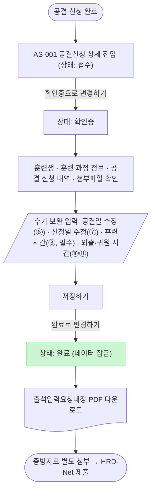

# 출석입력요청대장 PDF 자동 발급 기획서

| 항목 | 내용 |
| --- | --- |
| 작성자 | 박인식 PM |
| 최종 수정일 | 2026-08-03 |
| 상태 | 초안 (v1.5) |
| 관련 문서 | 초기 공결신청 기획서(어드민2) — [노션](https://app.notion.com/p/31344860a4f4808d886acd2a60199791) / 발췌본: [`docs/reference/공결신청-기획서-어드민2-노션발췌.md`](reference/공결신청-기획서-어드민2-노션발췌.md) |
| 문서 성격 | 본 문서는 어드민 정책서·기능 정의서를 겸한다(문서 구조 분리 여부는 확정 전) |

## 변경 이력

| 날짜 | 버전 | 변경 내용 | 작성자 |
| --- | --- | --- | --- |
| 2026-08-03 | v1.0 | 초안 정리 및 정식 기획서화. (a) 발급 버튼 노출 조건 '비활성화 또는 미노출' → '미노출'로 확정 표기 (b) 상태 정의 출처를 어드민2 §2-2 → §0으로 정정 (c) 초안에 흩어진 미결 사항을 §10으로 신규 식별·등록 | 박인식 |
| 2026-08-03 | v1.1 | 검수 반영: 용어 통일(공결 신청/공가 표기 정리), 권한 범위 원복(발급 권한에만 한정), §4-1 필수 필드 검증 표·예외 처리 표 신설, 상태별 버튼 표 사이드바 행 정리, §5·§7 일련번호·신청일 서술 보강, §10 확인 필요 사항 10건 신규 등록(총 20건), §11 착수 순서 표기 신설. 미반영 4건: 담당자·기한 지정(사용자 지정 사안) / 인수 기준(QA 단계 산출) / SVG 렌더(게이트 전 별도 처리) / 화면 ID(사이트맵 미작성) | 박인식 |
| 2026-08-03 | v1.2 | 재검수 반영: §10 확인 필요 사항 20건 → 17건 병합·재정렬(본문 §10-N 참조 전체 갱신), 착수 차단 열 신설, §11 착수 순서 재배열(서명 이미지 등록 → PDF 렌더), 훈련시간 레이블 최초 선언 후 약칭 통일, §5 ③ 비고 정리, §7-3 중복 행 삭제, §2·§4-1 잠정 표기 보강 | 박인식 |
| 2026-08-03 | v1.3 | 사이트맵·화면정의서 작성에 따른 화면 ID(AS-001/AS-002) 반영. v1.1 미반영 4건 중 화면 ID 항목 해소. §10-8 영향 범위 보강(QA 문서 연계) | 박인식 |
| 2026-08-03 | v1.4 | 사용자 확정 반영(`docs/decisions.md` 2026-08-03 "§10 미결 일괄 확정" 근거) — §10 종결 6건(§10-3, 11, 12, 13, 14, 15)·상태 변경 2건(§10-1, §10-9 자산 제공 대기). 착수 차단 잔여 0건. 훈련시간 숫자+'시간' 접미사 고정 UI 강제, 외출·귀원 time input 전환, 릴리스 이전 완료 건 발급 대상 외 확정, 발급 대상 신청 항목 전체로 확정, 권한 현행 유지 확정, 2~15행 일련번호 완전 공란 확정. §11에 상류 데이터 연동 방식 항목 추가 | 박인식 |
| 2026-08-03 | v1.4 | 마무리 표기 정리 6건 — §10-1/§10-9 확인 필요 잔존 표현을 자산 제공 대기로 통일(§7-1·§5⑬·§11), §10-13 항목명을 "외출·귀원 시간 입력 방식"으로 정합, §3-1에 릴리스 이전 완료 건 제외 명시, §11 착수 순서에 상류 데이터 연동 방식 편입 재배열(7단계), §4-1 예외 표 권한 없는 사용자 정의 반영(AC-019/EC-012 동일 문구), §5 ⑩⑪ "미입력 시 미적용 인쇄"로 통일 | 박인식 |
| 2026-08-03 | v1.4 | SVG 렌더 게재 완료 — §4-1·§4-3 Mermaid 블록 아래 `assets/기획서-상태전이.svg`, `assets/기획서-발급플로우.svg` 삽입(conventions.md §3.1 충족), §10-10 확정 종결(확정 7건으로 갱신) | 박인식 |
| 2026-08-03 | v1.5 | 전면 점검(내부 재검수+외부 감사) 지적 반영 — 자산 목록 정정(§10-18·19 신규, 서식 원본·골든 샘플), 미결 11건 신규 등록(§10-20~30, EC-002·006·007·017·025·034·035·036 연계), 등급 재판정(§10-6 비차단→차단, §10-16 잠정 방침 기재), §10-11 해석 확인 대기 명시, §2·§5·§7-4 표기 정정, §4-1·§9-5 역참조·대안 보강 | 박인식 |

---

## 1. 배경 및 목적 (Why)

### 1-1. 배경

- 공결 신청 기반 **출석입력요청대장**을 운영자가 **수기로 작성** 중
- 1건당 평균 약 30분 소요, 월 51~200건 발급 → 월 25.5~100시간 반복 업무 발생
- 수기 작성으로 인한 **데이터 누락·오기재 등 오류 가능성 상존**

### 1-2. 목적

- LMS 내 공결 신청 데이터를 활용하여 **출석입력요청대장 PDF 자동 발급**
- 단, 운영 특성상 **완전 자동화가 아닌 '자동 생성 + 수기 보완' 구조**로 설계
- 수기 보완이 필요한 항목은 **수정 가능 필드**로 제공하여 양식의 정확성과 운영 유연성을 동시에 확보

### 1-3. 기대 효과

- 운영자 반복 업무 시간 절감 (월 최대 100시간 수준)
- 공결 데이터 → 양식 자동 매핑으로 **오기재 리스크 감소**
- HRD-Net 행정 제출 일정 단축 및 표준화

---

## 2. 적용 범위

**어드민(운영자)** 의 공결 신청 상세 화면에서, **유관부서 담당자 권한을 보유한 운영자** 가 **공결 신청 상태가 '완료'** 인 건에 한해 **출석입력요청대장을 PDF로 다운로드**할 수 있다.

| 사용자 | 발급 가능 여부 |
| --- | --- |
| 어드민 — 유관부서 담당자 | 가능 — '완료' 상태인 공결 신청 건 전체(신청 항목 무관) 다운로드 가능. 실제 발급 여부는 운영자 판단. 릴리스 이전 완료 건은 제외(§3-1 참고) |
| 멋사홈 클래스룸 (훈련생) | 불가 — 다운로드 기능 제공하지 않음 |

- 출력 포맷: **PDF 단독** (별지 13호 양식과 1:1 정합 — §7 참고)
- 자동/수기 보완 필드 분류 상세는 **§5 양식 필드 매핑표** 참고
- 이번 범위에서 의도적으로 제외한 항목은 **§9 제외 범위(Out of Scope)** 참고

> 확정(2026-08-03, §10-11): 발급 대상은 신청 항목(휴가/공가/QR 오류) 구분 없이 '완료' 상태 공결 신청 건 전체이며, 실제 발급 여부는 운영자(어드민)가 판단한다. (사용자 회신 해석 — 오독 시 정정 필요, `docs/decisions.md` 참고)

---

## 3. 발급 정책 및 트리거 조건

### 3-1. 발급 대상

- **공결 신청 상태가 '완료'인 공결 신청 내역**에 한해서 발급 가능
- '접수' / '확인중' 상태에서는 발급 버튼 미노출 (§4-1 상태별 노출 표 기준)
- 단, 릴리스 이전 완료 건은 발급 대상 외(확정 — §10-14 참고)

### 3-2. 발급 위치

| 사용자 | 메뉴 위치 |
| --- | --- |
| 운영자(어드민) — 유관부서 담당자 | 어드민 → 훈련관리 → 행정/운영 → **공결신청** → 상세 화면 |

> 멋사홈 클래스룸(훈련생) 측에서는 PDF 다운로드 기능을 제공하지 않는다.

### 3-3. 발급 동작

- 공결 신청 상세 화면 우측 사이드바의 **[출석입력요청대장 PDF 다운로드] 버튼**으로 발급
- 클릭 시 별도 화면 이동 없이 **즉시 PDF 다운로드**
- PDF는 **상세 화면에 표시된 데이터(훈련생 / 훈련 과정 정보 / 공결 신청 내역 / 수기 보완)를 그대로** 별지 13 양식에 매핑하여 출력 (WYSIWYG)

**발급 권한 정책**

- **유관부서 담당자 권한**을 보유한 어드민 운영자만 발급 가능
- 권한 부여/회수는 기존 어드민 운영자 권한 관리 정책을 따른다 (확정 — §10-3, 저장·상태 전환까지 권한 확대는 하지 않음)

---

## 4. 화면 및 UX 설계

### 4-1. 어드민 화면 (운영자)

**메뉴 위치**

어드민 → 훈련관리 → 행정/운영 → 공결신청 → {신청 상세}

**상세 화면 카드 구성**

| 위치 | 카드 | 표시 항목 | 입력/조회 |
| --- | --- | --- | --- |
| 좌측 메인 ① | **훈련생** | 이름 / 연락처 / 이메일 | 조회 전용 (회원 정보 연동) |
| 좌측 메인 ② | **훈련 과정 정보** | KDT 훈련명 / HRD-NET 훈련과정명 / 훈련 기간 / 훈련 시간 / 실시 회차 | 조회 전용 (부트캠프 훈련 관리 연동) |
| 좌측 메인 ③ | **공결 신청 내역** | 공결일 / 신청 항목 / 상세 사유 / 추가 사유 | 조회 전용 (훈련생 신청 데이터) |
| 좌측 메인 ④ | **출석입력요청대장 수기 보완** (운영자 입력) | 공결일 수정 (date picker, 필수) / 신청일 수정 (date picker, 필수) / 훈련시간(별지 13호 ③ 인쇄용, 이하 '훈련시간') (숫자 입력 + '시간' 접미사 고정 UI, 필수) / 외출·귀원 시간 (입실·퇴실시간 time input) | **운영자 입력** — `확인중` 상태에서 노출·편집, `완료` 상태에서는 조회만 가능 |
| 좌측 메인 ⑤ | **첨부파일** | 훈련생 업로드 증빙 파일 (미리보기·다운로드) | 조회 전용 |
| 우측 사이드바 | **상태 및 액션 영역** | 현재 상태 표시 + 액션 버튼 (상태별 구성은 아래 표 참조) | 액션 |

> ② 훈련 과정 정보 카드의 '훈련 시간'(조회 전용, 부트캠프 훈련 관리 연동값)과 ④ 수기 보완 카드의 '훈련시간'은 서로 다른 필드다. ②값을 ④ 기본값으로 프리필하지 않는다(확정 — §10-12, 빈 값 유지).

**④ 출석입력요청대장 수기 보완 카드 상세 동작**

- 설명 문구: "고용노동부 별지 13호 양식에 따라 필요한 항목을 보완 및 수정합니다."
- **공결일 수정** (date picker, **필수**)
    - 기본값: 훈련생이 신청한 공결일 (`공결 신청 내역` 카드의 공결일)
    - 안내: "* 양식 ⑥ 발생일 칸에 인쇄됩니다. 실제 사유 발생일과 다를 경우 수정하세요."
- **신청일 수정** (date picker, **필수**)
    - 기본값: LMS 최초 공결 신청일
    - 안내: "* HRD-Net 시스템 입력일과 실제 신청일이 다른 경우 수정하세요."
- **훈련시간** (숫자 입력 + '시간' 접미사 고정 UI, **필수**) — 확정(2026-08-03, §10-12)
    - 기본값: **빈 값**(프리필 없음). 숫자만 입력 가능하며 고정 접미사 `시간`이 함께 표기됨(예: `640` 입력 시 `640 시간`)
    - 형식: 숫자 입력 + '시간' 접미사로 고정되어 자유 텍스트 입력은 폐기됨(형식 오입력 자체가 불가)
    - 안내: "* 별지 13호 양식 ③ 훈련시간 항목에 그대로 인쇄됩니다. 필수 입력 항목입니다."
    - 검증: 빈 값으로 저장 시도 시 에러 메시지 노출, [완료로 변경하기] / PDF 다운로드 차단
- **외출/귀원 시간** — 확정(2026-08-03, §10-13)
    - 입실시간 time input (시:분 자유 입력, 기본값: 미입력 = `미적용`)
    - 퇴실시간 time input (시:분 자유 입력, 기본값: 미입력 = `미적용`)
    - 안내: "* 입력된 시간은 PDF 생성 시 대장의 입실/퇴실 항목에 반영됩니다. (디폴트: 미적용)"
    - dropdown 폐기, 분 단위 임의 제한 없는 자유 입력으로 전환
- 저장: 사이드바 **[저장하기]** 버튼으로 수기 보완 값 저장 (`확인중` 상태에서만)

**필수 필드 검증**

| 필드 | 검증 규칙 | 실패 시 동작 | 에러 문구(시안 — 확정 시 용어집 등록) |
| --- | --- | --- | --- |
| 공결일 수정 | 필수 입력 (미입력 불가) | 저장 차단 | "공결일을 입력해 주세요." |
| 신청일 수정 | 필수 입력 (미입력 불가) | 저장 차단 | "신청일을 입력해 주세요." |
| 훈련시간 | 필수 입력. 숫자 입력 + '시간' 접미사 고정 UI(형식 강제, 자유 텍스트 입력 불가) | 빈 값으로 저장 시도 시 저장 차단, [완료로 변경하기] / PDF 다운로드 차단 | "훈련시간을 입력해 주세요." |

> 훈련시간은 숫자 입력 + '시간' 접미사 고정 UI로 형식이 강제된다(확정 — §10-12). 자유 텍스트 입력에 따른 오기재 위험은 해소됨.

**상태 및 액션 영역 (우측 사이드바)**

상태 표시

- 위치: 우측 사이드바 상단
- 형식: `{훈련생명}님은 ●{상태} 상태입니다.`
- 상태값: `접수` (기본값) / `확인중` / `완료`

상태 정의 (초기 공결신청 기획서 §0 기준)

| 상태 | 정의 |
| --- | --- |
| **접수** | 훈련생이 폼을 작성하여 최초 제출한 직후 상태 |
| **확인중** | 운영진이 신청 건을 확인하고 대응을 시작한 상태 (확인·소통 진행 중) |
| **완료** | 운영진이 첨부파일 확인 및 클래스챗 소통을 통해 최종 출결 정정 처리를 마친 최종 상태 |

**상태 전이 다이어그램**

- **접수 → 확인중 → 완료** 순으로만 전환 가능
- 단계 건너뛰기 불가, 역방향 전환 불가
- 운영자의 처리 단계를 강제하여 상태 일관성을 보장 (초기 기획 정책 유지)

**상태별 화면 노출 및 사이드바 버튼 구성**

| 현재 상태 | 수기 보완 카드 | 사이드바 액션 버튼 (좌→우 순서) |
| --- | --- | --- |
| 접수 | 미노출 | [목록으로] / [확인중으로 변경하기] |
| **확인중** | **노출 + 편집 가능** | [목록으로] / [저장하기] / [완료로 변경하기] |
| 완료 | 노출 (조회 전용, 편집 불가) | [목록으로] / [출석입력요청대장 PDF 다운로드] |

> 확정(2026-08-03, §10-14): 릴리스 이전에 이미 '완료' 처리된 건은 발급 대상 외(기존 수기 발행으로 종결)이며, [출석입력요청대장 PDF 다운로드] 버튼을 미노출 처리한다. [개발 검토 필요]

> [확인 필요] 초기 공결신청 기획서(어드민2) §2-2 원본의 상태 변경 버튼 레이블은 [확인 시작](접수→확인중) / [완료](확인중→완료)로, 본 문서의 [확인중으로 변경하기] / [완료로 변경하기]와 표기가 다르다. 최종 버튼 레이블 확정은 §10-8 참고.

공통 버튼

- **[목록으로]**: 모든 상태에서 노출. 상태 변경 없이 공결신청 목록 페이지로 이동 (초기 기획 [취소] 버튼의 역할)
- **[저장하기]** (`확인중` 상태에서만): `출석입력요청대장 수기 보완` 카드 입력값(공결일 수정 / 신청일 수정 / 훈련시간 / 외출·귀원 시간)을 저장. 운영자가 확인·소통 단계에서 데이터를 보완하며 작업한다. **훈련시간이 비어있으면 저장 차단.**
- **[완료로 변경하기]** (`확인중` 상태에서만): 저장된 수기 보완 값을 기준으로 상태를 '완료'로 전환. 전환 이후에는 데이터가 **잠금**되어 수정 불가. [확인 필요] 수기 보완 카드에 [저장하기]를 누르지 않은 미저장 변경분이 남아있는 상태에서 클릭 시 동작(자동 저장 / 클릭 차단 / 변경분 폐기)이 미정 — §10-25 참고
- **[출석입력요청대장 PDF 다운로드]** (`완료` 상태에서만): 잠긴 화면 데이터를 기반으로 별지 13 양식 PDF 즉시 생성·다운로드. 발급 가능한 운영자는 §3-3 발급 권한 정책에 따른다.

> **데이터 잠금 정책**
> `완료` 상태로 전환된 이후에는 수기 보완 카드(공결일 / 신청일 / 훈련시간 / 외출·귀원 시간)를 포함한 모든 카드의 데이터가 **수정 불가**하다. 잘못된 데이터가 발견된 경우의 정정 절차(예: 어드민 관리자 권한으로 상태 되돌리기)는 이번 범위에서 제외한다 — §9-5 참고.

**예외 처리**

| 예외 상황 | 처리 방침 |
| --- | --- |
| PDF 생성 실패(렌더링 오류 등) | 잠정 방침: 에러 안내 노출 + 재시도 허용 [개발 검토 필요] (§10-16 참고) |
| 권한 없는 사용자의 상세 URL 직접 접근 | 권한 없는 사용자 = 어드민 상세 조회 권한 자체가 없는 사용자(비로그인·타 역할). 접근 차단 및 권한 없음 안내 노출. 유관부서 담당자 권한 미보유 어드민은 상세 진입 가능하며 PDF 버튼만 미노출 |
| 운영자 2인 동시 편집(저장 충돌) | 확인 필요 — 동시성 제어 방식 미정 |
| [완료로 변경하기] 중복 클릭 | 확인 필요 — 중복 클릭 방지 및 완료 전환 확인 모달 필요 여부 미정 |

> 위 예외 상황의 처리 방침은 §10-16 참고.

**PDF 출력 원칙 (WYSIWYG)**

상세 화면에 표시된 4개 카드(**훈련생** / **훈련 과정 정보** / **공결 신청 내역** / **수기 보완**)의 데이터를 **추가 조회 없이 그대로** 별지 13 양식 필드에 매핑하여 PDF로 출력한다. 화면에 보이는 값 = PDF에 인쇄되는 값.

### 4-2. 클래스룸 화면 (훈련생)

**메뉴 위치**

멋사홈 → 클래스룸 → 행정/운영 → 공결 신청 → {본인 신청 상세}

**적용 정책**

- 훈련생(클래스룸) 측에는 **[출석입력요청대장 PDF 다운로드] 기능을 제공하지 않는다.**
- 사유: 출석입력요청대장은 HRD-Net 행정 제출용 문서로, 발급 권한을 **어드민의 유관부서 담당자**에게만 한정한다.
- 기존 클래스룸 공결 신청 상세 화면 UI는 변경 없음 (조회·신청 기능만 유지)

### 4-3. 발급 플로우

---

## 5. 양식 필드 매핑표 (별지 13 기준)

| 항목 | 양식 필드명 | 처리 방식 | 데이터 출처 / 기본값 | 비고 |
| --- | --- | --- | --- | --- |
| ① | 훈련과정명 | **자동** | `훈련 과정 정보` 카드 → HRD-NET 훈련과정명 | 부트캠프 훈련 관리 연동 |
| ② | 훈련기간 | **자동** | `훈련 과정 정보` 카드 → 훈련 기간 | 부트캠프 훈련 관리 연동 |
| ③ | 훈련시간 | **수기(필수)** | `수기 보완` 카드 → 훈련시간 (숫자 입력 + '시간' 접미사 고정 UI, **기본값 없음**) | 고정 UI — 형식 오입력 불가 (확정 — §10-12, §4-1 검증표 참고). [확인 필요] 인쇄 문자열·0값·자릿수 규칙은 §10-27 참고 |
| ④ | 대장관리자 | **자동(고정)** | **장지연** | 고정값. 담당자 변경·퇴사 시 운영 방안은 확인 필요 — §10-5 참고 |
| ⑤ | 일련번호 | **자동** | 1행에만 값 `1` 기재. 2~15행은 완전 공란(표 구조는 유지) — §7-2 참고 | 2~15행 일련번호 숫자 미인쇄 확정(2026-08-03) — §7-2 참고 |
| ⑥ | 발생일 | **반자동** | `수기 보완` 카드 → 공결일 수정 (기본값: 훈련생이 신청한 공결일) | 형식: `YYYY년 MM월 DD일` |
| ⑦ | 신청일 | **반자동** | `수기 보완` 카드 → 신청일 수정 (기본값: LMS 최초 공결 신청일) | HRD-Net 입력일과 다를 때 수정. 인쇄 형식(제안): `YYYY년 MM월 DD일`(⑥ 발생일과 동일). 신청 화면의 요청일(YYYY-MM-DD HH:MM:SS)에서 날짜만 추출하는 변환 규칙(타임존·자정 경계)은 확인 필요 — §10-17 참고 |
| ⑧ | 훈련생 성명 | **자동** | `훈련생` 카드 → 이름 | — |
| ⑨ | 사유 | **자동** | `공결 신청 내역` 카드 → 신청 항목 / 상세 사유 / 추가 사유 조합 (§6 표기 규칙 참고) | — |
| ⑩ | 입실시간 (외출시간) | **반자동** | `수기 보완` 카드 → 외출/귀원 시간 → 입실시간 (미입력 시 `미적용` 인쇄) | time input (확정 — §10-13, dropdown 폐기). [확인 필요] 시각 의미 매핑은 서식 원본 수령 후 확정 — §10-26 참고 |
| ⑪ | 퇴실시간 (귀원시간) | **반자동** | `수기 보완` 카드 → 외출/귀원 시간 → 퇴실시간 (미입력 시 `미적용` 인쇄) | time input (확정 — §10-13, dropdown 폐기). [확인 필요] 시각 의미 매핑은 서식 원본 수령 후 확정 — §10-26 참고 |
| ⑫ | 훈련생 서명 | **자동(고정)** | **`원격`** 텍스트 자동 인쇄 | 비대면 훈련 운영 정책 반영 |
| ⑬ | 관리자 서명 | **자동** | **관리자 서명 자동 반영** | 사전 등록된 서명 이미지. 자산 제공 대기(개발 착수 시 사용자 제공) — §10-9 참고 |

> 매핑 원칙
> - 모든 자동/반자동 필드는 §4-1 어드민 상세 화면에 표시되는 카드 데이터를 **그대로** 사용한다 (별도 데이터 조회 없음).
> - 추가 사유, 신청 항목 등 별지 13 양식에 직접 대응되지 않는 입력값은 §6 표기 규칙에 따라 조합·변환한다.

---

## 6. 사유(⑨) 표기 규칙

현재 공결 신청 상세 화면에는 사유 관련 항목이 3개 존재한다.

| 화면 항목 | 예시 |
| --- | --- |
| 신청 항목 | `휴가` / `공가` / `QR 오류` |
| 상세 사유 | `휴가신청` / `본인 질병/입원` |
| 추가 사유 | `질병으로 인한 휴식` / `장염에 걸린 것 같아...` |

**양식 ⑨ 사유 칸 표기 규칙**

- 기본 포맷: **`{신청 항목} : {상세 사유}`**
- 추가 사유가 있는 경우: **`{신청 항목} : {상세 사유} - {추가 사유}`**

**표기 예시**

- `휴가 : 휴가신청 - 질병으로 인한 휴식`
- `공가 : 본인 질병/입원 - 장염에 걸린 것 같아...`
- `공가 : 예비군/민방위훈련`
- `공가 : 병가(질병)`

> 사유 코드 ↔ 양식 표기 텍스트 매핑 룰 표는 추후 개발 단계 별첨으로 분리 관리 — 확인 필요 §10-4 참고

---

## 7. PDF 출력 양식 사양

PDF 출력본은 고용노동부 **[별지 제13호 서식] 출석입력요청대장** 양식과 **1:1로 동일하게** 출력된다.

### 7-1. 양식 구조 (별지 13호 기준)

| 영역 | 내용 |
| --- | --- |
| 양식 헤더 | `■ 현장 실무인재 양성을 위한 직업능력개발훈련 운영규정 [별지 제13호 서식]` |
| 양식 제목 | **출석입력요청대장** |
| 훈련기관 표기 | `( {훈련기관명} )` — 멋사 정식 기관 명칭(고정값). 자산 제공 대기(개발 착수 시 사용자 제공) — §10-1 참고 |
| 상단 정보 영역 | ① 훈련과정명 / ② 훈련기간 / ③ 훈련시간 / ④ 대장관리자 (2×2 grid) |
| 본문 테이블 (15행 고정) | ⑤ 일련번호 / ⑥ 발생일 / ⑦ 신청일 / ⑧ 훈련생 성명 / ⑨ 사유 / ⑩ 입실시간(외출시간) / ⑪ 퇴실시간(귀원시간) / ⑫ 훈련생 서명 / ⑬ 관리자 서명 |
| 하단 작성요령 | 별지 13호 양식 하단의 작성요령 텍스트(고정 안내문) 그대로 보존 |

### 7-2. 일련번호 행 처리 정책

- 1건의 공결 신청 = 1개의 PDF
- 데이터는 **일련번호 1행에만 채움** (1행 일련번호 값: `1`)
- 확정(2026-08-03, §10-15): 2~15행은 일련번호 숫자를 포함해 완전 공란으로 처리한다. 15행 표 구조 자체는 별지 13호 양식 원형 그대로 보존한다(행은 모두 출력하되 내용만 비움)
- 다일자 신청(여러 일자에 걸친 단일 신청) 등 다행 채움이 필요한 케이스는 이번 범위에서 제외한다 — §9-4 참고

### 7-3. PDF 적용 데이터 소스

PDF 다운로드 시 **어드민 공결 신청 상세 화면의 데이터를 그대로 적용**한다 (§4-1 WYSIWYG 원칙). 필드별 데이터 출처·처리 방식은 **§5 양식 필드 매핑표**를 따르며, 여기서는 중복 기재하지 않는다.

양식 인쇄 시 포맷 특이사항만 정리한다.

| 항목 | 포맷 특이사항 |
| --- | --- |
| ⑤ 일련번호 | 1행에만 값 `1` 채움. 2~15행 처리는 §7-2 참고 |
| ⑥ 발생일 / ⑦ 신청일 | 날짜 형식(제안): `YYYY년 MM월 DD일` (§5 ⑦ 비고 참고) |

### 7-4. 파일명 규칙 (제안)

`{발생일YYYYMMDD}_{훈련생명}_출석입력요청대장.pdf` (기존 수기 산출물 명명 규칙과 동일, 확정 여부는 확인 필요 — §10-2 참고)

> 골든 샘플 3건(§8 참고자료) 중 2건(`20251211_이예린_출석입력요청대장.pdf`, `20251229_우창호_출석입력요청대장.pdf`)은 위 규칙과 일치하나, 1건(`출석입력요청대장(6회차)_강범준_260310.pdf`)은 명명 규칙이 다르다. 위 제안은 3건 중 2건 기준이며, §10-2 확정 시 재확인 필요.

> 동일 훈련생·동일 발생일 건이 재발급되는 경우 파일명이 충돌할 수 있다. 충돌 처리 방식(덮어쓰기/버전 접미사 등)은 확인 필요 — §10-2 참고.

---

## 8. 참고 자료

- 고용노동부 [별지 13] 출석입력요청대장 (현장 실무인재 양성을 위한 직업능력개발훈련 운영규정)
- 기존 수기 작성 산출물:
    - `20251211_이예린_출석입력요청대장.pdf`
    - `20251229_우창호_출석입력요청대장.pdf`
    - `출석입력요청대장(6회차)_강범준_260310.pdf`
- 관련 기 개발 문서:
    - 공결 신청 메뉴 신규 추가 (훈련생 신청 → 운영자 처리 3단계: 접수 → 확인중 → 완료)
    - KDT 훈련 정보 항목 추가 (HRD-Net 훈련과정명·NCS 코드, 휴가 관리)
- 관련 기획 문서:
    - **초기 공결신청 기획서(어드민2)**: [노션](https://app.notion.com/p/31344860a4f4808d886acd2a60199791) — §0 상태 정의, §2 공결신청 상세 페이지(상태/액션 영역 정책 원본) / 발췌본: [`docs/reference/공결신청-기획서-어드민2-노션발췌.md`](reference/공결신청-기획서-어드민2-노션발췌.md)
    - 원본 초안: [`docs/reference/기획서-초안-원본.md`](reference/기획서-초안-원본.md)
    - 화면 설계서(AS-001 공결신청 상세): [`docs/admin/screens/AS-001-공결신청-상세.md`](admin/screens/AS-001-공결신청-상세.md)
    - 프로토타입: [`prototype/admin-공결신청-상세.html`](../prototype/admin-공결신청-상세.html)

---

## 9. 제외 범위 (Out of Scope)

이번 범위에서 의도적으로 제외한 기능·정책이다. 누락이 아니라 확정된 제외임을 명시한다.

| # | 제외 항목 | 사유 / 비고 | 근거 |
| --- | --- | --- | --- |
| 1 | 증빙자료 자동 결합 (PDF Merge) | PDF는 별지 13 양식 단독 생성만 지원. 증빙 첨부는 운영자가 별도로 첨부해 HRD-Net에 제출 | §2, §4-3 |
| 2 | HRD-Net 행정지원시스템 입력일 자동 매핑 | 본 기능은 LMS 내부 PDF 생성까지가 범위이며 외부 시스템 연동은 포함하지 않음 | §2 |
| 3 | 훈련생(클래스룸) 측 PDF 다운로드 제공 | 발급 권한을 어드민 유관부서 담당자로 한정 | §2, §4-2 |
| 4 | 다일자 신청(여러 일자에 걸친 단일 신청)의 다행 채움 | v1은 1건 = 1행(일련번호 1행)만 지원. 다행 처리 로직은 범위 외 | §7-2 |
| 5 | 완료 상태 데이터의 정정 절차 (예: 어드민 관리자 권한으로 상태 되돌리기) | 완료 전환 후 데이터는 잠금 처리되며, 오류 정정 워크플로는 이번 범위에서 다루지 않음. 확정 전 임시 운영 대안: 정정 필요 건은 기존 수기 발행으로 대체 | §4-1 데이터 잠금 정책 |

각 항목의 후속 처리 방향은 §10 확인 필요 사항에서 추적한다.

---

## 10. 확인 필요 사항

초안 및 원본 문서에 흩어져 있던 미결 사항을 한 곳에 모았다. 작성·검수 과정에서 신규로 식별된 항목도 포함되어 있다. 2026-08-03 사용자 일괄 확정으로 6건(§10-3, 11, 12, 13, 14, 15)이 확정되고 §10-10(SVG 렌더)도 렌더·게재 완료로 확정되어 확정 7건이다. 이후 전면 점검(내부 재검수+외부 감사)으로 §10-18~30이 신규 등록되고 §10-6이 비차단→차단으로 재판정되었다. 최종 기준 **정책 차단 6건**(§10-6, 20, 21, 25, 26, 29), **자산 대기 4건**(§10-1, 9, 18, 19 — 이 중 §10-18·19는 각각 PDF 렌더〈§11 순서6〉·QA 골든 샘플 대조에 한해 조건부 차단), 나머지 13건은 비차단이다.

| # | 항목 | 상세 | 확인 주체 | 근거 | 착수 차단(잠정 — PM 확정 필요) |
| --- | --- | --- | --- | --- | --- |
| 1 | 훈련기관명 고정값 | 상태 변경(2026-08-03): 개발 착수 시 사용자가 명칭을 직접 제공 예정(자산 제공 대기). 별도 정책 확정 불필요 | 운영팀 | §7-1 | 비차단(자산 대기) |
| 2 | 파일명 규칙 및 재발급 충돌 처리 | `{발생일YYYYMMDD}_{훈련생명}_출석입력요청대장.pdf`(제안)의 확정 여부. 동일 훈련생·동일 발생일 재발급 시 파일명 충돌 처리 방식(덮어쓰기/버전 접미사 등) 포함 | 운영팀 / 개발 | §7-4 | 비차단 |
| 3 | 발급 권한 정책 | 확정(2026-08-03): (a) 유관부서 담당자 권한의 부여·회수는 기존 어드민 운영자 권한 관리 정책을 따름 (b) [저장하기] / 상태 전환(확인중·완료 변경)까지 권한 제한을 확대하지 않음 — 현행 스펙(PDF 발급만 제한) 유지 | 운영팀 | §3-3, §11 | 확정(2026-08-03) |
| 4 | 사유 코드 ↔ 양식 표기 매핑 룰 | 신청 항목·상세 사유 전체 케이스의 매핑 규칙을 별첨표로 확정 | 기획 / 개발 | §6 | 비차단 |
| 5 | 대장관리자 고정값 '장지연'의 담당자 변경·퇴사 시 운영 방안 | 고정값을 어떻게 갱신하고 운영할지 정책 필요 | 운영팀 | §5(④), §7-1, §7-3 | 비차단 |
| 6 | 완료 상태 데이터 오류 발견 시 정정 절차 | 재판정(2026-08-03, 외부 감사): 비차단 → 차단으로 상향. 상태 되돌리기 등 후속 정정 워크플로 정책 필요 (§9-5 제외 범위). 릴리스 이전 완료 건 처리(§10-14)와 상호 참조. 확정 전 임시 운영 대안은 §9-5 참고(정정 필요 건은 기존 수기 발행으로 대체) | 기획 / 운영팀 | §4-1, §9-5 | 차단(운영 개시 전 확정 필요) |
| 7 | 다일자 신청 다행 채움 처리 방식 | 여러 일자에 걸친 단일 신청 건 처리 정책 필요 (§9-4 제외 범위) | 기획 / 운영팀 | §7-2, §9-4 | 비차단 |
| 8 | 상태값·버튼 레이블 정합 | (a) 초기 공결신청 기획서(어드민2) §2-2 원본 버튼 레이블은 [확인 시작]/[완료], 본 문서는 [확인중으로 변경하기]/[완료로 변경하기] — 최종 레이블 확정 필요. (b) 어드민2 §1-2 목록 화면의 처리상태 레이블(신청/처리중/완료)이 §0 상태 정의(접수/확인중/완료)와 표기가 다름 — 화면 노출 레이블과 개발 참조용 실제 상태 코드값을 통일된 기준으로 확정 필요. 목록↔상세 상태 표기가 다르면 상태 일치 검증 기준이 흔들림. (c) 레이블 확정 시 `docs/qa/acceptance-criteria.md`의 관련 AC/TC 문구도 갱신 대상 | 기획(박인식 PM) / 개발 | 어드민2 §0, §1-2, §2-2, 본 문서 §4-1, `docs/qa/acceptance-criteria.md` | 비차단 |
| 9 | 관리자 서명 이미지 등록·관리 정책 | 상태 변경(2026-08-03): 서명 이미지 파일은 개발 착수 시 사용자가 직접 제공 예정(자산 제공 대기). 저장 위치·형식·갱신 절차는 개발 착수 시 확정 | 운영팀 / 개발 | §5(⑬), §7-3 | 비차단(자산 대기) |
| 10 | 플로우차트 SVG 렌더링 | 확정(2026-08-03) — 렌더·게재 완료: `docs/assets/기획서-상태전이.svg`(§4-1), `docs/assets/기획서-발급플로우.svg`(§4-3)를 각 Mermaid 블록 아래 게재해 `conventions.md` §3 기준(Mermaid + SVG 동시 게시) 충족 | 기획 / 문서유닛 | conventions.md §3 | 확정(2026-08-03) |
| 11 | 발급 대상 신청 항목 범위 | 확정(2026-08-03): 발급 대상은 '완료' 상태인 공결 신청 건 전체(신청 항목 무관 — 휴가/공가/QR 오류 모두 포함). 실제 발급 여부 판단은 운영자(어드민) 몫 (사용자 회신 해석 — 오독 시 정정 필요, `docs/decisions.md` 참고) | 운영팀 | §2 | 확정(해석 확인 대기 — 신청 항목 무관 전체 발급 해석) |
| 12 | 훈련시간 입력 방식 확정(프리필·형식 강제) | 확정(2026-08-03): (a) 프리필 없음 — ②의 '훈련 시간' 값을 ④ 기본값으로 자동 채우지 않는다(빈 값 유지) (b) 숫자 입력 + '시간' 접미사 고정 UI로 형식을 강제한다(자유 텍스트 입력 폐기) | 기획 / 개발 / 디자인 | §4-1 | 확정(2026-08-03) |
| 13 | 외출·귀원 시간 입력 방식 | 확정(2026-08-03): dropdown 폐기, 시:분 자유 입력(time input)으로 전환. 분 단위 임의 제한 없음. 미입력 = 미적용 | 운영팀 / 디자인 | §4-1 | 확정(2026-08-03) |
| 14 | 릴리스 이전 완료 건 처리 방안 | 확정(2026-08-03): 릴리스 이전 완료 건은 발급 대상 외(기존 수기 발행으로 종결). PDF 다운로드 버튼 미노출 처리 [개발 검토 필요]. 완료 상태 데이터 정정 절차(§10-6)와 상호 참조 | 운영팀 / 기획 | §3-1, §4-1 | 확정(2026-08-03) |
| 15 | 2~15행 일련번호 숫자 인쇄 여부 | 확정(2026-08-03): 2~15행은 일련번호 숫자를 포함해 완전 공란으로 처리한다. 15행 표 구조(별지 13호 양식 원형)는 그대로 보존 | 기획 / 운영팀 | §7-2 | 확정(2026-08-03) |
| 16 | 예외 처리 방침 확정 | PDF 생성 실패 잠정 방침: 에러 안내 노출 + 재시도 허용 [개발 검토 필요]. 운영자 2인 동시 편집 / [완료로 변경하기] 중복 클릭 및 완료 전환 확인 모달 필요 여부는 미정 (권한 없는 사용자 URL 직접 접근은 §4-1에 잠정 방침 반영 완료) | 기획 / 개발 | §4-1 예외 처리 | 비차단 |
| 17 | 신청일 인쇄 형식·요청일 변환 규칙 | 신청일 인쇄 형식(제안: 발생일과 동일 `YYYY년 MM월 DD일`) 확정 및 요청일(YYYY-MM-DD HH:MM:SS)에서 날짜를 추출하는 변환 규칙(타임존·자정 경계) 확정 필요 | 개발 | §5(⑦) | 비차단 |
| 18 | 별지 13호 서식 원본 파일 | 별지 13호 서식 원본 파일(하단 작성요령 원문 포함)이 필요하다. PDF 렌더링 시 양식 그래픽·고정 안내문의 기준 자료로 사용된다. 자산 제공 대기(사용자 제공) | 운영팀 | §7-1, §11 | 차단(PDF 렌더 — §11 순서6 한정) · 자산 대기 |
| 19 | 골든 샘플 3건(기존 수기 PDF) | §8 참고자료의 기존 수기 작성 산출물 3건 원본 파일. QA 골든 샘플 대조 TC(AC-018/TC-019)의 전제조건. 자산 제공 대기(사용자 제공) | 운영팀 / QA | §8, `docs/qa/acceptance-criteria.md` AC-018·TC-019 | 차단(QA 골든 샘플 대조 한정) · 자산 대기 |
| 20 | 상태 전이·저장 값의 서버측 재검증 여부 | 상태 전이(접수→확인중→완료 순서 강제) 및 수기 보완 저장값의 서버 레벨 재검증(클라이언트 조작 방어) 여부·구현 범위가 미정 | 개발 | `docs/qa/edge-cases.md` EC-002, EC-006, EC-007 | 차단(저장 API 설계 전 확정 — §11 순서2) |
| 21 | 사유(⑨) 텍스트 양식 칸 초과 시 처리 | §6 표기 규칙으로 조합한 사유 텍스트가 별지 13호 양식 ⑨ 칸의 인쇄 가능 길이를 초과할 때 줄바꿈/말줄임/폰트 축소 등 처리 방식이 미정 | 기획 / 개발 | `docs/qa/edge-cases.md` EC-017, §6 | 차단(PDF 렌더 전 확정 — §11 순서6) |
| 22 | 공결일이 훈련 기간 밖일 때 검증 | ④ 수기 보완 카드의 공결일 수정 값이 ② 훈련 과정 정보의 훈련 기간을 벗어나는 경우 검증·경고 여부가 미정 | 기획 / 개발 | `docs/qa/edge-cases.md` EC-025, §4-1 | 비차단 |
| 23 | 데이터 결손 건(과정 정보 미연동·무첨부) 발급 허용 여부 | ② 훈련 과정 정보 연동 실패(값 없음) 또는 ⑤ 첨부파일이 전혀 없는 건에 대해 PDF 발급을 허용할지, 별도 경고를 노출할지 미정 | 운영팀 / 기획 | `docs/qa/edge-cases.md` EC-035, EC-036, §4-1 | 비차단 |
| 24 | 발급 이력 로그 필요 여부 | 재발급 이력(발급 시각·발급자)을 로그로 남길지 여부 — HRD-Net 제출용 공문서 특성상 감사 추적 필요 가능성 | 운영팀 / 개발 | `docs/qa/edge-cases.md` EC-034, §11 | 비차단 |
| 25 | 미저장 변경분 상태에서 [완료로 변경하기] 클릭 시 동작 | 수기 보완 카드에 입력했지만 [저장하기]를 누르지 않은 변경분이 남아있는 상태에서 [완료로 변경하기]를 클릭하면 자동 저장 / 클릭 차단(저장 먼저 요구) / 변경분 폐기 중 어느 것으로 동작할지 미정 — 감사 지적 | 기획 / 개발 | 본 문서 §4-1 공통 버튼 | 차단(저장 API·완료 전환 로직 설계 전 확정 — §11 순서2·3) |
| 26 | ⑩ 입실(외출)/⑪ 퇴실(귀원) 시각의 의미 매핑 | 별지 13호 서식 원본상 ⑩·⑪ 칸이 실제로 요구하는 시각의 의미(예: 외출 시작 시각인지 복귀 시각인지)가 화면 필드(입실시간/퇴실시간)와 정확히 일치하는지 서식 원본 확인 전까지 미정 | 기획 / 운영팀 | §5(⑩⑪), §10-18(서식 원본) | 차단(§10-18 서식 원본 수령 후 확정) |
| 27 | 훈련시간 PDF 인쇄 문자열·0값·자릿수 규칙 | 숫자 입력 + '시간' 접미사 고정 UI 값을 PDF에 인쇄할 때 0 또는 큰 자릿수 입력 시 표시 규칙(허용 범위·자릿수 제한)이 미정 | 기획 / 개발 | §5(③) | 비차단 |
| 28 | 릴리스 이전 완료 건의 상세 화면 카드 표시 방식 | §10-14 확정(발급 대상 외)에 따라 PDF 버튼은 미노출되지만, 수기 보완 카드 자체를 노출(값 없음 상태로 조회 전용 표시)할지 완전히 숨길지 화면 표시 방식은 후속 미정 | 기획 / 디자인 | §10-14, §4-1 | 비차단 |
| 29 | '유관부서 담당자' 역할의 기존 어드민 권한 체계 실존 여부 | §10-3에서 '기존 어드민 운영자 권한 관리 정책을 따른다'고 확정했으나, '유관부서 담당자'라는 역할/권한이 현재 어드민 권한 체계에 실제로 존재하는지 확인 필요. 미실존 시 §11에 권한 신설 단계 추가 필요 | 개발 / 운영팀 | §3-3, §10-3, §11 | 차단(권한 체크 구현 전 확정 — §11 순서7) |
| 30 | 상세 화면 조회 권한 기본값의 개인정보 관점 재검토 | ③ 공결 신청 내역의 사유에 건강 정보(질병·입원 등)가 포함될 수 있음에도, 현재 방침은 유관부서 담당자 권한 미보유 어드민도 상세 화면 조회는 가능(§4-1 예외 처리 표)하도록 되어 있다. 개인정보(민감정보) 보호 관점에서 조회 권한 기본값을 더 좁혀야 하는지 재검토 필요 | 기획 / 법무·운영팀 | §4-1 예외 처리, `docs/qa/acceptance-criteria.md` AC-019 | 비차단 |

---

## 11. 개발/디자인 전달 시 주의사항

- 본 기획서는 동작·정책 범위까지만 다룬다. 화면 레이아웃·컴포넌트 상세는 디자인 단계에서 화면 설계서로 별도 정의한다(CLAUDE.md §1, conventions.md §1).
- API·데이터 영향이 예상되는 지점은 아래와 같이 표기한다. 실제 설계는 각 항목의 §10 확인 필요 사항 확정 이후 진행한다.
- **착수 순서**: 스키마 → 저장 API → 잠금 → 서명 이미지 등록 → 상류 데이터 연동 방식 확정 → PDF 렌더 → 권한 (아래 표의 순서 열 기준)

| 순서 | 영역 | 내용 | 표기 |
| --- | --- | --- | --- |
| 1 | 수기 보완 값 저장 필드 신설 (스키마) | 공결일 수정 / 신청일 수정 / 훈련시간 / 입실시간 / 퇴실시간을 저장할 신규 데이터 필드(기존 공결 신청 레코드 확장 또는 별도 테이블) 설계 필요. `docs/glossary/dev-terms.md`에 식별자가 없으므로 임의 명명 금지, 담당자에게 등록 요청 | [개발 검토 필요] |
| 2 | 수기 보완 저장 API | §4-1 필수 필드 검증 표 기준으로 공결일/신청일/훈련시간 필수값을 서버 측에서도 검증하는 저장 API 설계 필요 | [개발 검토 필요] |
| 3 | 완료 상태 데이터 잠금 처리 | '완료' 전환 시 수기 보완 카드를 포함한 전체 카드의 수정 API를 차단(읽기 전용 강제)하는 로직 필요. 정정 절차(§9-5, §10-6)가 확정되기 전까지는 잠금 해제 경로를 두지 않음 | [개발 검토 필요] |
| 4 | 관리자 서명 이미지 등록·관리 | 사전 등록된 서명 이미지의 저장 위치·형식·갱신 권한 설계 필요. 자산 제공 대기(개발 착수 시 사용자 제공) — §10-9 참고, 서명 이미지 자산 수령 후 진행 | [개발 검토 필요] |
| 5 | 완료 후 상류 데이터 연동 방식 | 완료 상태 데이터를 PDF 생성 시점에 스냅샷으로 고정할지, 실시간으로 재조회할지는 개발에서 확정한다. 수강증명서 발급과 동일 연동 방식일 것으로 예상 | [개발 검토 필요] |
| 6 | PDF 생성 방식 | 별지 13호 양식과 1:1 정합되는 PDF 렌더링 방식 선정 필요. WYSIWYG 원칙에 따라 상세 화면 표시 데이터를 그대로 반영하는 생성 로직 설계 | [개발 검토 필요] |
| 7 | 권한 체크 | [출석입력요청대장 PDF 다운로드] 노출 및 API 호출 시 '유관부서 담당자' 권한 검증 로직 필요(§10-3 확정 — 발급 권한만 제한, 저장·상태 전환 권한 확대 없음). 릴리스 이전에 이미 '완료' 처리된 건은 PDF 다운로드 버튼을 미노출 처리한다(확정 — §10-14) | [개발 검토 필요] |
