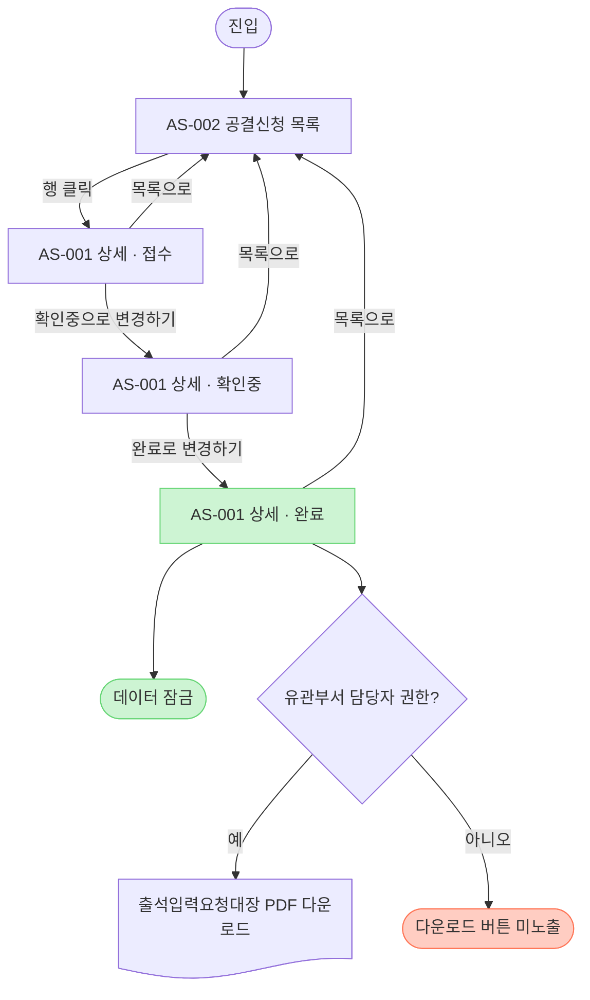

> 본 문서는 화면정의서 합본이다 — 로컬 작업 폴더(~/planning/attendance-ledger)의 3개 파일(docs/admin/screen-definition.md, screens/AS-001-공결신청-상세.md, screens/AS-002-공결신청-목록.md)을 순서대로 담았다. 문서 내 링크는 본 리포 구조 기준으로 정정했다 — 합본된 3개 파일 사이의 링크는 문서 내 앵커로 연결한다. 기획서는 본 폴더의 [2026-08-11_출석입력요청대장-PDF발급-기획서.md](2026-08-11_출석입력요청대장-PDF발급-기획서.md)를 참조한다.

---

# 어드민 화면 설계서 — 인덱스

> 작성: 박인식 PM (내부 검토) / 대상: 어드민
> 이 파일은 **전체 화면 목록·링크만** 관리하는 인덱스다. 각 화면 상세는 `screens/`에 화면별 파일로 분리한다.
> 정책 해석 우선순위: 1순위 `docs/출석입력요청대장-기획서.md`(v1.8) / 2순위 `docs/reference/공결신청-기획서-어드민2-노션발췌.md`(기획서가 다루지 않는 기존 화면 영역에 한함).

## 변경 이력

| 날짜 | 변경 내용 | 사유 |
| --- | --- | --- |
| 2026-08-03 | 신설 — AS-001(공결신청 상세, 상태별 3-variant), AS-002(공결신청 목록, 변경 없음) 등록 | 출석입력요청대장 PDF 자동 발급 기획서 v1.2(작성 당시) 화면 반영 |
| 2026-08-03 | 검수 반영 — AF-001 스텁 등록 상태로 문구 갱신, 화면 목록 표에 프로토타입 열 추가 | 내부 검토(조건부 통과) 지적 반영 |
| 2026-08-03 | 헤더 문구 수정 — "정책·유효성 해석이 충돌하면 위 두 문서가 우선" 순환 표현을 "1순위 기획서 / 2순위 어드민2 발췌본(기획서 미다룸 영역 한정)" 서열로 명시 | 내부 검토 지적 반영 — 문서 우선순위 서열 명시 |
| 2026-08-03 | 사용자 확정 반영(기획서 v1.4) — 기준 문서 버전 표기 갱신 | 사용자 확정 반영(기획서 v1.4) — 입력 컴포넌트·발급 대상·릴리스 이전 완료 건 확정 |
| 2026-08-11 | 기준 문서 버전 표기 v1.7 갱신 | 공결일·신청일 인라인 수정 구조 개편 반영(기획서 v1.7) |
| 2026-08-11 | 기준 문서 버전 표기 v1.8 갱신 | 서식 원본 반영·카드④ 재개명 정합(기획서 v1.8) |

## 화면 목록

| 화면 ID | 화면명 | 메뉴 | 연결 기능(AF) | 설계서 | 프로토타입 | Figma 프레임 |
|---|---|---|---|---|---|---|
| AS-001 | 공결신청 상세 | 훈련관리 › 행정/운영 › 공결신청 › {신청 상세} | AF-001 | [상세](#as-001-공결신청-상세--화면-설계서) | [2026-08-11_출석입력요청대장-PDF발급-프로토타입.html](../prototype/2026-08-11_출석입력요청대장-PDF발급-프로토타입.html) | TBD |
| AS-002 | 공결신청 목록 | 훈련관리 › 행정/운영 › 공결신청 | AF-001 | [상세](#as-002-공결신청-목록--화면-설계서) | — | TBD |

> AF-001(공결신청 처리 및 출석입력요청대장 PDF 발급)은 `feature-definition.md`에 **스텁만** 등록되어 있다(기능명·레퍼런스만 채움, 기능 상세는 미기입 템플릿 유지). `docs/출석입력요청대장-기획서.md` v1.8이 정책서·기능 정의서를 겸하는 임시 SSOT다(2026-08-03 결정 이력 참고). **[결정 필요]** 정식 기능 정의서 분리 시 AF-001로 등록할지 확인.

## 참고 — 서비스 화면(변경 없음)

- 멋사홈 클래스룸(훈련생) 공결 신청 상세 화면은 **변경 없음**. 출석입력요청대장 PDF 다운로드 기능을 제공하지 않는다(기획서 §4-2, §9-3). 화면 ID(SS-###)는 서비스 세트 착수 시 `docs/service/screen-definition.md`에서 별도 부여하며, 본 문서에서는 AS-001의 진입/이탈 경로 대조를 위해서만 언급한다.

## 작성 규칙

- **화면 1개 = `screens/AS-XXX-{화면명}.md` 1개**(flat). 새 화면은 다음 번호로 파일 생성 후 위 표에 행 추가.
- 페이지가 삭제·분리되어도 **행을 지우지 말고 취소선 + 비고로 이력을 남긴다.**
- **입력 = 기획서(정책·기능 정의 겸용) · 어드민2 발췌본.** 화면정의서는 이를 화면 단위로 구체화한 것이며, 정책·유효성의 정본은 기획서다.
- **추측 금지**: 기획서·발췌본으로 검증한 사실만 기재한다. 근거 없는 항목, 기획서 §10 미결 사항은 `[확인 필요 — 기획서 §10-N]`으로 그대로 승계하고 임의로 확정하지 않는다.
- **컴포넌트 우선**: 요소(버튼·배지·칩 등)는 색상/토큰이 아니라 디자인 시스템 컴포넌트 + variant로 지정한다. 현재 Figma·디자인 시스템 연동 정보가 없어 GUI 디테일 항목은 대부분 TBD다.
- 전 화면 공통 규칙은 [conventions.md](https://github.com/likelion-campus/product-dev-template/blob/main/docs/conventions.md) §2 기준 — 여기엔 화면별 예외만 적는다.
- 문서는 한글로 작성(한자 금지).


---

# AS-001 공결신청 상세 — 화면 설계서

> 메뉴: 훈련관리 › 행정/운영 › 공결신청 › {신청 상세} · 대상: 어드민 · 작성: 박인식 PM (내부 검토)
> 단계: 기획 (디자인 단계 화면 설계서의 선행 초안 — GUI 확정은 디자이너)
> 정책 해석 우선순위: 1순위 `docs/출석입력요청대장-기획서.md`(v1.8) / 2순위 `docs/reference/공결신청-기획서-어드민2-노션발췌.md`(기획서가 다루지 않는 기존 화면 영역에 한함).
> 전 화면 공통 규칙은 [conventions.md](https://github.com/likelion-campus/product-dev-template/blob/main/docs/conventions.md) §2 기준 — 여기엔 예외·화면 고유 정의만 적는다.
> 인덱스: [본 문서 상단 인덱스](#어드민-화면-설계서--인덱스)
> 프로토타입: [2026-08-11_출석입력요청대장-PDF발급-프로토타입.html](../prototype/2026-08-11_출석입력요청대장-PDF발급-프로토타입.html)

## 변경 이력

| 날짜 | 변경 내용 | 사유 |
| --- | --- | --- |
| 2026-08-03 | 신설 — 상태별(접수/확인중/완료) 3-variant 화면 정의, 출석입력요청대장 PDF 다운로드 버튼·수기 보완 카드 반영 | 출석입력요청대장 PDF 자동 발급 기획서 v1.2(작성 당시) 화면 반영 |
| 2026-08-03 | 검수 반영 — 단계 표기 추가, AF-001 스텁 캐비어트, 조회 권한 표현 [확인 필요]화, [완료로 변경하기] 조건 정합(기획서 §4-1과 일치), 프로토타입 링크·표준 더미 데이터 세트 추가, "다 상태" 표기 수정 | 내부 검토(조건부 통과) 지적 반영 |
| 2026-08-03 | 헤더 문구 수정 — "해석 차이 시 두 문서가 우선" 순환 표현을 "1순위 기획서 / 2순위 어드민2 발췌본(기획서 미다룸 영역 한정)" 서열로 명시 | 내부 검토 지적 반영 — 문서 우선순위 서열 명시 |
| 2026-08-03 | 사용자 확정 반영(기획서 v1.4) — 훈련시간 숫자+'시간' 접미사 고정 UI, 외출·귀원 time input 전환, 발급 대상 신청 항목 무관 전체 확정, 릴리스 이전 완료 건 PDF 버튼 미노출 확정, §10-3/11/12/13/14/15 확정·§10-1/9 자산 제공 대기로 미결 요약표 갱신, 기준 문서 버전 v1.4로 갱신 | 사용자 확정 반영(기획서 v1.4) — 입력 컴포넌트·발급 대상·릴리스 이전 완료 건 확정 |
| 2026-08-03 | §10 승계표 §10-13 항목명을 "외출·귀원 시간 입력 방식"으로 정정(dropdown 표현 제거), 외출·귀원 기본값 표기를 "미입력 시 미적용 처리(PDF에 `미적용` 인쇄)"로 통일(기획서 §5 ⑩⑪과 정합) | 내부 검토 지적 반영 — 항목명·기본값 표기 정합 |
| 2026-08-03 | 원문자(①~⑤) 카드 번호 표기를 전부 "카드N"으로 전환하고 별지 13 양식 필드 번호(①~⑬)는 원문자로 유지해 혼용 해소, 표준 더미 데이터 세트에 카드2 조회값(960 시간) 행 추가·훈련시간을 640 시간으로 변경(카드2 조회값과 구분, 프리필 아님 대조 검증용) | 전면 점검 지적 반영 |
| 2026-08-11 | 공결일·신청일을 카드4(수기 보완)에서 카드3(공결 신청 내역) 인라인 수정으로 이동(확인중 한정, 신청 원본 병기), 카드4를 "별지 13호 추가 입력"으로 개명. 이어서 카드4의 훈련시간 입력 필드를 삭제하고 PDF ③ 훈련시간을 카드2(훈련 과정 정보) 연동값 자동 매핑으로 전환(§10-12 번복) — 연동값 부재 시 [완료로 변경하기]·PDF 다운로드 차단. 카드 구성표·상세 동작·검증 표·상태별 표·공통 버튼·잠금 정책·표준 더미·GUI 디테일·승계 요약표 전수 정합, "수기 보완" 잔존 참조 정리, 기준 문서 버전 v1.7 | 공결일·신청일 인라인 수정 구조 개편 반영(기획서 v1.7) |
| 2026-08-11 | 카드4를 "외출/귀원 시간"으로 재개명(내부 중복 라벨 제거, 잔존 "별지 13호 추가 입력" 표기 2건 정리), 카드 상단 설명·입실·퇴실 안내 문구를 기획서 v1.8 원문과 일치, ⑩⑪ 의미(§10-26, 서식 작성요령 4·5항) 반영. 승계 요약표를 §10 최종 분포(31건) 기준 재대조 — §10-15 확정 전환, §10-18 해소, §10-20·26·28 신규 추가. 기준 문서 버전 v1.8로 갱신 | 서식 원본 반영·카드④ 재개명 정합(기획서 v1.8) |

- **목적**: 운영자가 개별 공결 신청 건을 확인·보완 처리하고, `완료` 상태 건에 한해 출석입력요청대장(별지 13호) PDF를 발급한다. (기획서 §1-2, §3-1)
- **연결 기능 정의**: AF-001 공결신청 처리 및 출석입력요청대장 PDF 발급 — `feature-definition.md`에 스텁만 등록됨(정식 분리 여부 [결정 필요]), 정본(SSOT)은 `docs/출석입력요청대장-기획서.md` v1.8 (2026-08-11 결정 이력)
- **진입 경로**: AS-002 공결신청 목록에서 행 클릭 → 본 화면 진입 (어드민2 §2 기준, 기획서 §3-2)
- **이탈 경로**: 사이드바 **[목록으로]** 클릭 시 상태 변경 없이 AS-002로 이동 (기획서 §4-1 공통 버튼). 그 외 화면 이동을 유발하는 액션 없음 — PDF 다운로드는 별도 화면 이동 없이 즉시 다운로드(§3-3)
- **노출 조건**: [확인 필요 — policy.md §1 미정: 상세 화면 조회 권한 범위]. **[출석입력요청대장 PDF 다운로드] 버튼만 유관부서 담당자 권한 보유자에게 노출**(기획서 §3-3, 아래 "권한 정책" 참고)
- **데이터 범위**: 공결 신청 1건 단위 조회·수정. 수정 가능 범위는 상태값에 따라 다름 (아래 "상태별 화면" 참고)
- **모드**: 상태값(접수/확인중/완료)에 따라 조회 전용 ↔ 편집 가능 전환 (기획서 §4-1 상태별 노출 표)
- **샘플 데이터**: 아래 "표준 더미 데이터 세트" 참고 — 프로토타입과 대조 검증 기준
- **입력·유효성(노출/처리)**: 기획서 §4-1 필수 필드 검증 표(카드3 공결일·신청일 운영자 입력, 카드2 훈련 시간 연동값 존재 여부)를 화면에서 인라인 에러 메시지로 노출 — 아래 "필수 필드 검증" 참고
- **Figma 프레임/노드**: TBD (연동 정보 없음 — `design/README.md` 확인 필요)

---

## 표준 더미 데이터 세트

프로토타입(`../prototype/2026-08-11_출석입력요청대장-PDF발급-프로토타입.html`)과 본 화면정의서가 서로 어긋나지 않는지 대조 검증하기 위한 기준 데이터다. 프로토타입 제작 담당도 동일 세트를 사용하도록 별도 안내되어 있다.

| 필드 | 표준 값 |
|---|---|
| 훈련생 이름 | 김훈련 |
| 훈련 과정 정보(카드2) 훈련 시간 — 조회값이자 PDF ③ 훈련시간 자동 매핑 원본. 카드4에는 별도 훈련시간 입력 필드가 없음(§10-12 번복, decisions.md 2026-08-11). 연동값이 비면 완료 전환·PDF 발급 차단 | `960 시간` |
| 사유(카드3 공결 신청 내역의 신청 항목 : 상세 사유 - 추가 사유 조합 → 양식 필드 ⑨, 기획서 §6) | `공가 : 본인 질병/입원 - 몸살로 병원 진료` |

## 레이아웃

```
┌───────────────────────────────────────────┬───────────────────────────┐
│ 좌측 메인                                    │ 우측 사이드바               │
│                                             │                           │
│ 카드1 훈련생 (조회 전용)                      │ 상태 표시                  │
│                                             │ "{훈련생명}님은 ●{상태}    │
│ 카드2 훈련 과정 정보 (조회 전용)              │  상태입니다."              │
│                                             │                           │
│ 카드3 공결 신청 내역 (공결일·신청일은          │ 액션 버튼 영역             │
│    확인중 상태에서 인라인 편집, 원본 병기)     │ (상태별 구성 — 하단 표)    │
│ 카드4 외출/귀원 시간                     │                           │
│    (접수: 미노출 / 확인중·완료: 노출)         │                           │
│                                             │                           │
│ 카드5 첨부파일 (조회 전용)                    │                           │
└───────────────────────────────────────────┴───────────────────────────┘
```
(근거: 기획서 §4-1 상세 화면 카드 구성 표. 카드 순서·2-컬럼 배치는 기획서 표기 순서를 그대로 따름. 정확한 그리드·간격은 디자인 시스템 확정 후 GUI 디테일에서 보강)

## 주요 요소

| 카드 | 영역 | 컴포넌트 | 내용 |
|---|---|---|---|
| 카드1 | 좌측 메인 | 정보 카드(조회) | 훈련생 이름 / 연락처 / 이메일 — 회원 정보 연동, 조회 전용 (기획서 §4-1) |
| 카드2 | 좌측 메인 | 정보 카드(조회) | KDT 훈련명 / HRD-NET 훈련과정명 / 훈련 기간 / 훈련 시간 / 실시 회차 — 부트캠프 훈련 관리 연동, 조회 전용 (기획서 §4-1). 이 '훈련 시간' 값이 별지 13호 PDF ③ 훈련시간 항목에 그대로 자동 매핑된다 — 카드4에는 별도 훈련시간 입력 필드가 없다(§10-12 번복, decisions.md 2026-08-11). 연동값이 비어 있으면 [완료로 변경하기]·PDF 다운로드가 차단된다 |
| 카드3 | 좌측 메인 | 정보 카드(부분 편집) | 공결일 · 신청일(date picker, 필수 — `확인중` 상태 한정 인라인 편집, 값이 원본과 다르면 "신청 원본: YYYY-MM-DD" 병기) / 신청 항목 · 상세 사유 · 추가 사유(모든 상태 조회 전용) — 훈련생 신청 데이터 (기획서 §4-1) |
| 카드4 | 좌측 메인 | 입력 카드 | 입실시간 · 퇴실시간(time input, 시:분 자유 입력, 미입력 시 미적용 처리, 확정 §10-13) — 외출(중간 이탈 후 복귀)이 있었던 경우에만 입력. 운영자 입력. `확인중` 상태에서 노출·편집, `완료` 상태에서는 조회만 가능, `접수` 상태에서는 미노출 (기획서 §4-1) |
| 카드5 | 좌측 메인 | 파일 카드(조회) | 훈련생 업로드 증빙 파일 미리보기·다운로드, 조회 전용 (기획서 §4-1) |
| 사이드바 | 우측 | 상태 배지 + 버튼 그룹 | 현재 상태 표시(`{훈련생명}님은 ●{상태} 상태입니다.`) + 상태별 액션 버튼 (기획서 §4-1) |

---

## 화면 흐름도 (진입·이탈·상태 전이)

목록(AS-002) 진입부터 상태 전이, PDF 발급 분기까지의 화면 단위 흐름이다. 표준 기호·색상 규칙은 [conventions.md §3](https://github.com/likelion-campus/product-dev-template/blob/main/docs/conventions.md#3-플로우차트) 기준.



(근거: 기획서 §4-1 상태 전이 다이어그램·상태별 버튼 표, §4-3 발급 플로우, §3-3 발급 권한 정책)

- **접수 → 확인중 → 완료** 순으로만 전환 가능. 단계 건너뛰기·역방향 전환 불가 (기획서 §4-1)
- **[저장하기]**(확인중 상태에서만 노출)는 상태 전이를 일으키지 않고 같은 variant 내에서 카드3(공결일·신청일)·카드4(입실·퇴실시간) 입력값만 저장한다 — 위 흐름도에는 별도 노드로 표시하지 않음(아래 "상태별 화면 — 확인중" 버튼 표 참고)

---

## 상태별 화면

### 가. 상태 = 접수 (기본값)

상태 표시: `김훈련님은 ●접수 상태입니다.`

**카드 구성**

| 카드 | 노출 | 입력/조회 |
|---|---|---|
| 카드1 훈련생 | 노출 | 조회 전용 |
| 카드2 훈련 과정 정보 | 노출 | 조회 전용 |
| 카드3 공결 신청 내역 | 노출 | 조회 전용(공결일·신청일 포함 전 항목) |
| 카드4 외출/귀원 시간 | **미노출** | 해당 없음 |
| 카드5 첨부파일 | 노출 | 조회 전용 |

(근거: 기획서 §4-1 상태별 화면 노출 및 사이드바 버튼 구성 표)

**사이드바 버튼**

| 버튼 | 트리거 | 조건 | 결과 | 예외 | 권한 |
|---|---|---|---|---|---|
| [목록으로] | 클릭 | 모든 상태에서 노출 | 상태 변경 없이 AS-002로 이동 | 없음 | 제한 없음 (기획서 §4-1) |
| [확인중으로 변경하기] | 클릭 | 상태 = 접수 | 상태 접수 → 확인중 전환, 카드3 공결일·신청일 인라인 편집 가능 전환 + 카드4 외출/귀원 시간 노출·편집 가능 전환 | 중복 클릭 방지 방식 미정 [확인 필요 — 기획서 §10-16] | 제한 없음 — 확정(2026-08-03, 기획서 §10-3(b), 권한 확대 없음) |

> [확인 필요 — 기획서 §10-8] 어드민2 §2-2 원본 버튼 레이블은 [확인 시작], 본 화면은 기획서 §4-1 기준 [확인중으로 변경하기]로 표기했다. 최종 레이블 확정 필요.

---

### 나. 상태 = 확인중

상태 표시: `김훈련님은 ●확인중 상태입니다.`

**카드 구성**

| 카드 | 노출 | 입력/조회 |
|---|---|---|
| 카드1 훈련생 | 노출 | 조회 전용 |
| 카드2 훈련 과정 정보 | 노출 | 조회 전용 |
| 카드3 공결 신청 내역 | 노출 | **편집 가능(공결일·신청일만, 신청 원본 병기)** / 신청 항목·상세 사유·추가 사유는 조회 전용 |
| 카드4 외출/귀원 시간 | **노출 + 편집 가능** | 운영자 입력 |
| 카드5 첨부파일 | 노출 | 조회 전용 |

(근거: 기획서 §4-1 상태별 화면 노출 및 사이드바 버튼 구성 표)

**카드3 공결 신청 내역 — 공결일·신청일 수정 상세**

- 공결일·신청일은 `확인중` 상태에서 카드 안에서 직접 수정 가능(date picker, **필수** — 빈 값 불가 검증 유지)
- 값이 신청 원본과 달라지면 항목 옆에 **"신청 원본: YYYY-MM-DD"** 를 병기해 훈련생 제출 원본을 보존한다
- 신청 항목·상세 사유·추가 사유는 모든 상태에서 조회 전용(수정 불가)

| 필드 | 컴포넌트 | 원본값 | 안내 문구 | 근거 |
|---|---|---|---|---|
| 공결일 | date picker (필수, `확인중` 상태 한정 편집) | 훈련생이 신청한 공결일 | "* 양식 ⑥ 발생일 칸에 인쇄됩니다. 실제 사유 발생일과 다를 경우 수정하세요." | 기획서 §4-1 |
| 신청일 | date picker (필수, `확인중` 상태 한정 편집) | LMS 최초 공결 신청일 | "* HRD-Net 시스템 입력일과 실제 신청일이 다른 경우 수정하세요." | 기획서 §4-1 |

상태별 편집 권한: `접수` 조회 전용 / `확인중` 편집 가능(공결일·신청일만) / `완료` 잠금(조회 전용) (기획서 §4-1)

**카드4 외출/귀원 시간 — 입력 컴포넌트 상세**

| 필드 | 컴포넌트 | 기본값 | 안내 문구 | 근거 |
|---|---|---|---|---|
| 입실시간 | time input (시:분 자유 입력) | 미입력 시 미적용 처리(PDF에 `미적용` 인쇄) | "* 입력된 시간은 PDF 생성 시 대장의 입실/퇴실 항목에 반영됩니다." | 기획서 §4-1, §5(⑩). 확정(2026-08-03, 기획서 §10-13) — dropdown 폐기, 분 단위 임의 제한 없음. 의미 확정(2026-08-11, §10-26, 서식 작성요령 4항): 직권사유가 발생한 훈련생의 입실(외출) 시간 |
| 퇴실시간 | time input (시:분 자유 입력) | 미입력 시 미적용 처리(PDF에 `미적용` 인쇄) | 상동 | 기획서 §4-1, §5(⑪). 확정(2026-08-03, 기획서 §10-13) — dropdown 폐기, 분 단위 임의 제한 없음. 의미 확정(2026-08-11, §10-26, 서식 작성요령 5항): 직권사유가 발생한 훈련생의 퇴실(귀원) 시간 |

> 운영자 참고(기획서 §4-1): 일반적인 출입 기록이 아니라 공결(직권입력) 사유가 발생한 훈련생에 한정된 시간이다(오해 방지).

> 훈련시간 입력 필드는 카드4에 없다(§10-12 번복, 기획서 §4-1·§5(③)). PDF ③ 훈련시간은 카드2(훈련 과정 정보)의 훈련 시간 연동값을 자동 매핑한다 — 아래 "필수 필드 검증" 표 참고.

카드 상단 설명 문구: "외출(중간 이탈 후 복귀)이 있었던 경우에만 입력합니다. 입력하지 않으면 대장에 '미적용'으로 인쇄됩니다." (기획서 §4-1)

**필수 필드 검증** (기획서 §4-1 필수 필드 검증 표 인용)

| 필드 | 검증 규칙 | 실패 시 동작 | 에러 문구(시안) |
|---|---|---|---|
| 공결일 (카드3 공결 신청 내역) | 필수 입력 | 저장 차단 | "공결일을 입력해 주세요." |
| 신청일 (카드3 공결 신청 내역) | 필수 입력 | 저장 차단 | "신청일을 입력해 주세요." |
| 훈련 시간 연동값 (카드2 훈련 과정 정보 — 화면에서 직접 입력하는 필드 아님) | 카드2 훈련 시간 연동값 필수 — 값이 비어 있으면 안 됨 | 연동값 부재 시 [완료로 변경하기] · PDF 발급 차단 [개발 검토 필요] | "부트캠프 훈련 관리에서 훈련 시간을 등록하세요." (시안 — 확정 시 용어집 등록, 기획서 §4-1) |

**사이드바 버튼**

| 버튼 | 트리거 | 조건 | 결과 | 예외 | 권한 |
|---|---|---|---|---|---|
| [목록으로] | 클릭 | 모든 상태에서 노출 | 상태 변경 없이 AS-002로 이동 | 없음 | 제한 없음 (기획서 §4-1) |
| [저장하기] | 클릭 | 상태 = 확인중 | 카드3 입력값(공결일·신청일)과 카드4 입력값(입실·퇴실시간)을 함께 저장. 상태 변화 없음, 화면 유지 | 공결일·신청일 미입력 시 저장 차단(위 검증 표) / 운영자 2인 동시 편집(저장 충돌) 처리 방식 미정 [확인 필요 — 기획서 §10-16] | 제한 없음 — 확정(2026-08-03, 기획서 §10-3(b), 권한 확대 없음) |
| [완료로 변경하기] | 클릭 | 상태 = 확인중 & 카드3·카드4 저장 완료 & 카드2 훈련 시간 연동값 존재 | 저장된 값(공결일/신청일/입실·퇴실시간)과 카드2 연동값(훈련시간)을 기준으로 상태 확인중 → 완료 전환, 데이터 잠금 적용 | 카드2 훈련 시간 연동값 부재 시 전환 차단, 원천(훈련 관리) 등록 안내 노출(§10-12 번복, decisions.md 2026-08-11) / [확인 필요 — 기획서 §10-25] 미저장 변경분 상태에서 클릭 시 동작(자동 저장/클릭 차단/변경분 폐기) 미정 / 중복 클릭 방지·확인 모달 필요 여부 미정 [확인 필요 — 기획서 §10-16] | 제한 없음 — 확정(2026-08-03, 기획서 §10-3(b), 권한 확대 없음) |

> [확인 필요 — 기획서 §10-8] 어드민2 §2-2 원본 버튼 레이블은 [완료], 본 화면은 기획서 §4-1 기준 [완료로 변경하기]로 표기했다. 최종 레이블 확정 필요.

---

### 다. 상태 = 완료

상태 표시: `김훈련님은 ●완료 상태입니다.`

**카드 구성**

| 카드 | 노출 | 입력/조회 |
|---|---|---|
| 카드1 훈련생 | 노출 | 조회 전용 |
| 카드2 훈련 과정 정보 | 노출 | 조회 전용 |
| 카드3 공결 신청 내역 | 노출 | **잠금(조회 전용)** — 공결일·신청일 포함 전 항목 |
| 카드4 외출/귀원 시간 | 노출 | **조회 전용 (편집 불가, 데이터 잠금)** |
| 카드5 첨부파일 | 노출 | 조회 전용 |

(근거: 기획서 §4-1 상태별 화면 노출 및 사이드바 버튼 구성 표, 데이터 잠금 정책)

**사이드바 버튼**

| 버튼 | 트리거 | 조건 | 결과 | 예외 | 권한 |
|---|---|---|---|---|---|
| [목록으로] | 클릭 | 모든 상태에서 노출 | 상태 변경 없이 AS-002로 이동 | 없음 | 제한 없음 (기획서 §4-1) |
| [출석입력요청대장 PDF 다운로드] | 클릭 | 상태 = 완료 & 릴리스 이후 완료 건(릴리스 이전 완료 건은 발급 대상 외 — 확정, 기획서 §10-14) & **유관부서 담당자 권한 보유** | 별도 화면 이동 없이 잠긴 화면 데이터를 별지 13 양식에 매핑해 PDF 즉시 다운로드(WYSIWYG, 기획서 §3-3·§4-1·§7-3). 발급 대상은 신청 항목 구분 없이 '완료' 상태 건 전체다(확정, 기획서 §10-11·§2). 카드2 훈련 시간 연동값 부재 검증은 완료 전환 단계(위 "나. 확인중" [완료로 변경하기])에서만 이뤄지며, 기획서 §4-1 공통 버튼 절은 이 버튼 자체에 별도 조건을 명시하지 않는다 | PDF 생성 실패(렌더링 오류) 시 재시도·에러 안내 방식 미정 [확인 필요 — 기획서 §10-16] | **유관부서 담당자 권한 보유자에게만 노출**. 미보유 운영자에게는 버튼 자체 미노출(기획서 §3-3) |

> 확정(2026-08-03, 기획서 §10-14): 릴리스 이전에 이미 `완료` 처리된 건은 발급 대상 외(기존 수기 발행으로 종결)이며, 이 버튼을 미노출 처리한다. 완료 전환 시점이 본 기능 릴리스 이전인지 판별하는 로직은 [개발 검토 필요].
>
> 확정(2026-08-03, 기획서 §10-11 · §2): 출석입력요청대장 PDF 발급 대상은 신청 항목(휴가/공가/QR 오류) 구분 없이 '완료' 상태 공결 신청 건 전체다. 실제 발급 여부는 운영자(어드민)가 판단한다.

---

## 데이터 잠금 정책

`완료` 상태로 전환된 이후에는 카드3 공결 신청 내역(공결일 · 신청일)과 카드4 외출/귀원 시간(입실 · 퇴실시간)을 포함한 **모든 카드의 데이터가 수정 불가**하다(기획서 §4-1 데이터 잠금 정책). 훈련시간은 카드4에 입력 필드가 없으므로(카드2 연동값 자동 매핑, §10-12 번복) 별도 잠금 대상이 아니다 — 원천 데이터(카드2, 훈련 관리 연동)는 이 화면의 잠금 범위 밖이다. 화면상으로는 상태 = 완료의 카드3(공결일·신청일 필드)·카드4가 "조회 전용"으로 렌더링되며, 입력 컴포넌트(date picker/time input)는 비활성 또는 읽기 전용 표시로 전환한다(구체적 비활성 UI는 GUI 디테일에서 디자인 시스템 확정 후 보강).

잘못된 데이터가 발견된 경우의 정정 절차(예: 어드민 관리자 권한으로 상태 되돌리기)는 이번 범위에서 제외한다 — 기획서 §9-5, 후속 정책은 [확인 필요 — 기획서 §10-6].

## 권한 정책

- [확인 필요 — policy.md §1 미정: 상세 화면 조회 권한 범위]. 확정 전까지는 어드민 로그인 사용자 전체가 조회 가능한 것으로 잠정 가정한다.
- **[출석입력요청대장 PDF 다운로드] 버튼만 유관부서 담당자 권한을 보유한 운영자에게 한정 노출한다**(기획서 §3-3). 미보유자에게는 완료 상태에서도 이 버튼을 노출하지 않는다.
- [확인중으로 변경하기] / [저장하기] / [완료로 변경하기]에는 권한 제한이 없다. 확정(2026-08-03, 기획서 §10-3(b)) — 이 세 버튼까지 권한 제한을 확대하지 않으며, 전체 어드민 운영자가 사용 가능하다(현행 스펙 유지, PDF 발급 권한만 제한).
- 권한 없는 사용자가 상세 URL에 직접 접근하는 경우 접근을 차단하고 권한 없음 안내를 노출한다(잠정 — 기획서 §4-1 예외 처리 표).
- 유관부서 담당자 권한의 부여·회수는 확정(2026-08-03, 기획서 §10-3(a)) — 기존 어드민 운영자 권한 관리 정책을 그대로 따르며 별도 신규 정책을 두지 않는다.

## 예외 처리 (기획서 §4-1 예외 처리 표 인용)

| 예외 상황 | 처리 방침 |
|---|---|
| PDF 생성 실패(렌더링 오류 등) | [확인 필요 — 기획서 §10-16] 재시도·에러 안내 방식 미정 |
| 권한 없는 사용자의 상세 URL 직접 접근 | 접근 차단 및 권한 없음 안내 노출 (잠정) |
| 운영자 2인 동시 편집(저장 충돌) | [확인 필요 — 기획서 §10-16] 동시성 제어 방식 미정 |
| [완료로 변경하기] 중복 클릭 | [확인 필요 — 기획서 §10-16] 중복 클릭 방지 및 완료 전환 확인 모달 필요 여부 미정 |

## 데이터 필드 ↔ 별지 13 매핑

화면에 표시되는 카드 데이터와 별지 13 양식 필드 간 매핑(①~⑬)은 **기획서 §5 양식 필드 매핑표**를 정본으로 한다. 본 화면정의서에서는 중복 기재하지 않는다. 사유(⑨) 표기 규칙은 기획서 §6, PDF 출력 양식 사양(15행 고정 테이블·일련번호 처리 등)은 기획서 §7 참고.

---

## 상태별 화면 (시스템 레벨)

> 위 "상태별 화면"(접수/확인중/완료)은 **업무 상태**다. 아래는 화면 자체의 로딩·오류 등 **시스템 레벨 상태**로, 템플릿 공통 항목이다.

| 상태 | 표시 |
|---|---|
| 기본 | 위 "상태별 화면" 절의 상태별 카드·버튼 구성을 따른다 |
| 로딩 | [확인 필요] 기획서·conventions.md §2 모두 로딩 UX 미정. 공통 패턴 확정 후 반영 |
| 빈 상태 | 상세 화면은 개별 신청 1건 기준이라 전체 빈 상태 없음. 카드5 첨부파일 0건 시 표시 방식은 [확인 필요] 기획서에 명시 없음 |
| 권한 없음 / 타 접근(403) | 접근 차단 및 권한 없음 안내 노출(잠정, 기획서 §4-1 예외 처리 표) |
| 서버 오류(5xx·타임아웃) | PDF 다운로드 관련은 위 예외 처리 표(PDF 생성 실패) 참고. 그 외 일반 5xx 처리는 [확인 필요] conventions.md §2 공통 패턴 미정 |

## GUI 디테일 (컬러·간격·컴포넌트)

> 레이아웃·화면 설계서 작성 후 GUI 디테일은 기능 QA 완료 후 최종 확정. Figma·디자인 시스템 연동 정보가 없어(design/README.md 미기입) 현재는 대부분 TBD다.

| 요소 | DS 컴포넌트 / variant | 비고 |
|---|---|---|
| 상태 배지 | TBD | 접수/확인중/완료 3종 상태 표기(●+텍스트, 기획서 §4-1) |
| 카드3·카드4 입력 컴포넌트 | TBD | 카드3: date picker 2종(공결일·신청일, 확인중 한정) / 카드4: time input 2종(입실·퇴실시간, 확정 §10-13). 훈련시간 입력 컴포넌트는 삭제됨(카드2 연동값 자동 매핑, §10-12 번복) |
| PDF 다운로드 버튼 | TBD | 권한 없을 시 미노출(비활성이 아닌 미노출, 기획서 §2) |

- **반응형**: 어드민 데스크톱 전용 여부 등 브레이크포인트 규칙은 [확인 필요] `conventions.md` §2 공통 규칙에 아직 값이 채워지지 않음

---

## 승계된 확인 필요 사항 요약 (기획서 §10)

기획서 v1.8 §10 최종 분포(31건) 기준 — 확정 7건(§10-3,10,11,12,13,14,26), 정책 차단 6건(§10-6,15,20,21,25,29), 자산 대기 3건(§10-1,9,19), 자산 수령으로 해소 1건(§10-18), 비차단 14건. 본 표는 AS-001에 직접 걸리는 항목만 추적한다. §10-4,7,17,22,23,24,27,30,31 등 화면 UI에 직접 걸리지 않는 항목(사유 매핑 별첨·다일자 신청·신청일 변환 규칙·PDF 렌더 세부 등)은 표에서 생략한다 — 상세는 기획서 §10 표 참고.

| 기획서 §10-N | 항목 | 상태 | 본 화면 영향 |
|---|---|---|---|
| §10-3 | 발급 권한 정책(부여·회수, 타 버튼 확대 여부) | 확정(2026-08-03) | "권한 정책" 절 |
| §10-6 | 완료 상태 데이터 오류 발견 시 정정 절차 | **차단**(운영 개시 전 확정 필요 — 2026-08-11 비차단→차단 재판정) | "데이터 잠금 정책" 절 |
| §10-8 | 상태값·버튼 레이블 정합 | 비차단(미확정) | "상태별 화면" 가/나 절 버튼명 |
| §10-11 | 발급 대상 신청 항목 범위 | 확정(해석 확인 대기) | "상태 = 완료" 절 PDF 다운로드 버튼 |
| §10-12 | 훈련 시간 자동 매핑(카드2 연동값, 카드4 입력 삭제) — 2026-08-11 번복 | 확정(2026-08-11, 번복, 기획서 §4-1·§5(③)) | 카드2 훈련 시간 연동값 → 카드4에 훈련시간 필드 없음, 완료 전환·PDF 발급 차단 조건 |
| §10-13 | 외출·귀원 시간 입력 방식 | 확정(2026-08-03) | 카드4(외출/귀원 시간) 입실·퇴실시간 필드 |
| §10-14 | 릴리스 이전 완료 건 PDF 버튼 노출 여부 | 확정(2026-08-03) | "상태 = 완료" 절 |
| §10-15 | 2~15행 일련번호 숫자 인쇄 여부 | 확정(2026-08-11 — 번호 1~15는 서식 원형대로 인쇄, 데이터(⑥~⑬)만 2~15행 공란. 기획서 §7-2·§10-15 동일 확정 반영 확인) | 화면 자체엔 직접 영향 없음(PDF 출력 규칙, 기획서 §7-2 참고) |
| §10-16 | 예외 처리 방침(PDF 생성 실패/동시 편집/중복 클릭) | 비차단(미확정) | "예외 처리" 절 |
| §10-18 | 별지 13호 서식 원본 파일 | 해소(2026-08-11, 자산 수령 완료) | 화면 자체엔 직접 영향 없음 — PDF 렌더링 백엔드 자산(기획서 §7-1·§11) |
| §10-20 | 상태 전이·저장 값의 서버측 재검증 여부 | **차단**(저장 API 설계 전 확정 필요) | "나. 확인중" 절 [저장하기]·[완료로 변경하기] 버튼(클라이언트 검증 외 서버 재검증 범위 미정) |
| §10-25 | 미저장 변경분 상태에서 [완료로 변경하기] 클릭 시 동작 | **차단**(저장 API·완료 전환 로직 설계 전 확정 필요) | "나. 확인중" 절 [완료로 변경하기] 버튼 |
| §10-26 | ⑩ 입실(외출)/⑪ 퇴실(귀원) 시각의 의미 매핑 | 확정(2026-08-11, 서식 작성요령 4·5항) | "나. 확인중" 절 카드4(외출/귀원 시간) 입실·퇴실시간 안내 |
| §10-28 | 릴리스 이전 완료 건의 상세 화면 카드 표시 방식 | 비차단(미확정) | "상태 = 완료" 절 — PDF 버튼은 미노출 확정(§10-14)이나 카드4(외출/귀원 시간) 자체 노출 여부는 미정 |

> §10-1(훈련기관명 고정값)·§10-9(관리자 서명 이미지 등록)·§10-19(골든 샘플 3건)는 자산 제공 대기 상태다. 세 항목 모두 본 화면(AS-001)의 입력·표시 필드가 아니라 PDF 출력·QA 검증 전용 자산이라 화면정의서 본문에는 별도 태그가 없다 — 정본은 기획서 §5·§7·§8 참고. §10-31(작성요령 1항 자필 서명 vs ⑫ '원격' 고정 인쇄)은 PDF ⑫ 필드 전용 이슈로 AS-001 화면 입력·표시 항목과 무관해 본 표에서 생략한다.


---

# AS-002 공결신청 목록 — 화면 설계서

> 메뉴: 훈련관리 › 행정/운영 › 공결신청 · 대상: 어드민 · 작성: 박인식 PM (내부 검토)
> **변경 없음.** 출석입력요청대장 PDF 자동 발급 기획서(v1.8)는 이 화면에 영향을 주지 않는다(기획서 §4-1, §4-3 — 발급 버튼·공결일/신청일 인라인 수정(카드3)·외출/귀원 시간(카드4)은 AS-001 상세 화면에만 존재).
> 정책 해석 우선순위: 1순위 `docs/출석입력요청대장-기획서.md`(v1.8) / 2순위 `docs/reference/공결신청-기획서-어드민2-노션발췌.md`(기획서가 다루지 않는 기존 화면 영역에 한함). 본 문서는 AS-001의 진입 경로 확인용으로 최소 정의만 둔다.
> 인덱스: [본 문서 상단 인덱스](#어드민-화면-설계서--인덱스)

## 변경 이력

| 날짜 | 변경 내용 | 사유 |
| --- | --- | --- |
| 2026-08-03 | 신설 — AS-001 진입 경로 확인용 최소 정의 등록 (화면 자체는 변경 없음) | 출석입력요청대장 PDF 자동 발급 기획서 v1.2(작성 당시) 화면 반영 |
| 2026-08-03 | 검수 반영 — AF-001 스텁 등록 상태 캐비어트 추가 | 내부 검토(조건부 통과) 지적 반영 |
| 2026-08-03 | 헤더 문구 수정 — "해석 차이 시 두 문서가 우선" 순환 표현을 "1순위 기획서 / 2순위 어드민2 발췌본(기획서 미다룸 영역 한정)" 서열로 명시 | 내부 검토 지적 반영 — 문서 우선순위 서열 명시 |
| 2026-08-03 | 사용자 확정 반영(기획서 v1.4) — 기준 문서 버전 표기 갱신(화면 자체 변경 없음) | 사용자 확정 반영(기획서 v1.4) — 입력 컴포넌트·발급 대상·릴리스 이전 완료 건 확정 |
| 2026-08-11 | 기준 문서 버전 표기 v1.7 갱신, AS-001 카드 명칭 변경("수기 보완" → 카드3 인라인 편집 + 카드4 "별지 13호 추가 입력") 반영해 헤더 문구 정정(화면 자체 변경 없음) | 공결일·신청일 인라인 수정 구조 개편 반영(기획서 v1.7) |
| 2026-08-11 | 기준 문서 버전 표기 v1.8 갱신, AS-001 카드4 재개명("별지 13호 추가 입력" → "외출/귀원 시간") 반영해 헤더 문구 정정(화면 자체 변경 없음) | 서식 원본 반영·카드④ 재개명 정합(기획서 v1.8) |

- **목적**: 운영진이 전체 훈련생의 공결 신청 내역을 모니터링하고 원하는 건을 찾아 상세로 진입한다 (어드민2 §1)
- **연결 기능 정의**: AF-001 (AS-001과 동일 기능 묶음. 목록 자체는 변경 없음). AF-001은 `feature-definition.md`에 스텁만 등록된 상태 — 정식 분리 여부 [결정 필요]
- **진입 경로**: 어드민 → 훈련관리 → 행정/운영 → 공결신청 메뉴 진입 (어드민2 §1-0)
- **이탈 경로**: 행 클릭 → AS-001 공결신청 상세로 이동 (어드민2 §2)
- **노출 조건**: 어드민 로그인 사용자 (세부 역할 범위는 `../policy.md` §1 미정)
- **데이터 범위**: 전체 훈련생의 공결 신청 목록 (필터·검색 범위는 어드민2 §1-1 기준)
- **모드**: 조회 전용 (목록에서 직접 수정하는 액션 없음)
- **샘플 데이터**: 어드민2 원문 참고 — 실명 대신 가상 인물(예: "김훈련") 기준 예시 사용
- **입력·유효성(노출/처리)**: 해당 없음(목록 화면에 입력 필드 없음)
- **Figma 프레임/노드**: TBD

## 화면 구성 (변경 없음 — 어드민2 §1 원문 요약)

| 영역 | 내용 | 근거 |
|---|---|---|
| 검색·필터 | 텍스트 검색(이름 기본값/연락처), 상태 필터(전체/접수/확인중/완료), 교육과정(HRD-Net 훈련과정명·실시회차 드롭다운) | 어드민2 §1-1 |
| 리스트(테이블) | 요청일 / 교육과정 / 교육회차 / 이름 / 연락처 / 신청항목 / 처리상태, 기본 정렬 최신순 | 어드민2 §1-2 |
| 목록 공통 UI | 건수 표시, Rows per page(기본 20, 20/50/100), 페이지네이션 | 어드민2 §1-3 |

> [확인 필요] 어드민2 §1-1 상태 필터 표기 `접숙`은 오탈자로 추정. §1-2 처리상태 레이블(신청/처리중/완료)이 상태 정의(접수/확인중/완료)와 표기가 다르다 — 최종 레이블 정합은 기획서 §10-8과 함께 확인 필요.

## 상태별 화면 (시스템 레벨)

| 상태 | 표시 |
|---|---|
| 기본 | 위 목록 구성 표 참고 |
| 로딩 | [확인 필요] 어드민2 원문·기획서 모두 로딩 UX 미정 |
| 빈 상태 | [확인 필요] 검색 결과 0건 시 표시 방식 원문에 명시 없음 |
| 권한 없음 / 타 접근(403) | [확인 필요] 원문에 명시 없음 |
| 서버 오류(5xx·타임아웃) | [확인 필요] 원문에 명시 없음 |

## GUI 디테일

TBD — 변경 없는 화면이며 본 작업 범위에서 신규 디자인 검토 대상이 아니다. 실제 시안은 기존 어드민 화면(운영 중인 프로덕트) 또는 Figma 확정본 확인 필요.
