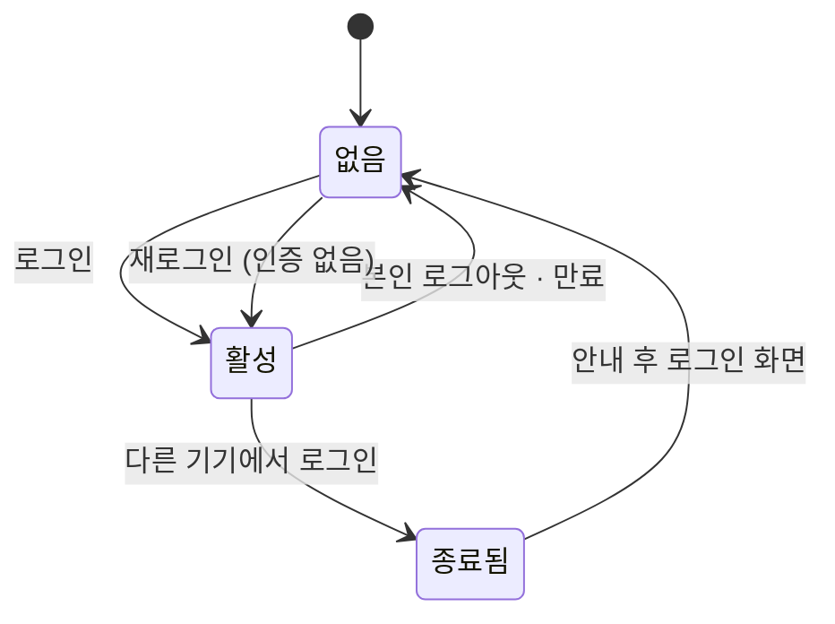
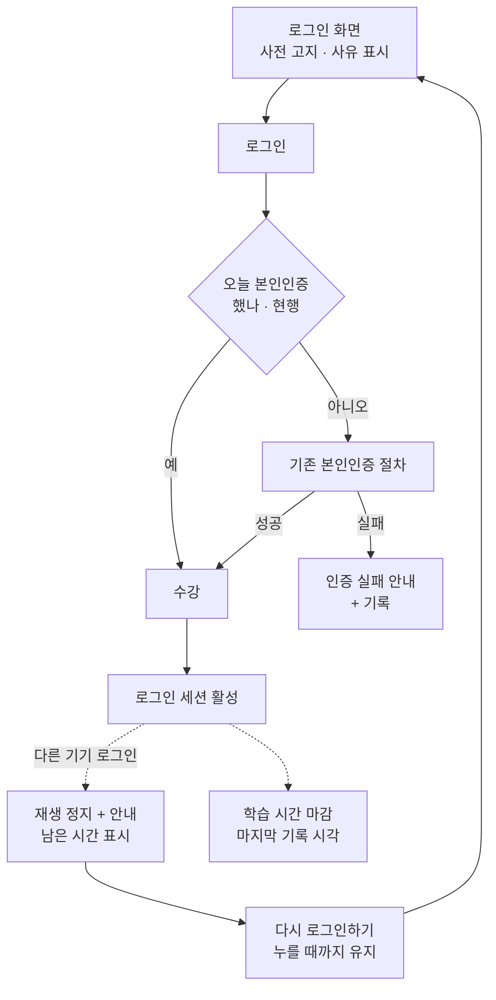

# PRD — 동시 수강 차단

## 문제

한 계정으로 두 곳에서 동시에 수강할 수 있다. 국비 훈련에서 계정 공유는 훈련비 부정수급이 되고, 적발되면 되돌릴 수 없다.

차단은 **로그인 세션 하나**로 건다. 새 기기에서 로그인하면 먼저 있던 기기는 로그아웃된다. 수강 화면 입장 기준으로 막는 방법은, 화면을 열지 않고 학습 시간이 적립되는 통로만 두드리는 우회가 가능해 택하지 않았다.

본인인증(하루 1회)은 현행 그대로 두고 건드리지 않는다. 그래서 같은 날 번갈아 넘겨 쓰는 형태는 이번에 막히지 않는다 — 알고 감수하며, 측정으로 관찰한다.

정책 근거: [POL-CR-05](../policies/POL-CR-05-동시수강차단-정책.md)

---

## 사용자 시나리오

### 1. 정상 이동 — 마찰 없음

1. Trainee가 집 PC에서 본인인증을 마치고 강의를 듣는다.
2. 로그아웃하거나 그냥 PC를 끈다.
3. 회사 PC에서 로그인해 이어서 듣는다. 인증도, 대기도 없다.

### 2. 강제 로그아웃 — 먼저 있던 쪽

1. Trainee가 강의를 재생 중이다.
2. 다른 기기에서 같은 계정으로 로그인한다.
3. 재생이 즉시 멈추고 안내가 뜬다. 안내는 **[다시 로그인하기]를 누를 때까지 남는다.**
4. **부트캠프·커리어 화면을 함께 열어 두었다면 거기서도 로그아웃된다.** 안내는 어느 화면에서 보든 같은 내용이다.
5. 다시 로그인하면 그대로 이어 듣는다. 이번엔 반대쪽이 로그아웃된다.

### 3. 그날 첫 수강

1. 오늘 아직 본인인증을 하지 않았다.
2. 기존 절차대로 인증을 받고 수강한다. (현행과 동일 — 본 기획서가 바꾸는 것 없음)

---

## 기능 목록

| # | 기능 | 설명 | 정책 |
|---|---|---|---|
| F-1 | 로그인 1세션 유지 | **새 로그인 세션이 만들어지면** 기존 세션을 종료한다. 토큰 갱신·유효기간 내 재접속은 새 세션이 아니므로 해당 없음 | §1-1, §1-2 |
| F-1a | 대리 로그인 예외 | 회원관리 접근 권한자만 실행. 회원의 기존 로그인을 끊지 않고, 본인인증 외 모든 메뉴에 접근한다. 그동안 학습 시간은 쌓이지 않는다. 회원 본인이 로그인하면 대리 세션은 끊긴다 | §1-6 |
| F-2 | 로그인 전 사전 고지 | 로그인 화면에 "다른 기기에서 로그인하면 기존 기기는 로그아웃됩니다"를 알린다 | §1-5 |
| F-3 | 재생 정지 · 안내 · 이동 | 로그아웃되는 기기에서 **영상을 멈추고** 안내를 띄운다. [다시 로그인하기]를 눌러야 로그인 화면으로 이동한다(자동 이동 없음) | §2-1, §2-3 |
| F-4 | 공통 안내 문구 | 온라인 강의·부트캠프·커리어가 **하나의 문구를 똑같이** 쓴다. 서비스별 문구를 두지 않는다 | §2-2 |
| F-5 | 학습 시간 마감 | 마지막으로 도착한 진도 기록 시각까지 인정한다. 로그아웃은 적립에 즉시 반영되고, 그 뒤 도착한 기록은 인정하지 않는다 | §3-1, §3-3, §3-4 |
| F-6 | 마감 사유 표기 | 기존 어드민 수강 이력 화면에서 로그아웃으로 마감된 건임을 구분해 볼 수 있다 | §3-4 |
| F-7 | 인증 실패 기록 | 인증 시도·결과와 실패 사유의 출처를 남긴다 | §6-2 |
| F-8 | 소명 자료 조회·내려받기 | 매니저가 기간·과정으로 조회하고 파일로 받는다 | §6-3, §6-4 |

> 본인인증 자체(F-7·F-8이 기록하는 대상)는 현행 기능이며 이번에 바꾸지 않는다.

---

## 로그인 세션의 상태



- **활성 → 종료됨** 시점에 학습 시간이 마감된다. 기준은 **마지막으로 도착한 진도 기록의 시각**이며, 로그아웃 시각이 아니다. (§3-1)
- **로그아웃된 뒤** 도착하는 진도 기록은 인정하지 않는다. 통신이 끊겼던 기기가 밀린 기록을 올려도 마찬가지다. (§3-3)
- 종료된 기기는 **재로그인만 하면 곧바로 수강할 수 있다.** 대기 시간도 추가 인증도 없다. (§1-4, §4-2)

---

## 화면 흐름



> 점선이 이번에 새로 생기는 흐름이다. 실선은 현행 그대로다.

---

## 예외 처리

| 조건 | 시스템 동작 | 화면에 보이는 것 |
|---|---|---|
| 영상 재생 중 다른 기기 로그인 | **즉시 정지** + 마지막 기록 시각까지 인정 | 안내가 누를 때까지 남음 → [다시 로그인하기] → 로그인 화면 |
| 자리를 비운 사이에 로그아웃됨 | 동일. 안내가 그대로 남아 있음 | 돌아와서 안내를 그대로 봄 |
| 안내에서 [다시 로그인하기]를 누름 | 로그인 화면으로 이동 | 로그인 화면 |
| 부트캠프·커리어를 함께 열어 둠 | 해당 서비스도 함께 로그아웃 | 어느 화면에서든 **똑같은 안내** |
| 곧바로 재로그인 | 반대쪽이 로그아웃됨. 인증 없음 | 바로 수강 |
| 두 기기가 로그인을 계속 주고받음 | 매번 반복. 지금은 막지 않음 | 안내 반복 → §비정책 10 |
| 영상 틀어 둔 채 절전·잠듦 → 다음 날 다른 기기 로그인 | 마지막 기록 시각까지만 인정 | 이전 기기: 재로그인 화면 |
| 통신 끊긴 채 재생 지속 → 밀린 기록 도착 | 로그아웃된 뒤 도착한 기록은 인정하지 않음 | 이전 기기: 재로그인 화면 |
| 같은 PC의 다른 브라우저로 로그인 | 다른 세션으로 보아 이전 브라우저가 로그아웃 | "다른 기기"가 아닌 표현 필요 → 디자인 |
| 운영자가 대리 로그인 | 회원의 기존 로그인을 끊지 않음. 학습 시간 적립 없음 | 회원 화면: 변화 없음 |
| 대리 로그인 중 회원 본인이 로그인 | 대리 로그인 세션이 끊김 | 운영자 화면: 같은 안내 |
| PC 수강 중 폰으로 사이트만 열어봄 (로그인 유지 중) | 새 세션이 아니므로 PC는 영향 없음 | 변화 없음 |
| 그날 아직 본인인증 안 함 | 현행 인증 절차 (변경 없음) | 평소 본인인증 화면 |
| 인증 수단 장애로 인증 불가 | 진입 차단(우회 없음) + 시도·실패 사유 기록 | 인증 실패 안내 — 서비스 오류가 아님을 밝힘 |
| 퀴즈 응시 중 로그아웃 | 진행분 소실. 재응시 여부는 POL-CR-01 §2-9를 따름 | 재로그인 후 해당 퀴즈의 현재 상태 |
| 작성 중이던 TIL·과제 | 각 기능의 기존 임시저장을 따르고, 없으면 소실. 별도 보존 장치 없음 | 각 기능에 따름 |
| 배포 시점에 이미 로그인 중 | 그대로 둔다. 다음 로그인부터 적용 (§7) | 변화 없음 |

---

## 안내 문구

온라인 강의(likelion.net)·부트캠프(bootcamp.likelion.net)·커리어(career.likelion.net)는 **로그인을 공유**한다 *[확인함]*. 사용자는 어느 화면을 보고 있었든 같은 사건을 겪으므로, **세 서비스가 하나의 문구를 똑같이 쓴다.** 서비스별 문구를 따로 두지 않는다.

### ① 로그아웃되는 기기 — 모달

```
다른 기기에서 로그인되어 로그아웃됩니다.

모든 서비스에서 로그아웃되니, 이어서 이용하시려면 다시 로그인 해주세요.
작성 중이던 내용은 저장되지 않습니다.
본인이 로그인한 게 아니라면 비밀번호를 변경해주세요.

                                          [ 다시 로그인하기 ]
```

- **[다시 로그인하기]** → 로그인 화면으로 이동
- **자동으로 닫거나 이동하지 않는다.** 사용자가 누를 때까지 남는다 *[PM 확정]*
- 세 서비스 모두 같게 동작 (커리어에서 이력서 작성 중이어도 동일)
- **영상은 안내가 뜨는 순간 멈춘다.** 안내가 남아 있는 동안 재생이 이어져서는 안 된다 *[PM 확정]*

### ② 로그인 화면 사전 고지 — 상시 노출 (§1-5)

```
다른 기기에서 로그인하면 기존 기기는 로그아웃됩니다.
```

> 문안은 PM 확정본이다. 톤·길이 조정은 UX 라이팅에서 하되, **어느 항목이 어느 화면에 들어가는지**는 정책(§2-2~§2-5)을 따른다.

---

## 권한

| 대상 | 로그인 세션 | 소명 자료 조회 | 소명 자료 내려받기 | 다운로드 이력 조회 | 대리 로그인 실행 |
|---|---|---|---|---|---|
| Trainee | ✅ 본인 계정 1개 | ❌ | ❌ | ❌ | ❌ |
| Operator — 매니저 | ✅ 본인 계정 1개 | ✅ 기간·과정 | ✅ 조회 범위와 동일 | ✅ | ✅ 회원관리 접근 권한자 |
| Operator — 멘토 | ✅ 본인 계정 1개 | ❌ | ❌ | ❌ | 회원관리 접근 권한이 있으면 ✅ |

- 소명 자료는 **매니저만** 다룬다. 용어상 Operator는 멘토를 포함하지만, 훈련생 인증 이력은 상시 근무가 아닌 멘토가 기간 단위로 내려받을 성격이 아니다. (§5)
- 내려받는 파일에는 소명에 필요한 최소 항목만 담고, 화면에서 가려 보여주는 항목이 파일에서 원본으로 나가지 않는다. 누가 언제 무엇을 받았는지 남긴다. (§6-4)
- Operator가 Trainee 계정으로 대신 접속하는 경로를 **새로 만들지 않는다.** 이미 있는 어드민 대리 로그인은 §1-6 예외를 따른다 — 기존 로그인을 끊지 않고, 그동안 학습 시간이 쌓이지 않는다.

---

## 성공 지표

- **한 계정이 하루에 사용한 기기 수** — 순차 공유의 크기. 동시 수강이 막히면 공유는 이 지표로만 드러난다
- **강제 로그아웃 발생 건수** (계정당·일별) — 오탐 감시 + 반복 상한을 정하는 근거
- **강제 로그아웃 관련 CS 문의 건수** — 폰·PC 병행 마찰의 실제 크기
- **로그아웃 후 재로그인까지 걸린 시간** — 정상 이동인지 도용 다툼인지 가르는 신호
- **한 계정이 하루에 로그인을 주고받은 횟수** — 반복되는 계정 = 공유 의심 또는 도용 의심

> **측정이 되려면 먼저 확인할 것**: 강제 로그아웃은 서버가 판단해서 일으키는 일인데, 지금 우리 사용 기록은 사용자 화면에서 보내는 방식만 있다. 로그아웃된 기기가 이미 브라우저를 닫았거나 인터넷이 끊겨 있으면 **아무 기록도 남지 않는다.** 위 지표를 세려면 **서버가 직접 남기는 기록**이 필요하다. BE와 함께 확정한다.

---

## 범위 (이번 버전)

- 로그인 1세션 유지와 기존 세션 종료
- 로그인 전 사전 고지
- 로그아웃되는 기기의 정지·안내·이동, 이동 후 사유 확인
- 학습 시간 마감 기준과, 로그아웃된 뒤 도착한 기록의 제외
- 기존 어드민 수강 이력 화면에서의 마감 사유 구분
- 인증 실패 기록과 매니저의 소명 자료 조회·내려받기

## 비범위

- **본인인증 변경** — 하루 1회 현행 유지 (§4)
- **부트캠프 동반 로그아웃 완화** — 세션 분리는 범위 밖. 알고 감수 (§비정책 1)
- **폰·PC 병행 마찰 완화** — 알고 감수, CS 문의량으로 재판단 (§비정책 2)
- **순차 공유 차단** — 알고 감수, 한 달 관찰 후 재판단 (§비정책 3)
- **로그아웃 반복 상한** — 이번에 정하지 않음. 알고 감수 (§비정책 10)
- **차단을 임시로 멈추는 수단** — 만들지 않음. 오작동 시 개발이 원인을 찾아 고침. 알고 감수 (§비정책 9)
- **배포 시점 로그인 세션 일괄 종료** — 하지 않음. 배포 이후 로그인부터 적용 (§7)
- **응시·작성 진행분 보존과 구제 경로** — 이어풀기·임시저장·응시 기록 초기화 모두 만들지 않음. 알고 감수 (§비정책 12)
- **기기 수 제한·등록 기기 관리 / 이상 패턴 자동 적발** (§비정책 5·6)
- **인증 수단 장애 시 우회·임시 승인** (§비정책 7)
- **학습 시간 이력 조회·정정 화면** — 별도 관리 시스템 소관 (§비정책 8)

---

## 넘기기 전에 필요한 것

| 무엇 | 누가 | 왜 |
|---|---|---|
| 수강 화면이 어느 서비스에 속하는지 확정 | PM·BE | 세션 관리 주체·배포 대상이 갈린다. 문서 어디에도 없다 |
| 부트캠프·커리어 팀 합의 | PM | 로그인이 공유되어 세 서비스가 함께 로그아웃된다. 라이브 수업·출결 시간대 영향, 이력서 작성 중 소실 영향 확인 |
| 용어 등록 — 로그인 세션 / 수강 화면 | BE | `events.yml`에 이미 `session_entered`가 있어 이름 충돌 위험 |
| 서버가 직접 남기는 사용 기록 | BE | 강제 로그아웃은 서버가 판단하는 일이라, 지금의 화면 기반 기록 방식으로는 셀 수 없다 |
| 기존 "다른 기기 로그인 시 로그아웃" 구현 정리 | BE | 걷어내고 본 정책 기준으로 다시 만든다 |
| 안내·사전 고지 화면 시안 | 디자인 | 세 서비스가 같은 문구를 쓴다. `status: design-review` 승격 조건 |
| 플로우차트 SVG | PM | 이 레포 선례는 Mermaid + SVG 동시 게시 |
| 화면정의서 | PM | F-8은 신규 어드민 화면. 조회 기본값·최대 범위·0건·에러·대용량 처리가 비어 있다 |

---

## 참고

- 정책: [POL-CR-05 — 동시 수강 차단](../policies/POL-CR-05-동시수강차단-정책.md)
- 본 문서의 §표기는 모두 POL-CR-05의 절 번호를 가리킨다.
