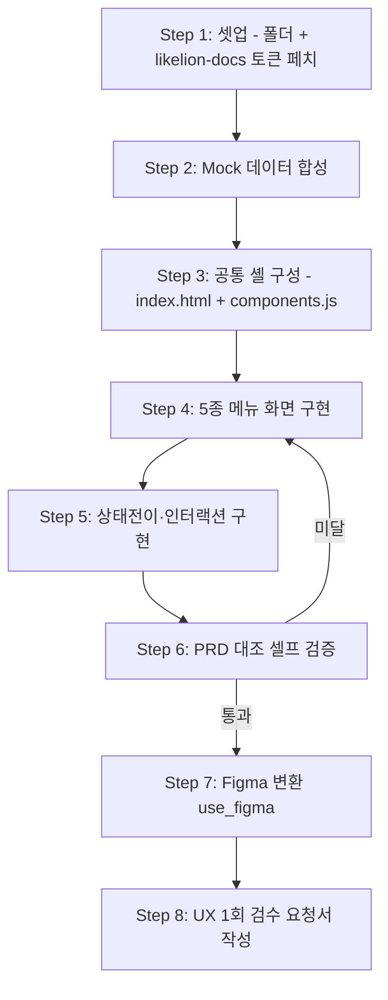

# 클래스룸 프로토타입 v2 에이전트 시스템 설계서

> 작성일: 2026-05-28
> 목적: Claude Code 구현 참조용 계획서 — PRD v1.2.1 5종 메뉴를 깊이 우선으로 프로토타이핑하고 Figma까지 인계
> 상위 PRD: [PRD-classroom-detail-v1.2.md](../prd/PRD-classroom-detail-v1.2.md)
> 기존 프로토타입(참고): [docs/handoff/prototype/classroom-v1.2/](../../../../../docs/handoff/prototype/classroom-v1.2/) — 단일 999줄 HTML, 골든패스만 커버

---

## 1. 작업 컨텍스트

### 배경 및 목적

기존 v1.2 프로토타입은 단일 HTML 999줄로 골든패스 클릭 흐름만 보여준다. PRD v1.2.1이 §4 (A)~(E) 5블록 구조로 디테일이 보강되면서 **빈상태·에러·매니저 탭(퀴즈현황·보충퀴즈 히트맵)·상태 전이·인터랙션 디테일이 프로토타입에서 빠진 상태**이다.

본 라운드는 **PRD §4 (D)(E) 표 100% 커버**를 목표로 한 v2 프로토타입을 만들어 (1) 운영팀 데모, (2) UX 디자이너 1회 검수, (3) 개발 인계 요청서의 SSOT(Single Source of Truth)를 확보한다.

### 범위

- **포함**: PRD §4 수정 스코프 5종 — AI 노트(컨텍스트용 미러)·AI 퀴즈·실습·TIL·프로젝트. 학생뷰/매니저뷰 동시 + 모든 빈상태·에러 케이스 + 매니저 탭(퀴즈현황·보충퀴즈 히트맵·실습 채점표·TIL 학생×날짜 히트맵).
- **제외**: 강의보드·출결현황·커리큘럼·공지사항·Q&A·훈련평가·설문조사·행정/운영 (PRD에서도 스코프외). 실제 API·DB 연동. 인증·라우팅 미들웨어. 모바일 반응형 정밀 튜닝(데스크톱 1440 기준).

### 입출력 정의

| 항목 | 내용 |
|------|------|
| **입력** | (1) PRD-classroom-detail-v1.2.md (`§4` 디테일), (2) likelion-docs MCP의 디자인 토큰·컴포넌트, (3) v1.2 프로토타입 (참고용 인터랙션 패턴) |
| **출력** | `1-planning/prototype/` 하위 HTML 5개 + index.html 허브 + mock-data.js + tokens.css + checklists/prd-match.md + figma-frames/README.md (Figma URL 인덱스) |
| **트리거** | 이 설계서 컨펌 후 사용자가 "구현 시작" 또는 `harness-work` 실행. Figma 단계는 HTML 셀프검증 통과 후 수동 트리거 |

### 제약조건

- **기술**: HTML5 + Tailwind CDN + Pretendard CDN + Vanilla JS (빌드 단계 없음, 브라우저 더블클릭 실행). likelion-docs MCP 토큰 우선, 부재 시 PRD-classroom-detail v1.2 컬러 근사치.
- **운영**: 데이터는 정적 합성. 상태 전이는 sessionStorage로만 유지(새로고침 시 reset). 외부 의존성 캐시 안되는 환경에서도 30초 내 첫 페인트.
- **품질**: PRD §4 (D)(E) 표의 모든 행이 프로토타입에서 트리거 가능해야 함(체크리스트로 검증). 색약 대응 — 히트맵은 색 + 명도/패턴 동시 사용 (PRD §7).
- **컨텍스트 한계**: 본 청사진의 워크플로우 단계 8개 — 권장한계 10개 이내 충족.

### 용어 정의

| 용어 | 정의 |
|------|------|
| 학생뷰/매니저뷰 | LNB 우상단 토글로 동일 메뉴에서 다른 화면 렌더 (PRD §2) |
| Draft / Published | 매니저 작성 퀴즈의 상태 (PRD §4.2 (D)) |
| 보충 퀴즈 | 학생이 본인 오답 기반으로 직접 생성하는 추가 객관식 (PRD §4.2). 하루 100문제 한도 |
| 히트맵 | 학생×날짜 또는 학생×점수 그리드 — 색 + 명도/패턴 (PRD §5) |
| Mock 데이터 | 30일치 × 30명 합성 데이터, `assets/mock-data.js` 단일 파일 |
| SSOT | 본 프로토타입을 디자인·개발 인계의 단일 진실 원천으로 사용 |

---

## 2. 워크플로우 정의

### 전체 흐름도



### LLM 판단 vs 코드 처리 구분

| LLM이 직접 수행 | 스크립트로 처리 |
|----------------|----------------|
| 화면 레이아웃·정보 위계 결정 | HTML/CSS/JS 파일 작성 (Write/Edit) |
| 빈상태·에러 문구 (PRD §10 카탈로그 적용) | 폴더 생성, 파일 존재 확인 |
| 컴포넌트 재사용 판단 (LNB·헤더·모달) | Mock 데이터 JSON 직렬화 |
| PRD §4 (D)(E) 행과 프로토타입 화면 매칭 검증 | 토큰 CSS 변수 export |
| Figma frame 분할 단위 결정 | figma-use MCP 호출 실행 |
| 인터랙션 디테일 트레이드오프 (예: 보충 퀴즈 한도 에러 UX) | sessionStorage 키 설계는 코드, 상태머신 다이어그램은 LLM |

### 단계별 상세

#### Step 1: 셋업 — 폴더 골격 + likelion-docs 토큰

- **처리 주체**: 에이전트
- **입력**: 본 설계서, likelion-docs MCP 접근권
- **처리 내용**: `1-planning/prototype/` 하위 폴더 구조 생성. `mcp__likelion-docs__get_design_tokens` 호출하여 `assets/tokens.css` 생성. `list_components`로 사용 가능한 컴포넌트 목록 확보 후 README.md에 인덱스.
- **출력**: `prototype/README.md`, `prototype/assets/tokens.css`, `prototype/checklists/`, `prototype/figma-frames/`
- **성공 기준**: tokens.css가 색상·간격·타이포 CSS 변수 30개 이상 포함. 토큰 페치 실패 시 PRD-classroom v1.2 근사치(#FF6B1F 등)를 명시적 fallback으로 기록.
- **검증 방법**: 스키마 검증 — `:root { --color-*: ...; }` 형식, Tailwind config에서 참조 가능
- **실패 시 처리**: MCP 호출 실패 → 1회 재시도 → 실패 시 fallback 토큰으로 진행하고 README에 경고 명시 + 매니저(사용자)에게 보고

#### Step 2: Mock 데이터 합성

- **처리 주체**: 에이전트
- **입력**: PRD §3 (일과 타임라인) + §7 (해당 수업 60명 기준)
- **처리 내용**: `assets/mock-data.js`에 단일 export — `{ students: 30명, days: 30일, quizzes: 일별 draft/published, attempts: 응시·정답·오답, practices: 발행+제출+채점, tils: 미작성/임시/작성 3상태 분포, projects: 기초/심화/파이널 3회차 + 기타 1회차 }`. 학생 이름은 가명 (학생01~30). 위험군이 자연스럽게 보이도록 분포 편향 — 학생 25~30번은 회색(미응시·미작성) 우세.
- **출력**: `assets/mock-data.js` (단일 파일, ESM export 또는 window 전역)
- **성공 기준**: 5종 메뉴 모두에서 정상·빈·에러 케이스 데이터를 호출할 수 있음. 매니저뷰 히트맵에 60셀 이상.
- **검증 방법**: 규칙 기반 — `mock.students.length === 30 && mock.days.length === 30 && 각 메뉴별 fixture 존재`
- **실패 시 처리**: 데이터 누락 → 해당 메뉴 화면에 빈상태 노출. 디버그용 콘솔 경고.

#### Step 3: 공통 셸 구성

- **처리 주체**: 에이전트
- **입력**: Step 1 토큰, PRD §2 LNB 구조, §5 공통 UI 패턴
- **처리 내용**: `index.html` — LNB(13개 메뉴, 스코프외 8개 회색 라벨) + 우상단 학생뷰/매니저뷰 토글 + 메뉴 라우팅(iframe 또는 fetch+innerHTML). `assets/components.js` — LNB·헤더·모달·토스트·빈상태카드·에러카드·날짜리스트카드·히트맵 셀 컴포넌트(Vanilla JS 함수). `assets/styles.css` — Tailwind config + 커스텀 유틸 클래스.
- **출력**: `index.html`, `assets/components.js`, `assets/styles.css`
- **성공 기준**: 빈 메뉴 5개 라우팅이 LNB에서 모두 동작. 뷰 토글 클릭 시 sessionStorage 키 갱신 + iframe reload.
- **검증 방법**: 사람 검토 — 브라우저에서 5개 메뉴 모두 클릭, 토글 좌우 정상 작동
- **실패 시 처리**: 라우팅 실패 → 단일 페이지 다중 섹션으로 fallback (각 메뉴를 `<section data-menu="ai-quiz">`로) + README에 명시

#### Step 4: 5종 메뉴 화면 구현

- **처리 주체**: 에이전트
- **입력**: Step 3 셸, Step 2 mock, PRD §4.1~4.5 (A)(B)(C)(E) 표
- **처리 내용**: 각 메뉴 HTML에 학생뷰·매니저뷰 두 컨테이너를 두고 components.js로 렌더. 빈상태·에러는 토글 또는 URL 쿼리(`?state=empty`)로 시연. 메뉴별 산출 화면:
  - **ai-quiz.html**: 학생 3탭(오늘의 퀴즈·오답노트·보충 퀴즈) + 매니저 3탭(오늘의 퀴즈·퀴즈 현황 히트맵·보충 퀴즈 사용수 히트맵). 응시 흐름 1→10문항 (데모는 3문항 후 결과로 점프). 빈상태 6종(발행전·생성실패·오답0·보충0·한도초과·네트워크끊김).
  - **practice.html**: 학생 날짜별 리스트 + 제출폼 + 채점결과. 매니저 발행폼·채점표(학생×문제 그리드 색상/회색). 빈상태 5종.
  - **til.html**: 학생 히트맵+카드리스트+작성폼 좌우 분할(좌 본문 + 우 컨텍스트 3종 — AI노트/오답노트/실습). 매니저 학생×날짜 히트맵 + 셀 클릭 슬라이드 패널. 빈상태 6종.
  - **project.html**: 학생 회차 카드 리스트(기초·심화·파이널·기타) + 제출폼 8필드 + 게시판형 다른 학생 제출물 열람 + 본인 피드백. 매니저 등록폼 + 모더레이션큐(비공개·우수마크). 빈상태 7종.
  - **ai-note.html**: PRD §4.1 스코프외이지만 TIL 우측 컨텍스트 패널 + AI퀴즈 진입 컨텍스트로 필요 → 카드 리스트만 가벼운 미러로 구현.
- **출력**: 5개 HTML 파일
- **성공 기준**: 각 메뉴의 PRD (A)(B)(C)(E) 표가 화면에 모두 노출. 학생·매니저 동시 시연 가능.
- **검증 방법**: 규칙 기반 — checklists/prd-match.md의 메뉴별 체크 항목 모두 통과
- **실패 시 처리**: 특정 빈상태 누락 → Step 6에서 catch → Step 4로 회귀

#### Step 5: 상태전이·인터랙션 구현

- **처리 주체**: 에이전트
- **입력**: Step 4 화면, PRD §4 각 메뉴 (D) 액션·반응·상태 표
- **처리 내용**: (D) 표의 모든 행을 실제 클릭으로 트리거 가능하게 만든다. 예: "매니저 재생성" 버튼 클릭 → 토스트 + 카드 배지 갱신. "학생 보충 퀴즈 100문제 초과" → 인라인 에러. 상태는 sessionStorage(`classroom-proto:state`)에 저장.
- **출력**: 각 HTML 내 인라인 `<script>` + components.js 공유 로직
- **성공 기준**: PRD §4의 5개 메뉴 (D) 표 전체 행(약 30행)이 클릭 시 시각적 피드백 발생.
- **검증 방법**: 규칙 기반 + LLM 자기 검증 — 체크리스트 행마다 트리거 방법 명시
- **실패 시 처리**: 일부 액션이 정적 표시뿐이라면 README "데모 한계" 섹션에 명시 (예: 자동 발행 시간 도달은 "데모 트리거" 버튼으로 대체)

#### Step 6: PRD 대조 셀프 검증

- **처리 주체**: 에이전트
- **입력**: 완성된 HTML 5개 + PRD §4 (A)(B)(C)(D)(E) 표 + §6 권한 매트릭스 + §10 빈상태 카탈로그
- **처리 내용**: `checklists/prd-match.md`를 작성/실행. 메뉴별 행으로:
  - (A) 페이지 구성 항목 노출 여부
  - (B) 학생 시나리오 1~N 단계 클릭 가능 여부
  - (C) 매니저 시나리오 1~N 단계 클릭 가능 여부
  - (D) 액션·반응·상태 행마다 트리거 가능 여부
  - (E) 빈상태·에러 행마다 시연 가능 여부
  - §6 권한 매트릭스 학생뷰/매니저뷰 행마다 화면 일치 여부
  - §10 표준 문구가 인용되었는지
- **출력**: `checklists/prd-match.md` (체크박스 표, 미달 항목은 ❌ + 사유)
- **성공 기준**: 95% 이상 ✅. 미달 항목은 ❌ 사유 + 회귀 결정 또는 "데모 한계로 명시" 처리.
- **검증 방법**: 사람 검토 — 사용자에게 체크리스트 보여주고 컨펌
- **실패 시 처리**: 미달 95% 미만 → Step 4·5로 회귀. 95% 이상이면 한계 항목만 README에 박제 후 Step 7 진행.

#### Step 7: Figma 변환 (use_figma)

- **처리 주체**: 에이전트
- **입력**: 완성된 HTML 5개 + Step 6 통과 결과
- **처리 내용**: `figma:figma-use` 스킬을 **반드시 먼저 로드**(MCP 지시 사항). 화면 분할 단위 결정 — 메뉴별 학생뷰 1 frame + 매니저뷰 1 frame + 빈상태 1 frame + 에러 1 frame = 메뉴당 4 frame × 5메뉴 = 20 frame. HTML 1개당 use_figma 호출 1회로 묶어서 효율화. Figma URL을 `figma-frames/README.md`에 인덱싱.
- **출력**: Figma 파일 1개 (URL 인덱스), `figma-frames/README.md`
- **성공 기준**: 20개 frame 모두 생성. 색상·타이포가 likelion-docs 토큰과 일치(figma-use가 토큰을 매핑하면 자동, 안되면 1회 수동 정렬).
- **검증 방법**: 사람 검토 — 사용자에게 Figma 링크 공유 후 시각 확인
- **실패 시 처리**: use_figma 호출 실패 → figma-generate-design으로 fallback. Figma API 한도 → 메뉴별 분할 실행 + README 진행 상황 기록.

#### Step 8: UX 1회 검수 요청서 작성

- **처리 주체**: 에이전트
- **입력**: Step 6 체크리스트, Step 7 Figma 링크, 기존 `docs/handoff/HANDOFF-TEMPLATE.md`
- **처리 내용**: handoff 폴더에 `classroom-v2-ux-review.md` 생성 — (1) 컨텍스트 3문장 (2) Figma 링크 (3) HTML 링크 (4) UX 의사결정 5종 질문(예: "오답노트 카드 리스트 표현 방식", "히트맵 셀 호버 상세 패널 깊이") (5) 검수 데드라인 (6) 후속 단계(개발 요청서).
- **출력**: `docs/handoff/classroom-v2-ux-review.md` + `prototype/README.md` 업데이트(완료 표시 + 인계 링크)
- **성공 기준**: 사용자가 그대로 UX 디자이너에게 전달 가능한 자기완결형 문서.
- **검증 방법**: 사람 검토 — 사용자 컨펌
- **실패 시 처리**: 누락 정보 → 사용자에게 1턴 질의 후 채움

### 상태 전이

| 상태 | 전이 조건 | 다음 상태 |
|------|----------|----------|
| 미시작 | 설계서 컨펌 | Step 1 진행 |
| 셸 완료 | Step 3 통과 | Step 4 진행 |
| 화면 완료 | Step 4·5 통과 + Step 6 95%↑ | Step 7 진행 |
| 셀프검증 미달 | Step 6 95% 미만 | Step 4로 회귀 |
| Figma 완료 | Step 7 통과 | Step 8 진행 |
| 인계 준비 완료 | Step 8 사용자 컨펌 | UX 디자이너 1회 검수로 외부 핸드오프 |

---

## 3. 구현 스펙

### 폴더 구조

```
KDT-ops/github structure (co-op structure)/kdt-ops-planning/classroom/1-planning/prototype/
  ├── README.md                     # 실행 방법 + 화면 인덱스 + 데모 한계
  ├── blueprint-classroom-prototype-v2.md   # 본 설계서 (현재 파일)
  ├── index.html                    # LNB 허브 + 뷰 토글 + 라우팅
  ├── ai-quiz.html                  # AI 퀴즈 (학생 3탭 + 매니저 3탭)
  ├── practice.html                 # 실습
  ├── til.html                      # TIL
  ├── project.html                  # 프로젝트
  ├── ai-note.html                  # 컨텍스트용 미러 (TIL 우패널 + 퀴즈 진입 시)
  ├── assets/
  │   ├── tokens.css                # likelion-docs MCP 토큰 export
  │   ├── styles.css                # Tailwind config + 커스텀 유틸
  │   ├── components.js             # LNB·헤더·모달·히트맵 등 공유 컴포넌트
  │   └── mock-data.js              # 30일 × 30명 합성 데이터
  ├── checklists/
  │   └── prd-match.md              # PRD §4 (A~E) + §6 + §10 매칭 표
  └── figma-frames/
      └── README.md                 # Figma 파일·frame URL 인덱스
```

### CLAUDE.md 핵심 섹션 목록

본 설계서는 일회성 산출물 프로젝트이므로 별도 CLAUDE.md를 두지 않고 **classroom 폴더 상위의 CLAUDE.md를 그대로 따른다**. 단 구현 중 본 설계서를 SSOT로 참조한다.

- 작업 정의: PRD v1.2.1 → 본 설계서 → 프로토타입 → Figma → UX 검수 → 개발 인계 (4단계 핸드오프 흐름 준수)
- 토큰·컴포넌트 규칙: likelion-docs MCP 우선, fallback은 README에 명시 (workspace CLAUDE.md 정책 그대로)
- 셀프 검증 의무: Step 6 PRD 대조 체크리스트를 거치지 않고 Figma 단계 진입 금지
- 변경 관리: 본 설계서 §변경 이력 표에 구조적 변경 기록

### 에이전트 구조

**구조 선택**: 단일 에이전트

**선택 근거**:
- 전체 워크플로우가 순차적 8단계이며 단계 간 맥락(토큰 → mock → 셸 → 화면 → 검증) 공유가 핵심. 분리 시 토큰·mock 형상이 재진입마다 다시 로드되어 오버헤드 증가.
- 8단계 컨텍스트가 윈도우 30% 이내 충분히 들어옴 (HTML 5파일 × 평균 400줄 ≈ 2000줄 + PRD §4 약 550줄).
- Figma 단계만 `figma-use` 스킬을 inline 로드하면 충분. 별도 서브에이전트로 분리할 만한 독립 도메인 없음.

#### 메인 에이전트 (classroom 폴더 CLAUDE.md 상속)

- **역할**: 8단계 워크플로우 전 구간 오케스트레이션 + 화면 구현 + 셀프 검증
- **담당 단계**: Step 1~8 전체

### 스킬/스크립트 목록

| 이름 | 유형 | 역할 | 트리거 조건 |
|------|------|------|-----------|
| `mcp__likelion-docs__get_design_tokens` | MCP 스킬 (기존) | 디자인 토큰 페치 | Step 1 |
| `mcp__likelion-docs__list_components` / `get_component` | MCP 스킬 (기존) | 사용 가능 컴포넌트 인덱스 | Step 1·3 |
| `figma:figma-use` | 스킬 (기존, 필수 prerequisite) | use_figma 호출 전 무조건 로드 | Step 7 진입 직전 |
| `figma:figma-generate-design` | 스킬 (기존) | fallback — 코드 변환이 아닌 새 디자인 생성 | Step 7 실패 시 |
| `figma:figma-use` 안에서 `mcp__figma__use_figma` | MCP 도구 | HTML → Figma frame 변환 실제 호출 | Step 7 |
| (없음 — 별도 스크립트 불필요) | — | mock-data는 JS 1파일, 빌드 단계 없음 | — |

> 본 라운드에서 **신규 스킬 생성은 불필요**. 모든 작업이 기존 MCP·스킬 + 에이전트 직접 구현으로 커버 가능.

### CLAUDE.md 작성 원칙

본 시스템은 별도 CLAUDE.md를 두지 않지만(상위 classroom/CLAUDE.md 상속), 구현 에이전트가 본 설계서를 따를 때 적용해야 할 4가지 원칙은 아래와 같다.

| 원칙 | 핵심 | 자기 검증 테스트 |
|------|------|-----------------|
| **구현 전에 생각하라** | PRD §4 표를 매핑 표로 먼저 변환한 뒤 코드 작성. 해석이 갈리면 멈추고 객관식 질문 | "PRD의 어느 행을 구현 중인지 명시할 수 있는가?" |
| **단순함 우선** | Vanilla JS + Tailwind만. React·상태관리 라이브러리·라우터 도입 금지. 일회성 mock은 추상화 X | "시니어 엔지니어가 '데모인데 너무 복잡하다'고 할까?" |
| **수술적 변경** | 기존 v1.2 프로토타입 스타일·네이밍 컨벤션 따르기. 새 패턴 도입 시 README에 사유 명시 | "변경된 모든 줄이 PRD §4의 어느 디테일에 직접 연결되는가?" |
| **목표 중심 실행** | 각 Step 시작 전 성공 기준 명시 → checklists/prd-match.md로 검증 루프 | "Step N의 성공 기준이 객관적으로 판단 가능한가?" |

**트레이드오프**: 본 가이드라인은 **PRD 충실도 > 코드 우아함**으로 편향. 데모 한계는 부끄러워하지 말고 README에 명시할 것 — 자동 발행 시간 같은 시간 의존 액션은 "데모 트리거 버튼"으로 대체해도 좋다.

**이 가이드라인이 잘 작동하고 있다면:**
- checklists/prd-match.md가 95% 이상 ✅로 채워진다
- 빈상태·에러가 골든패스만큼 정성껏 만들어진다
- Figma 변환 후 디자이너가 "구조가 명확해서 보기 좋다"고 평가한다
- 새 메뉴 추가 의뢰가 와도 components.js 재사용으로 1일 내 가능하다

> 상세 원칙은 `references/design-principles.md` › "CLAUDE.md / AGENTS.md 작성 원칙" 참조.

### 스킬 생성 규칙

> 이 설계서에 정의된 모든 스킬은 구현 시 반드시 `skill-creator` 스킬(`/skill-creator`)을 사용하여 생성할 것.
> 직접 SKILL.md를 수동 작성하지 말 것 — 규격 불일치 및 트리거 실패의 원인이 됨.

본 라운드는 **신규 스킬 생성이 없는** 일회성 산출물 프로젝트이지만, 만약 구현 도중 재사용 가치가 큰 패턴(예: "PRD § 표 → HTML 매핑 검증기")이 발견되면 `skill-creator`로 정식 스킬화한다.

skill-creator가 보장하는 규격:
1. SKILL.md frontmatter (`name`, `description`) 필수 필드 준수
2. `description`의 트리거 정확도 최적화 (eval 기반 optimization loop)
3. 폴더 구조 (`SKILL.md` + `scripts/` + `references/`) 규격 준수
4. Progressive disclosure: SKILL.md 본문 500줄 이내, 대용량 참조는 `references/`로 분리
5. 테스트 프롬프트 실행 및 품질 검증 완료

### 주요 산출물 파일

| 파일 | 형식 | 생성 단계 | 용도 |
|------|------|----------|------|
| `prototype/assets/tokens.css` | CSS | Step 1 | likelion-docs MCP 토큰 동기화 |
| `prototype/assets/mock-data.js` | JS | Step 2 | 30일 × 30명 합성 데이터 |
| `prototype/index.html` + `assets/components.js` | HTML+JS | Step 3 | LNB·뷰토글·공유 컴포넌트 |
| `prototype/{ai-quiz,practice,til,project,ai-note}.html` | HTML | Step 4·5 | 5종 메뉴 화면 |
| `prototype/checklists/prd-match.md` | MD | Step 6 | PRD 대조 셀프 검증 결과 |
| `prototype/figma-frames/README.md` | MD | Step 7 | Figma 파일·frame URL 인덱스 |
| `docs/handoff/classroom-v2-ux-review.md` | MD | Step 8 | UX 디자이너 1회 검수 요청서 |
| `prototype/README.md` | MD | Step 1·8 (양단) | 실행법·인덱스·데모 한계·후속 단계 |

### 검증 체크리스트

- [x] 모든 단계에 성공 기준 / 검증 방법 / 실패 시 처리가 있다
- [x] LLM 판단 vs 코드 처리 구분 표가 채워져 있다
- [x] `CLAUDE.md 작성 원칙` 섹션이 4원칙 + 자기 검증 테스트 + 트레이드오프 + 성공 지표를 포함한다
- [x] `스킬 생성 규칙` 섹션이 있고 `skill-creator`를 명시한다
- [x] 에이전트 구조가 단일/멀티 중 하나로 명시되어 있다
- [x] 표와 섹션에 `TBD` 같은 미완성 표기가 남아 있지 않다

### 설계서 유지보수

이 설계서는 **구현 전 계획**이다. 구현 중 설계가 변경되면 아래 규칙을 따른다:

- **경미한 변경** (파일명, 빈상태 문구 변형 등): 설계서 업데이트 없이 구현 코드 반영
- **구조적 변경** (Step 추가/삭제, 폴더 구조 변경, 에이전트 구조 변경): 본 설계서 해당 섹션 업데이트 + `### 변경 이력` 기록
- **범위 변경** (5종 → 13종 메뉴 확장, 기술 스택 변경, Figma 단계 제외): 본 설계서 재검토 또는 새 blueprint 작성

### 변경 이력

| 날짜 | 변경 내용 | 이유 |
|------|----------|------|
| 2026-05-28 | 초안 작성 | PRD v1.2.1 디테일 보강에 따라 프로토타입 v1.2 → v2 갱신 필요 |
