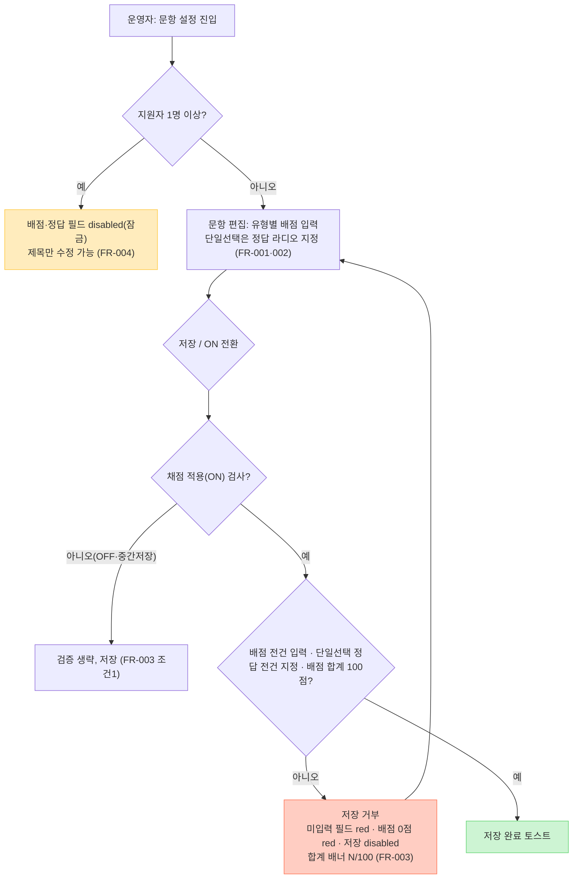
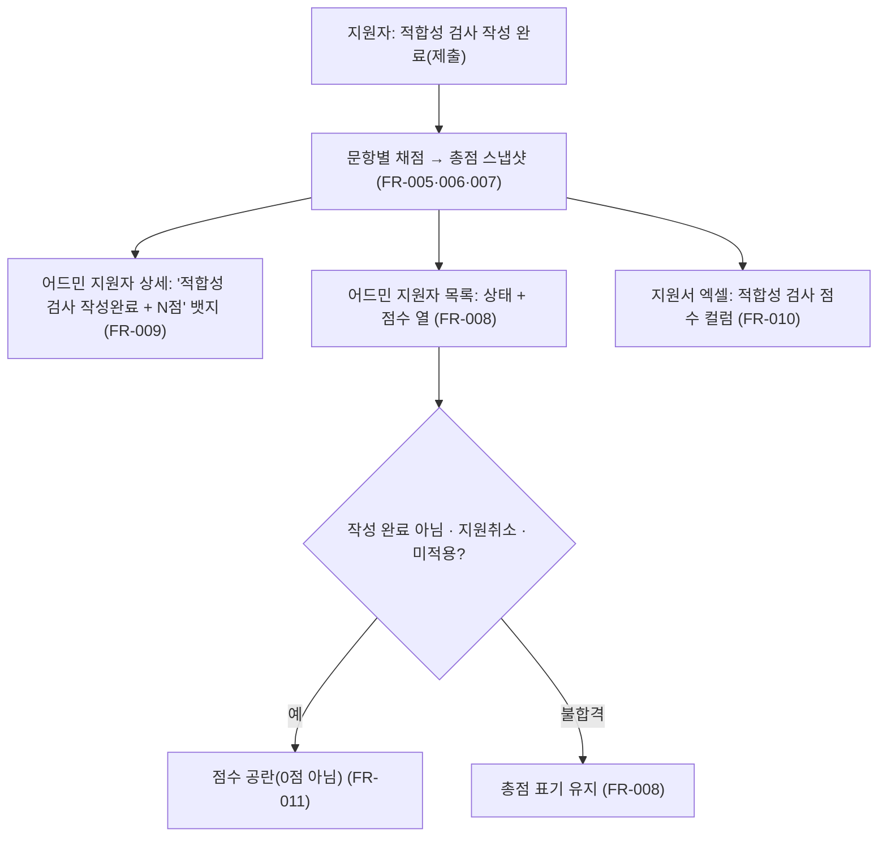

# UX Flow — 과정 적합성 검사 채점 기능

> 이번 델타는 **기존 과정 적합성 검사에 ① 문항 배점 입력 ② 객관식(단일선택) 정답 체크**를 추가하고,
> 지원자 화면(어드민 상세/목록·엑셀)에 **총점**을 노출하는 것이다. 검사 자체·ON/OFF·문항 CRUD는 기존 구현.
> 화면 매핑은 [figma-links.yml](../figma-links.yml) `PRD-classroom-과정적합성검사-채점기능` 참조.

## 어드민 문항 설정 — 저장·검증 플로우

## 지원자 화면 — 총점 노출

## 핵심 인터랙션 노트

- **배점 입력**: 전 유형(단일/복수/선형/주관식) 숫자 입력 + `점` suffix, 필수(`*`). 개별 배점은 **1 이상 정수** → `0`은 미입력으로 간주해 **red 에러**(질문·보기 미입력과 동일 처리).
- **정답 체크**: 객관식 단일선택만 보기별 `정답` 라디오. 라디오는 **항상 1개 선택 유지**(기본 선택)라 "정답 미지정" 상태는 UI상 발생하지 않음 → 별도 에러 상태 불필요(FR-003 ②는 백엔드 안전망). 복수선택·선형·주관식은 정답 UI 없음.
- **배점 합계 배너**: 상단 `N / 100점` 상시 노출. 합계 100 아니면 저장 불가.
- **잠금 상태**(지원자 발생): 배점·정답 필드 disabled, 제목만 수정 가능.
- **점수 공란 규칙**: 미작성·지원취소·미적용 과정은 **공란(0점 아님)**, 불합격 전환자는 총점 유지.

## 디자인 결정 근거

- 배점 0점 red 에러: FR-001의 "배점 1 이상" + FR-003 ①(배점 미입력 저장 차단)을, 질문·보기 미입력과 **동일한 에러 톤**으로 통일.
- 정답 미지정 에러 화면을 두지 않은 이유: 라디오 기본 선택으로 미지정 상태가 UI상 도달 불가(2026-08-12 리뷰 확정).

## ⚠️ 개발 동시 진행 필요 (신규 BE 필드 — PRD §4)

시안에만 존재하는 새 상태가 아니라 **데이터 모델 신규 필드**가 붙는 작업이라, BE PR 동시 진행이 필요하다:

- `exam.scoring_enabled` (Boolean, nullable) — 채점 적용 대상 판정 (FR-015)
- `question.score` (Integer, ≥1) — 문항 배점 (FR-001·003)
- `question.correct_choice` (선택지 참조) — 단일선택 정답 (FR-002)
- `submission.total_score` (Integer, nullable) — 총점 스냅샷 (FR-007)
